# Kinase Activity (Kinase Library + GSEA)

### Introduction

This report demonstrates kinase activity inference using the **Kinase
Library** motif predictions. Unlike PTMsigDB (which uses curated
kinase-substrate relationships), Kinase Library predicts
kinase-substrate assignments based on position-specific scoring matrices
(PSSMs) derived from peptide library screens.

We use the `term2gene.csv` file generated by the `scan-motifs` CLI,
which contains kinase-sequence assignments.

**Approach:** GSEA (Gene Set Enrichment Analysis) using ranked
phosphosite statistics.

### Analysis Details

| Parameter     | Value    |
|---------------|----------|
| Analysis Type | DPA      |
| Mode          | Vignette |

### Load Data and Kinase Library Predictions

``` r

library(clusterProfiler)
library(dplyr)
library(tidyr)
library(readxl)
library(ggplot2)
library(enrichplot)
library(purrr)
library(forcats)
library(writexl)
library(patchwork)
library(DT)
library(prophosqua)
```

``` r

if (pipeline_mode) {
  # Pipeline mode: load from files
  # Use explicit sheet param if provided, otherwise use analysis type as sheet name
  if (!is.null(params$sheet)) {
    sheet_name <- params$sheet
  } else {
    # Default: use analysis type as sheet name (works for combined PTM_results.xlsx)
    sheet_name <- params$analysis_type
  }

  # Load differential analysis data
  data <- read_xlsx(params$xlsx_file, sheet = sheet_name)
  output_dir <- if (!is.null(params$output_dir)) params$output_dir else dirname(params$xlsx_file)

  # Define config for stat_col (used in GSEA ranking)
  # Combined PTM_results.xlsx uses standardized column names
  config <- list(
    sheet = sheet_name,
    stat_col = "statistic.site"
  )
} else {
  # Vignette mode: use example data
  data("combined_test_diff_example", package = "prophosqua")
  data <- combined_test_diff_example
  output_dir <- tempdir()

  # Define config for vignette mode
  config <- list(
    sheet = "DPA",
    stat_col = "statistic.site"
  )
}

# Ensure SequenceWindow column exists
if (!"SequenceWindow" %in% names(data) && "PTM_FlankingRegion" %in% names(data)) {
  data <- data |> rename(SequenceWindow = PTM_FlankingRegion)
}

data_info <- tibble(
  Property = c("Rows", "Columns", "Contrasts"),
  Value = c(nrow(data), ncol(data),
            paste(unique(data$contrast), collapse = ", "))
)
knitr::kable(data_info, caption = "Differential Analysis Data")
```

| Property | Value |
|:---|:---|
| Rows | 105824 |
| Columns | 56 |
| Contrasts | KO_vs_WT, KO_vs_WT_at_Early, KO_vs_WT_at_Late, KO_vs_WT_at_Uninfect |

Differential Analysis Data {.table}

``` r

# Load term2gene - try multiple sources
term2gene_file <- params$term2gene_file

if (is.null(term2gene_file) || !file.exists(term2gene_file)) {
  # Try bundled resource (compressed)
  bundled_zip <- system.file("extdata", "term2gene.csv.zip", package = "prophosqua")
  if (file.exists(bundled_zip)) {
    temp_dir <- tempdir()
    unzip(bundled_zip, exdir = temp_dir)
    term2gene_file <- file.path(temp_dir, "term2gene.csv")
    message("Using bundled term2gene from prophosqua package")
  }
}

if (is.null(term2gene_file) || !file.exists(term2gene_file)) {
  stop("term2gene file not found. Provide via params$term2gene_file or install prophosqua with bundled data.")
}

# Load term2gene from scan-motifs output
term2gene <- read.csv(term2gene_file, stringsAsFactors = FALSE)

kl_info <- tibble(
  Property = c("Total assignments", "Unique kinases", "Unique sequences"),
  Value = c(nrow(term2gene), n_distinct(term2gene$term), n_distinct(term2gene$gene))
)
knitr::kable(kl_info, caption = "Kinase Library Predictions")
```

| Property          |  Value |
|:------------------|-------:|
| Total assignments | 384764 |
| Unique kinases    |    311 |
| Unique sequences  |  18935 |

Kinase Library Predictions {.table}

``` r

# IMPORTANT: Kinase Library sequences have lowercase letters for phosphorylated residues
# (e.g., "PETITIRsGPPSPLP"). Convert to uppercase to match our data.
term2gene <- term2gene |>
  mutate(gene = toupper(gene))

# Keep as TERM2GENE format for clusterProfiler GSEA
term2gene_df <- term2gene |>
  select(term, gene)

# Vignette mode: subsample to 50 kinase sets for speed
if (!pipeline_mode) {
  set.seed(42)
  keep_sets <- sample(unique(term2gene_df$term), min(50, n_distinct(term2gene_df$term)))
  term2gene_df <- term2gene_df |> filter(term %in% keep_sets)
  message("Vignette mode: subsampled to ", length(keep_sets), " kinase sets")
}
```

### Kinase-Substrate Assignment Statistics

``` r

our_sequences <- data |>
  pull(SequenceWindow) |>
  trimws() |>
  toupper() |>
  unique()
assigned_sequences <- unique(term2gene$gene)
overlap_seqs <- intersect(our_sequences, assigned_sequences)

assignment_stats <- tibble(
  Metric = c("Phosphosites in differential analysis",
             "Sites with kinase assignments",
             "Sites usable for GSEA",
             "Coverage (%)"),
  Value = c(length(our_sequences),
            length(assigned_sequences),
            length(overlap_seqs),
            round(100 * length(overlap_seqs) / length(our_sequences), 1))
)
knitr::kable(assignment_stats, caption = "Assignment Statistics")
```

| Metric                                |   Value |
|:--------------------------------------|--------:|
| Phosphosites in differential analysis | 21683.0 |
| Sites with kinase assignments         | 18902.0 |
| Sites usable for GSEA                 | 18902.0 |
| Coverage (%)                          |    87.2 |

Assignment Statistics {.table}

``` r

# Calculate kinase set sizes from term2gene
kinase_sizes <- term2gene_df |>
  count(term, name = "size")

kinase_overlap <- term2gene_df |>
  filter(gene %in% our_sequences) |>
  count(term, name = "overlap")

kinase_stats <- tibble(
  Metric = c("Number of kinases", "Mean substrates/kinase", "Median substrates/kinase",
             "Range (min-max)", "Mean substrates in our data",
             "Kinases with >= 15 substrates"),
  Value = c(nrow(kinase_sizes),
            round(mean(kinase_sizes$size)),
            median(kinase_sizes$size),
            paste(min(kinase_sizes$size), "-", max(kinase_sizes$size)),
            round(mean(kinase_overlap$overlap, na.rm = TRUE)),
            sum(kinase_overlap$overlap >= 15, na.rm = TRUE))
)
knitr::kable(kinase_stats, caption = "Kinase Set Size Distribution")
```

| Metric                         | Value      |
|:-------------------------------|:-----------|
| Number of kinases              | 50         |
| Mean substrates/kinase         | 1246       |
| Median substrates/kinase       | 1299.5     |
| Range (min-max)                | 593 - 1694 |
| Mean substrates in our data    | 1246       |
| Kinases with \>= 15 substrates | 50         |

Kinase Set Size Distribution {.table}

### Prepare Ranked Lists

``` r

# Prepare ranked lists using prophosqua function
ranks <- prepare_gsea_ranks(
  data,
  stat_col = config$stat_col,
  seq_col = "SequenceWindow",
  contrast_col = "contrast"
)

ranks_info <- tibble(
  Contrast = names(ranks),
  Sites = map_int(ranks, length)
)
knitr::kable(ranks_info, caption = paste(params$analysis_type, "Ranks Prepared"))
```

| Contrast             | Sites |
|:---------------------|------:|
| KO_vs_WT             | 21682 |
| KO_vs_WT_at_Early    | 21682 |
| KO_vs_WT_at_Late     | 21682 |
| KO_vs_WT_at_Uninfect | 21682 |

DPA Ranks Prepared {.table}

### GSEA Analysis

``` r

gsea_results <- names(ranks) |>
  set_names() |>
  map(function(ct) {
    GSEA(
      geneList = ranks[[ct]],
      TERM2GENE = term2gene_df,
      minGSSize = params$min_size,
      maxGSSize = params$max_size,
      pvalueCutoff = 0.25,
      nPermSimple = params$n_perm,
      verbose = FALSE
    )
  })

gsea_info <- tibble(
  Contrast = names(gsea_results),
  `Significant Kinases (FDR < 0.25)` = map_int(gsea_results, ~sum(.x@result$p.adjust < 0.25, na.rm = TRUE))
)
knitr::kable(gsea_info, caption = paste(params$analysis_type, "GSEA Results Summary"))
```

| Contrast             | Significant Kinases (FDR \< 0.25) |
|:---------------------|----------------------------------:|
| KO_vs_WT             |                                29 |
| KO_vs_WT_at_Early    |                                35 |
| KO_vs_WT_at_Late     |                                35 |
| KO_vs_WT_at_Uninfect |                                41 |

DPA GSEA Results Summary {.table}

``` r

has_gsea_results <- sum(map_int(gsea_results, ~nrow(.x@result))) > 0
```

``` r

cat("\n\n# No GSEA Results\n\n")
cat("No kinase gene sets passed the size filter (min_size=", params$min_size, ").\n")
cat("This typically means too few phosphosites overlap with kinase library assignments.\n\n")
cat("**Coverage was:", length(overlap_seqs), "sites out of", length(our_sequences), "**\n\n")
```

## Results by Contrast

``` r

# Extract all results into data frame using shared function
all_clean <- extract_gsea_results(gsea_results) |>
  mutate(kinase = ID)

for (ctr in unique(all_clean$contrast)) {
  cat("\n\n## ", ctr, "\n\n")

  ctr_data <- all_clean |> filter(contrast == ctr)
  n_sig <- sum(ctr_data$p.adjust < 0.1, na.rm = TRUE)
  cat("**Significant kinases (FDR < 0.1):** ", n_sig, "\n\n")

  # Using shared dotplot function
  p <- plot_enrichment_dotplot(
    ctr_data,
    item_col = "kinase",
    fdr_col = "p.adjust",
    title = paste0(params$analysis_type, " - ", ctr),
    subtitle = "Top 30 kinases by FDR"
  )
  print(p)
  cat("\n\n")

  # Significant kinases table
  cat("**Significant Kinases (FDR < 0.1):**\n\n")
  sig_table <- ctr_data |>
    filter(p.adjust < 0.1) |>
    select(kinase, NES, pvalue, FDR = p.adjust, setSize) |>
    arrange(FDR) |>
    mutate(across(where(is.numeric), ~round(.x, 4)))
  print(htmltools::tagList(
    DT::datatable(sig_table,
                  extensions = 'Buttons',
                  options = list(pageLength = 15, scrollX = TRUE,
                                 dom = 'Bfrtip', buttons = c('copy', 'csv', 'excel')))
  ))
  cat("\n\n")
}
```

### KO_vs_WT

**Significant kinases (FDR \< 0.1):** 26

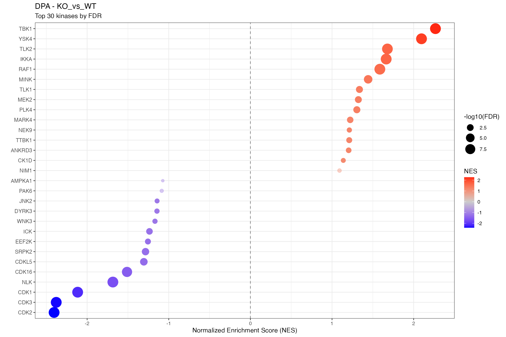

**Significant Kinases (FDR \< 0.1):**

### KO_vs_WT_at_Early

**Significant kinases (FDR \< 0.1):** 26

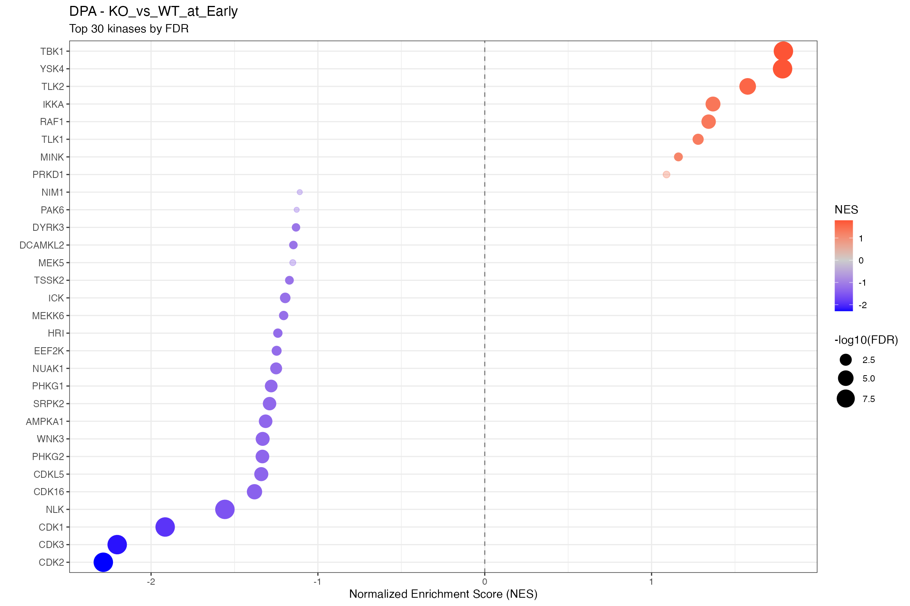

**Significant Kinases (FDR \< 0.1):**

### KO_vs_WT_at_Late

**Significant kinases (FDR \< 0.1):** 31

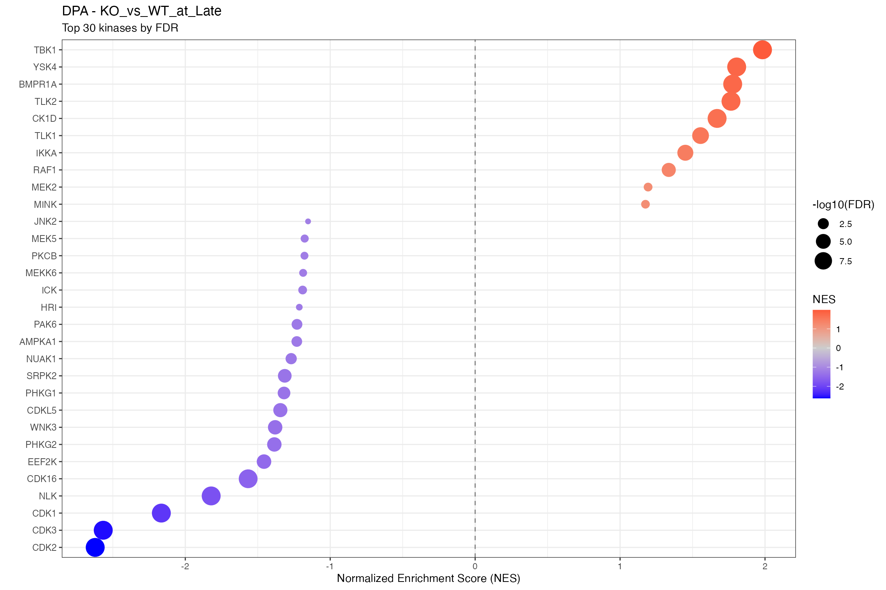

**Significant Kinases (FDR \< 0.1):**

### KO_vs_WT_at_Uninfect

**Significant kinases (FDR \< 0.1):** 38


**Significant Kinases (FDR \< 0.1):**

## clusterProfiler Dotplots

#### Merged Dotplot

``` r

merged <- merge_result(gsea_results)
dotplot(merged, showCategory = 15,
        title = paste(params$analysis_type, "GSEA - Kinase Library (FDR < 0.25)")) +
  theme(axis.text.x = element_text(angle = 45, hjust = 1))
```

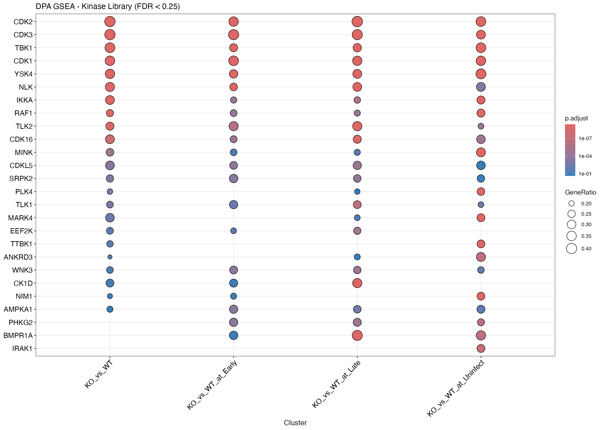

#### Individual Contrasts

``` r

plots <- names(gsea_results) |>
  map(function(ct) {
    res <- gsea_results[[ct]]@result
    # Skip if no results
    if (nrow(res) == 0 || sum(!is.na(res$NES)) == 0) {
      return(ggplot() +
        annotate("text", x = 0.5, y = 0.5, label = paste(ct, "\nNo significant kinases")) +
        theme_void() + ggtitle(ct))
    }
    dotplot(gsea_results[[ct]], showCategory = 15, title = ct) +
      theme(axis.text.y = element_text(size = 8))
  })
wrap_plots(plots, ncol = 2)
```

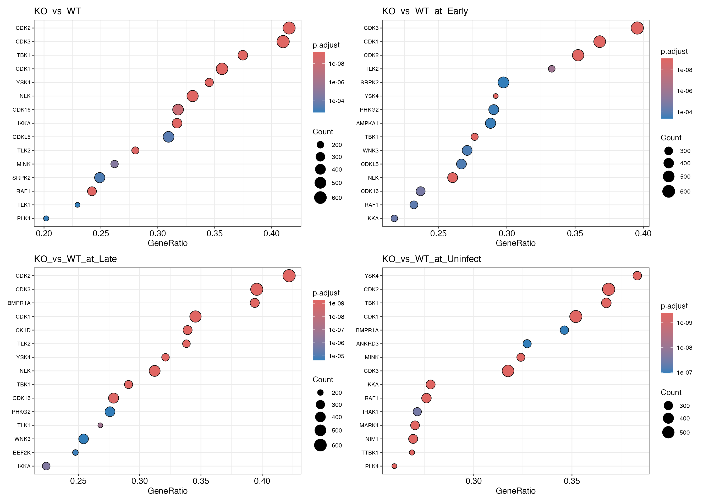

#### NES Heatmap

``` r

# Using shared heatmap function
plot_enrichment_heatmap(
  all_clean,
  item_col = "ID",
  fdr_col = "p.adjust",
  fdr_filter = 0.25,
  n_top = 30,
  title = paste(params$analysis_type, "- Top Kinases by NES")
)
```

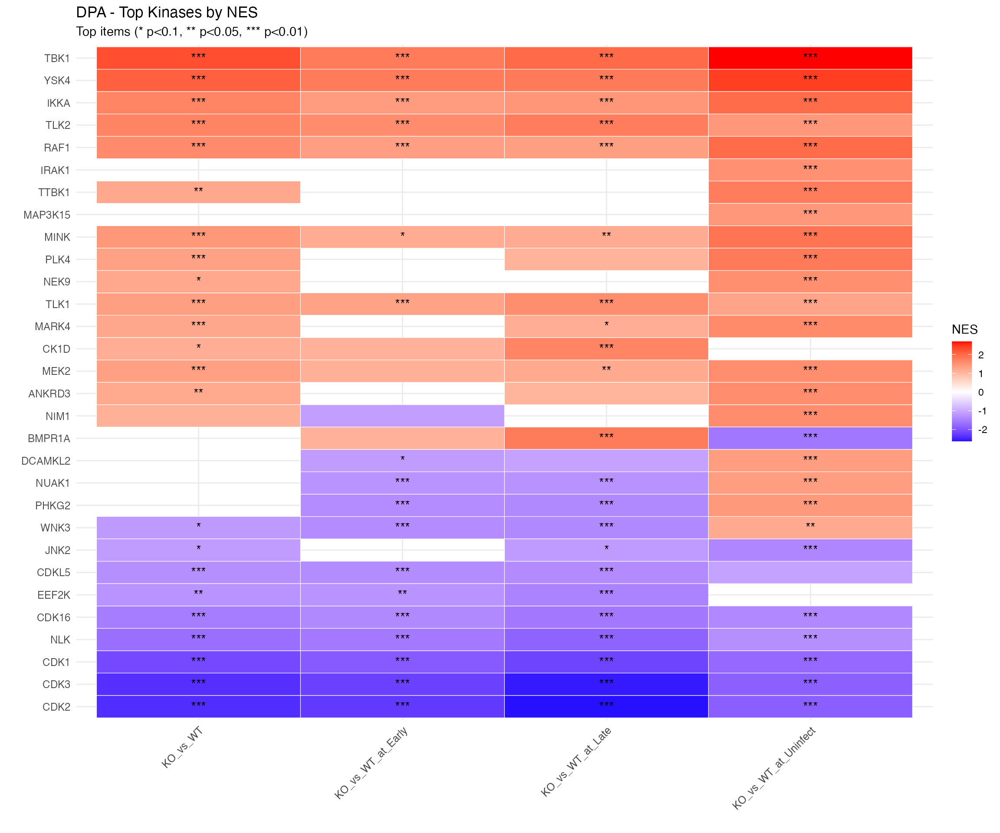

## Volcano Plot

``` r

# Using shared volcano function
plot_enrichment_volcano(
  all_clean,
  item_col = "ID",
  fdr_col = "p.adjust",
  title = paste(params$analysis_type, "- GSEA Volcano Plots")
)
```

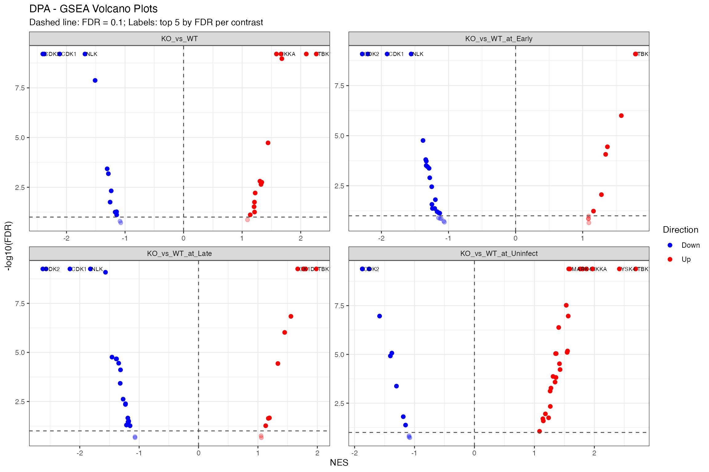

## Diagnostics

``` r

pval_diag <- names(gsea_results) |>
  map_dfr(function(ct) {
    res <- gsea_results[[ct]]@result
    tibble(
      Contrast = ct,
      `Min p-value` = signif(min(res$pvalue, na.rm = TRUE), 3),
      `p < 0.05` = sum(res$pvalue < 0.05, na.rm = TRUE),
      `p < 0.01` = sum(res$pvalue < 0.01, na.rm = TRUE),
      Total = nrow(res)
    )
  })
knitr::kable(pval_diag, caption = paste("Raw p-value Distribution (", params$analysis_type, ")"))
```

| Contrast             | Min p-value | p \< 0.05 | p \< 0.01 | Total |
|:---------------------|------------:|----------:|----------:|------:|
| KO_vs_WT             |           0 |        26 |        20 |    29 |
| KO_vs_WT_at_Early    |           0 |        26 |        19 |    35 |
| KO_vs_WT_at_Late     |           0 |        31 |        22 |    35 |
| KO_vs_WT_at_Uninfect |           0 |        37 |        32 |    41 |

Raw p-value Distribution ( DPA ) {.table}

## Export All GSEA Plots to PDF

``` r

# Export all GSEA enrichment plots to PDF using shared function
pdf_file <- file.path(output_dir, paste0("GSEA_plots_", params$analysis_type, ".pdf"))
n_plots <- export_gsea_plots_pdf(gsea_results, pdf_file)
cat("Exported", n_plots, "GSEA plots to:", pdf_file, "\n")
```

``` r

# Vignette mode: skip PDF export
n_plots <- sum(map_int(gsea_results, ~nrow(.x@result)))
message("Vignette mode: PDF export skipped. Would export ", n_plots, " plots.")
```

## GSEA Enrichment Plots

Showing top 3 plots per contrast.

``` r

for (ct in names(gsea_results)) {
  cat("\n\n### ", ct, " {.tabset}\n\n")

  res <- gsea_results[[ct]]
  top10 <- res@result |>
    as_tibble() |>
    arrange(pvalue) |>
    head(params$top_genesets) |>
    pull(ID)

  for (i in seq_along(top10)) {
    geneset <- top10[i]
    cat("\n\n#### ", geneset, "\n\n")

    row <- res@result |>
      as_tibble() |>
      filter(ID == geneset)
    nes_val <- round(row$NES, 2)
    fdr <- signif(row$p.adjust, 2)

    p <- gseaplot2(res, geneSetID = geneset,
      title = paste0(geneset, " (NES=", nes_val, ", FDR=", fdr, ")"))
    print(p)
    cat("\n\n")
  }
}
```

#### KO_vs_WT

##### CDK2

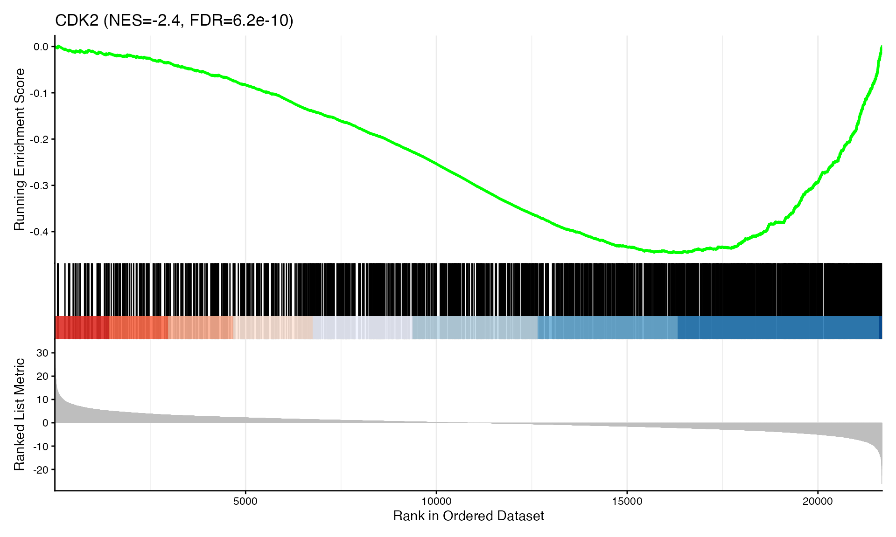

##### CDK3


##### TBK1

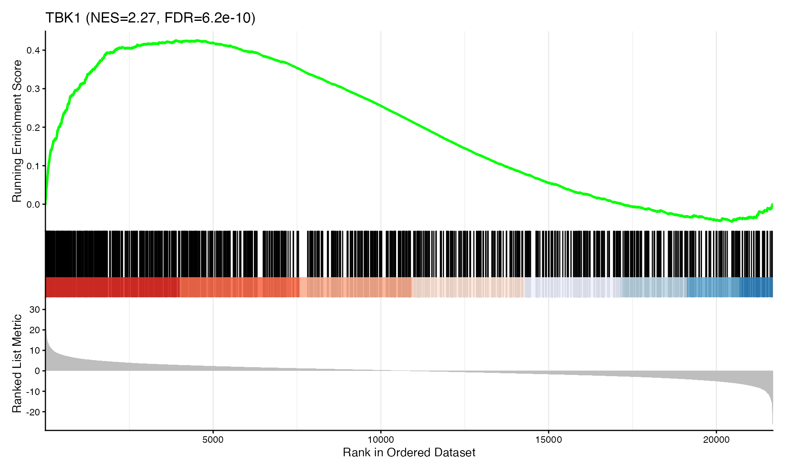

#### KO_vs_WT_at_Early

##### CDK2

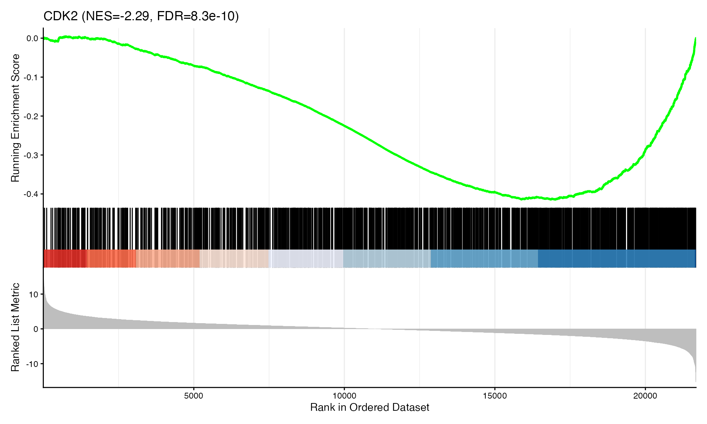

##### CDK3


##### CDK1

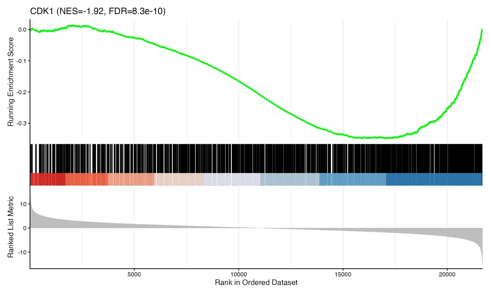

#### KO_vs_WT_at_Late

##### CDK2

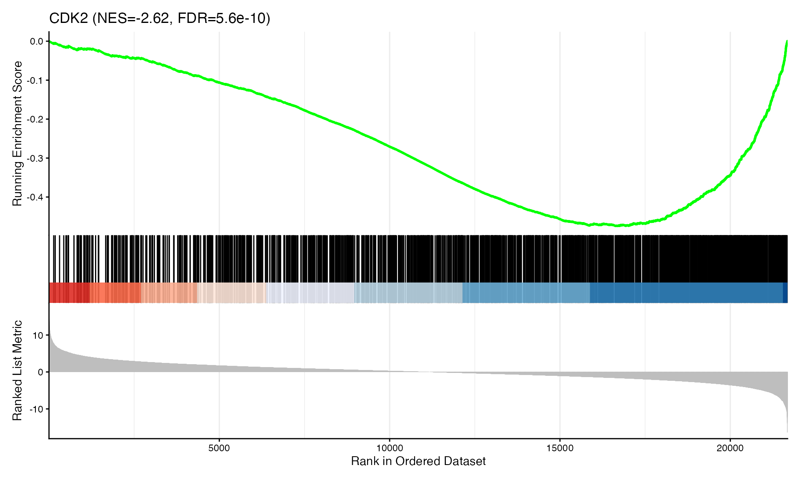

##### CDK3


##### CDK1

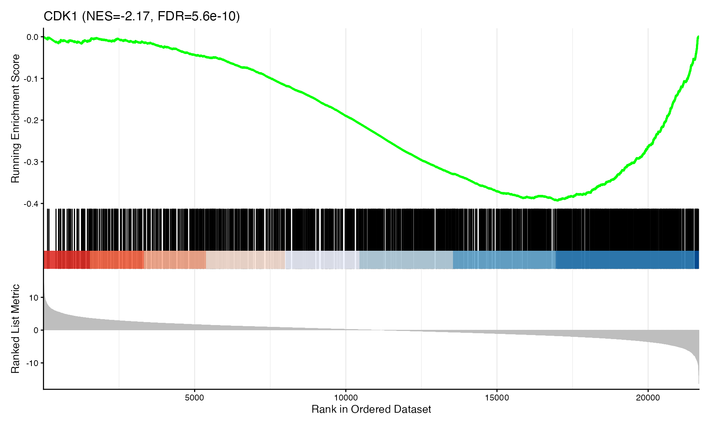

#### KO_vs_WT_at_Uninfect

##### TBK1

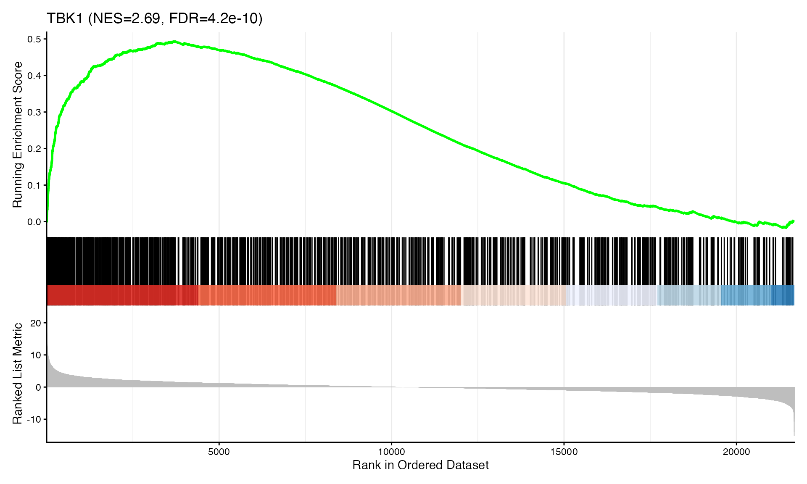

##### YSK4

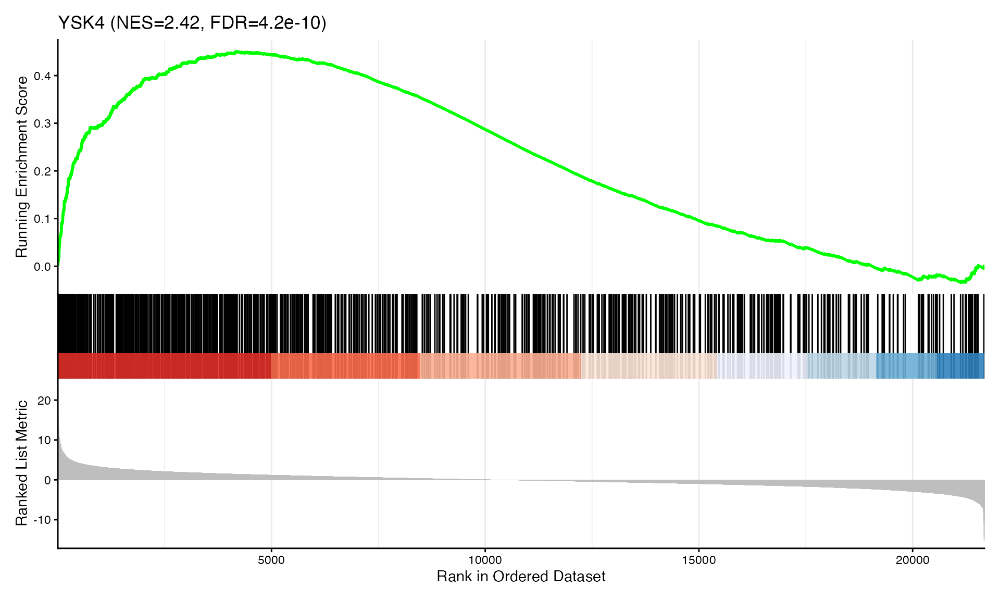

##### IKKA

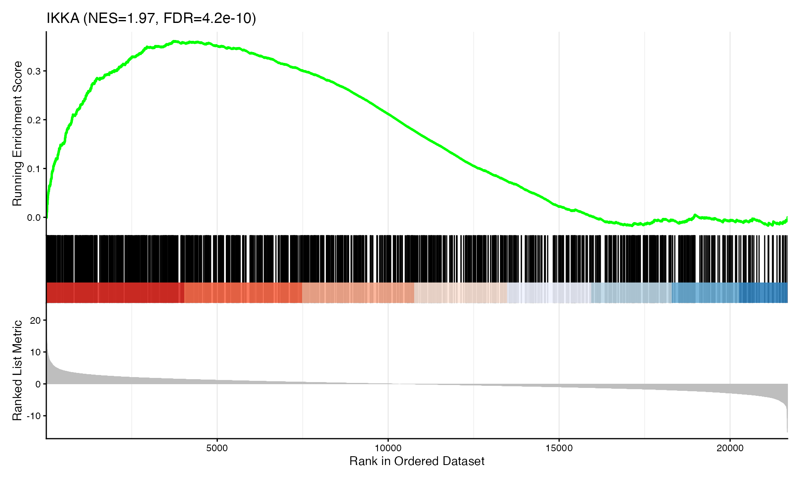

## All Results

``` r

# All kinases across all contrasts
all_results_dt <- names(gsea_results) |>
  map_dfr(function(ct) {
    gsea_results[[ct]]@result |>
      as_tibble() |>
      mutate(contrast = ct) |>
      select(contrast, kinase = ID, NES, pvalue, FDR = p.adjust, setSize)
  }) |>
  arrange(contrast, FDR) |>
  mutate(across(where(is.numeric), ~round(.x, 4)))

DT::datatable(all_results_dt,
  filter = "top",
  extensions = 'Buttons',
  options = list(pageLength = 15, scrollX = TRUE,
                 dom = 'Bfrtip', buttons = c('copy', 'csv', 'excel')),
  caption = "All kinases across all contrasts")
```

## Export Results

``` r

dir.create(output_dir, recursive = TRUE, showWarnings = FALSE)

# Combine all results
all_results_export <- names(gsea_results) |>
  map_dfr(function(ct) {
    gsea_results[[ct]]@result |>
      as_tibble() |>
      mutate(contrast = ct) |>
      select(contrast, kinase = ID, NES, pvalue, FDR = p.adjust, setSize)
  })

# Export to Excel
export_list <- list(
  all_results = all_results_export |> arrange(contrast, FDR),
  significant = all_results_export |> filter(FDR < 0.1) |> arrange(contrast, FDR),
  summary = gsea_info
)

xlsx_file <- file.path(output_dir, paste0("KinaseLib_GSEA_", params$analysis_type, ".xlsx"))
writexl::write_xlsx(export_list, xlsx_file)
cat("Exported Excel:", xlsx_file, "\n")

# Export RDS with full clusterProfiler result objects
rds_file <- file.path(output_dir, paste0("KinaseLib_GSEA_", params$analysis_type, ".rds"))
saveRDS(gsea_results, rds_file)
cat("Exported RDS:", rds_file, "\n")
```

``` r

message("Vignette mode: File export skipped.")
```

### Session Info

``` r

sessionInfo()
```

    ## R version 4.5.2 (2025-10-31)
    ## Platform: aarch64-apple-darwin20
    ## Running under: macOS Tahoe 26.3
    ## 
    ## Matrix products: default
    ## BLAS:   /System/Library/Frameworks/Accelerate.framework/Versions/A/Frameworks/vecLib.framework/Versions/A/libBLAS.dylib 
    ## LAPACK: /Library/Frameworks/R.framework/Versions/4.5-arm64/Resources/lib/libRlapack.dylib;  LAPACK version 3.12.1
    ## 
    ## locale:
    ## [1] en_US.UTF-8/en_US.UTF-8/en_US.UTF-8/C/en_US.UTF-8/en_US.UTF-8
    ## 
    ## time zone: Europe/Zurich
    ## tzcode source: internal
    ## 
    ## attached base packages:
    ## [1] stats     graphics  grDevices utils     datasets  methods   base     
    ## 
    ## other attached packages:
    ##  [1] prophosqua_0.3.0       DT_0.34.0              patchwork_1.3.2       
    ##  [4] writexl_1.5.4          forcats_1.0.1          purrr_1.2.1           
    ##  [7] enrichplot_1.30.3      ggplot2_4.0.2          readxl_1.4.5          
    ## [10] tidyr_1.3.2            dplyr_1.2.0            clusterProfiler_4.18.1
    ## 
    ## loaded via a namespace (and not attached):
    ##   [1] DBI_1.2.3               gson_0.1.0              rlang_1.1.7            
    ##   [4] magrittr_2.0.4          DOSE_4.4.0              otel_0.2.0             
    ##   [7] compiler_4.5.2          RSQLite_2.4.5           png_0.1-8              
    ##  [10] systemfonts_1.3.1       vctrs_0.7.1             reshape2_1.4.5         
    ##  [13] stringr_1.6.0           pkgconfig_2.0.3         crayon_1.5.3           
    ##  [16] fastmap_1.2.0           XVector_0.50.0          labeling_0.4.3         
    ##  [19] rmarkdown_2.30          ragg_1.5.0              bit_4.6.0              
    ##  [22] xfun_0.55               ggseqlogo_0.2.2         cachem_1.1.0           
    ##  [25] aplot_0.2.9             jsonlite_2.0.0          blob_1.2.4             
    ##  [28] BiocParallel_1.44.0     parallel_4.5.2          R6_2.6.1               
    ##  [31] bslib_0.9.0             stringi_1.8.7           RColorBrewer_1.1-3     
    ##  [34] cellranger_1.1.0        jquerylib_0.1.4         GOSemSim_2.36.0        
    ##  [37] Rcpp_1.1.1              Seqinfo_1.0.0           bookdown_0.46          
    ##  [40] knitr_1.51              ggtangle_0.0.9          R.utils_2.13.0         
    ##  [43] IRanges_2.44.0          Matrix_1.7-4            splines_4.5.2          
    ##  [46] igraph_2.2.1            tidyselect_1.2.1        qvalue_2.42.0          
    ##  [49] yaml_2.3.12             codetools_0.2-20        lattice_0.22-7         
    ##  [52] tibble_3.3.1            plyr_1.8.9              withr_3.0.2            
    ##  [55] treeio_1.34.0           Biobase_2.70.0          KEGGREST_1.50.0        
    ##  [58] S7_0.2.1                evaluate_1.0.5          gridGraphics_0.5-1     
    ##  [61] desc_1.4.3              Biostrings_2.78.0       pillar_1.11.1          
    ##  [64] ggtree_4.0.1            stats4_4.5.2            ggfun_0.2.0            
    ##  [67] generics_0.1.4          S4Vectors_0.48.0        scales_1.4.0           
    ##  [70] tidytree_0.4.6          glue_1.8.0              gdtools_0.4.4          
    ##  [73] lazyeval_0.2.2          tools_4.5.2             data.table_1.18.0      
    ##  [76] fgsea_1.36.0            ggiraph_0.9.2           fs_1.6.6               
    ##  [79] fastmatch_1.1-6         cowplot_1.2.0           grid_4.5.2             
    ##  [82] ape_5.8-1               crosstalk_1.2.2         AnnotationDbi_1.72.0   
    ##  [85] nlme_3.1-168            cli_3.6.5               rappdirs_0.3.3         
    ##  [88] textshaping_1.0.4       fontBitstreamVera_0.1.1 gtable_0.3.6           
    ##  [91] R.methodsS3_1.8.2       yulab.utils_0.2.2       fontquiver_0.2.1       
    ##  [94] sass_0.4.10             digest_0.6.39           BiocGenerics_0.56.0    
    ##  [97] ggrepel_0.9.6           ggplotify_0.1.3         htmlwidgets_1.6.4      
    ## [100] farver_2.1.2            memoise_2.0.1           htmltools_0.5.9        
    ## [103] pkgdown_2.2.0           R.oo_1.27.1             lifecycle_1.0.5        
    ## [106] httr_1.4.7              GO.db_3.22.0            fontLiberation_0.1.0   
    ## [109] bit64_4.6.0-1
