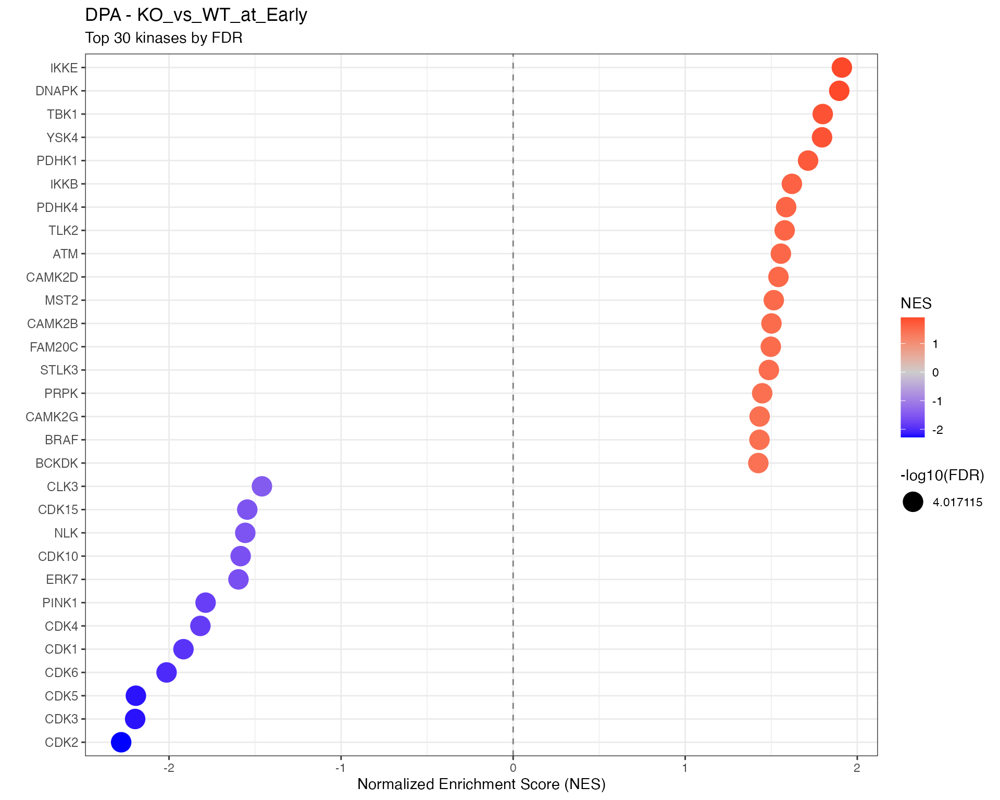
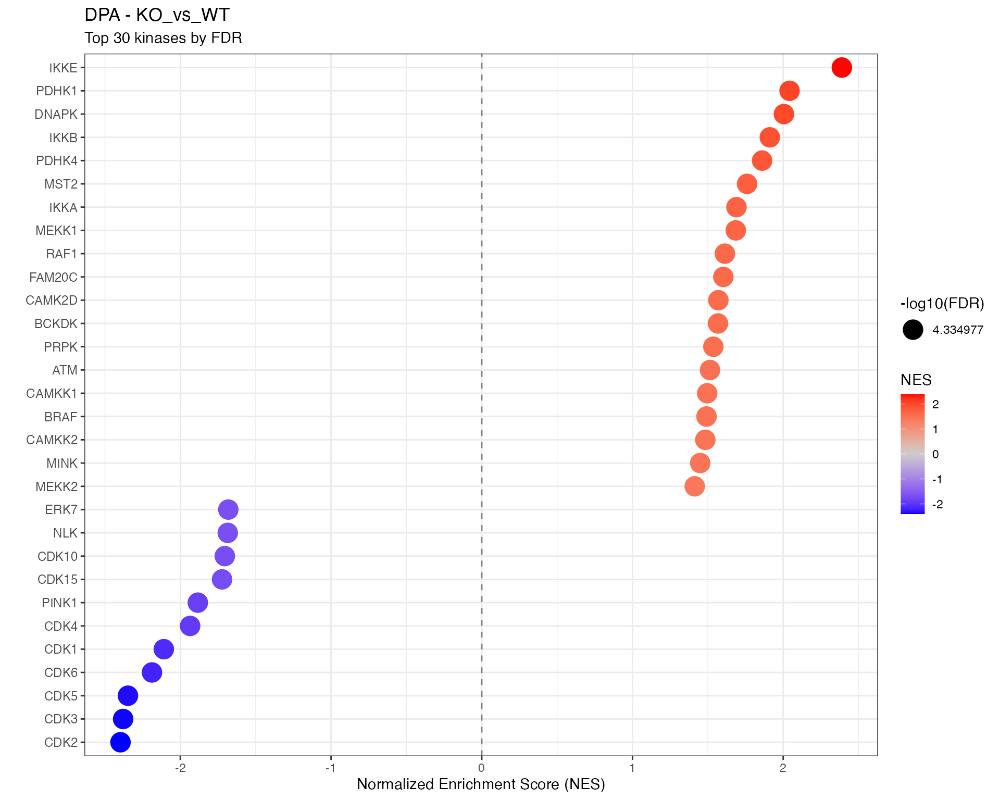
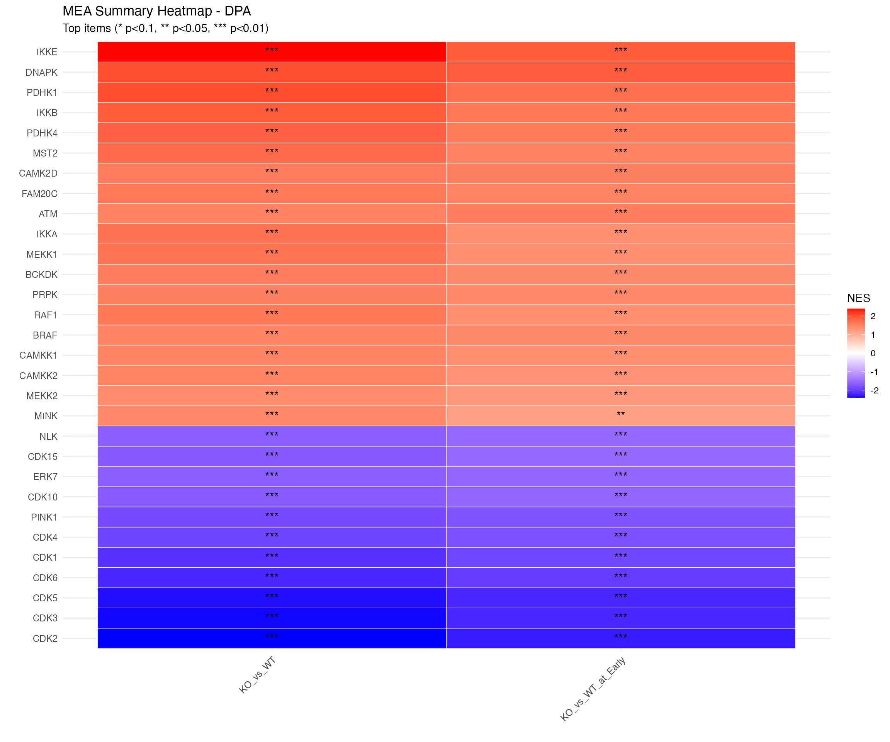
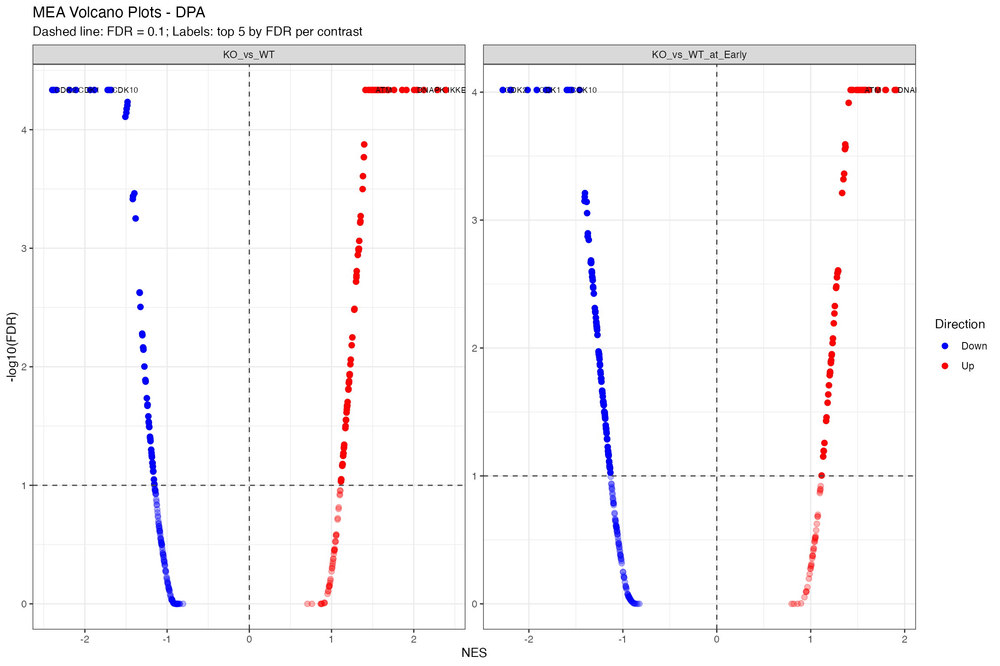

# Kinase Activity (Kinase Library + MEA)

## Overview

**Motif Enrichment Analysis (MEA)** results for **DPA** analysis using
the kinase-library package.

MEA identifies kinases whose known substrate motifs are enriched at the
extremes of ranked phosphoproteomics data, indicating altered kinase
activity.

## Load MEA Results

``` r

if (pipeline_mode) {
  # Pipeline mode: load from kinaselib directory
  mea_files <- list.files(params$kinaselib_dir, pattern = "^mea_.*\\.csv$", full.names = TRUE)

  if (length(mea_files) == 0) {
    stop("No MEA result files found in: ", params$kinaselib_dir)
  }

  # Load all MEA results
  mea_results <- mea_files |>
    set_names(gsub("^mea_|\\.csv$", "", basename(mea_files))) |>
    map_dfr(~ read.csv(.x, stringsAsFactors = FALSE), .id = "contrast")

  output_dir <- params$kinaselib_dir
} else {
  # Vignette mode: use bundled example data
  bundled_zip <- system.file("extdata", "mea_results.zip", package = "prophosqua")

  if (!file.exists(bundled_zip)) {
    stop("Bundled MEA example data not found. Run in pipeline mode with actual data.")
  }

  temp_dir <- tempdir()
  unzip(bundled_zip, exdir = temp_dir)
  mea_files <- list.files(temp_dir, pattern = "^mea_.*\\.csv$", full.names = TRUE)

  mea_results <- mea_files |>
    set_names(gsub("^mea_|\\.csv$", "", basename(mea_files))) |>
    map_dfr(~ read.csv(.x, stringsAsFactors = FALSE), .id = "contrast")

  output_dir <- tempdir()
  message("Using bundled MEA example data from prophosqua package")
}

# Standardize column names (MEA output uses Kinase, we need kinase)
if ("Kinase" %in% names(mea_results)) {
  mea_results <- mea_results |> rename(kinase = Kinase)
}
if ("p.value" %in% names(mea_results)) {
  mea_results <- mea_results |> rename(pvalue = `p.value`)
} else if ("p-value" %in% names(mea_results)) {
  mea_results <- mea_results |> rename(pvalue = `p-value`)
}
# Rename size column if present
if ("Subs.fraction" %in% names(mea_results)) {
  mea_results <- mea_results |> mutate(size = as.numeric(sub("/.*", "", `Subs.fraction`)))
} else if ("Subs fraction" %in% names(mea_results)) {
  mea_results <- mea_results |> mutate(size = as.numeric(sub("/.*", "", `Subs fraction`)))
}

cat("Loaded", nrow(mea_results), "results from", length(mea_files), "contrasts\n")
```

    ## Loaded 622 results from 2 contrasts

``` r

cat("Contrasts:", paste(unique(mea_results$contrast), collapse = ", "), "\n")
```

    ## Contrasts: KO_vs_WT_at_Early, KO_vs_WT

``` r

# Clean and prepare results using shared helper
mea_clean <- prepare_enrichment_data(mea_results, "FDR", 0.1)

# Summary
summary_df <- mea_clean |>
  group_by(contrast) |>
  summarize(
    total_kinases = n(),
    sig_up = sum(FDR < 0.1 & NES > 0, na.rm = TRUE),
    sig_down = sum(FDR < 0.1 & NES < 0, na.rm = TRUE),
    .groups = "drop"
  )

knitr::kable(summary_df, caption = paste("MEA Summary -", params$analysis_type))
```

| contrast          | total_kinases | sig_up | sig_down |
|:------------------|--------------:|-------:|---------:|
| KO_vs_WT          |           311 |     79 |       58 |
| KO_vs_WT_at_Early |           311 |     55 |      118 |

MEA Summary - DPA {.table}

## Results by Contrast

``` r

for (ctr in unique(mea_clean$contrast)) {
  cat("\n\n## ", ctr, "\n\n")

  ctr_data <- mea_clean |> filter(contrast == ctr)
  n_sig <- sum(ctr_data$FDR < 0.1, na.rm = TRUE)
  cat("**Significant kinases (FDR < 0.1):** ", n_sig, "\n\n")

  # Top kinases dotplot using shared function
  p <- plot_enrichment_dotplot(
    ctr_data,
    item_col = "kinase",
    fdr_col = "FDR",
    title = paste0(params$analysis_type, " - ", ctr),
    subtitle = "Top 30 kinases by FDR"
  )
  print(p)
  cat("\n\n")

  # Significant kinases table
  cat("### Significant Kinases\n\n")
  sig_table <- ctr_data |>
    filter(FDR < 0.1) |>
    select(kinase, NES, pvalue, FDR, n_substrates = size) |>
    arrange(FDR) |>
    mutate(across(where(is.numeric), ~round(.x, 4)))
  print(htmltools::tagList(
    DT::datatable(sig_table,
                  extensions = 'Buttons',
                  options = list(pageLength = 15, scrollX = TRUE,
                                 dom = 'Bfrtip', buttons = c('copy', 'csv', 'excel')))
  ))
  cat("\n\n")
}
```

### KO_vs_WT_at_Early

**Significant kinases (FDR \< 0.1):** 173



#### Significant Kinases

### KO_vs_WT

**Significant kinases (FDR \< 0.1):** 137



#### Significant Kinases

## Summary Heatmap

``` r

# Using shared heatmap function
plot_enrichment_heatmap(
  mea_clean,
  item_col = "kinase",
  fdr_col = "FDR",
  n_top = 30,
  title = paste0("MEA Summary Heatmap - ", params$analysis_type)
)
```



## Volcano Plot

``` r

# Using shared volcano function
plot_enrichment_volcano(
  mea_clean,
  item_col = "kinase",
  fdr_col = "FDR",
  title = paste0("MEA Volcano Plots - ", params$analysis_type)
)
```



## Diagnostics

``` r

pval_diag <- mea_clean |>
  group_by(contrast) |>
  summarise(
    `Min p-value` = signif(min(pvalue, na.rm = TRUE), 3),
    `p < 0.05` = sum(pvalue < 0.05, na.rm = TRUE),
    `p < 0.01` = sum(pvalue < 0.01, na.rm = TRUE),
    Total = n(),
    .groups = "drop"
  ) |>
  rename(Contrast = contrast)
knitr::kable(pval_diag, caption = paste("Raw p-value Distribution -", params$analysis_type))
```

| Contrast          | Min p-value | p \< 0.05 | p \< 0.01 | Total |
|:------------------|------------:|----------:|----------:|------:|
| KO_vs_WT          |       0.001 |       145 |       102 |   311 |
| KO_vs_WT_at_Early |       0.001 |       174 |       123 |   311 |

Raw p-value Distribution - DPA {.table}

## All Results

``` r

# All kinases across all contrasts
all_results_dt <- mea_clean |>
  select(contrast, kinase, NES, pvalue, FDR, size) |>
  arrange(contrast, FDR) |>
  mutate(across(where(is.numeric), ~round(.x, 4)))

DT::datatable(all_results_dt,
  filter = "top",
  extensions = 'Buttons',
  options = list(pageLength = 15, scrollX = TRUE,
                 dom = 'Bfrtip', buttons = c('copy', 'csv', 'excel')),
  caption = "All kinases across all contrasts")
```

## Export Results

``` r

# Export to Excel
export_list <- list(
  all_results = mea_clean |>
    select(contrast, kinase, NES, pvalue, FDR, size) |>
    arrange(contrast, FDR),
  significant = mea_clean |>
    filter(FDR < 0.1) |>
    select(contrast, kinase, NES, pvalue, FDR, size) |>
    arrange(contrast, FDR),
  summary = summary_df
)

xlsx_file <- file.path(output_dir, paste0("MEA_", params$analysis_type, "_results.xlsx"))
writexl::write_xlsx(export_list, xlsx_file)

rds_file <- file.path(output_dir, paste0("MEA_", params$analysis_type, "_results.rds"))
saveRDS(mea_clean, rds_file)

cat("Exported:\n -", xlsx_file, "\n -", rds_file, "\n")
```

``` r

message("Vignette mode: File export skipped.")
```

## Session Info

``` r

sessionInfo()
```

    ## R version 4.5.2 (2025-10-31)
    ## Platform: aarch64-apple-darwin20
    ## Running under: macOS Tahoe 26.3
    ## 
    ## Matrix products: default
    ## BLAS:   /System/Library/Frameworks/Accelerate.framework/Versions/A/Frameworks/vecLib.framework/Versions/A/libBLAS.dylib 
    ## LAPACK: /Library/Frameworks/R.framework/Versions/4.5-arm64/Resources/lib/libRlapack.dylib;  LAPACK version 3.12.1
    ## 
    ## locale:
    ## [1] en_US.UTF-8/en_US.UTF-8/en_US.UTF-8/C/en_US.UTF-8/en_US.UTF-8
    ## 
    ## time zone: Europe/Zurich
    ## tzcode source: internal
    ## 
    ## attached base packages:
    ## [1] stats     graphics  grDevices utils     datasets  methods   base     
    ## 
    ## other attached packages:
    ## [1] prophosqua_0.3.0 writexl_1.5.4    forcats_1.0.1    purrr_1.2.1     
    ## [5] ggplot2_4.0.2    tidyr_1.3.2      DT_0.34.0        dplyr_1.2.0     
    ## 
    ## loaded via a namespace (and not attached):
    ##  [1] gtable_0.3.6       jsonlite_2.0.0     compiler_4.5.2     tidyselect_1.2.1  
    ##  [5] jquerylib_0.1.4    systemfonts_1.3.1  scales_1.4.0       textshaping_1.0.4 
    ##  [9] yaml_2.3.12        fastmap_1.2.0      R6_2.6.1           labeling_0.4.3    
    ## [13] patchwork_1.3.2    generics_0.1.4     knitr_1.51         htmlwidgets_1.6.4 
    ## [17] tibble_3.3.1       bookdown_0.46      desc_1.4.3         RColorBrewer_1.1-3
    ## [21] bslib_0.9.0        pillar_1.11.1      rlang_1.1.7        cachem_1.1.0      
    ## [25] xfun_0.55          S7_0.2.1           fs_1.6.6           sass_0.4.10       
    ## [29] otel_0.2.0         cli_3.6.5          withr_3.0.2        pkgdown_2.2.0     
    ## [33] magrittr_2.0.4     crosstalk_1.2.2    digest_0.6.39      grid_4.5.2        
    ## [37] lifecycle_1.0.5    vctrs_0.7.1        evaluate_1.0.5     glue_1.8.0        
    ## [41] farver_2.1.2       ggseqlogo_0.2.2    ragg_1.5.0         rmarkdown_2.30    
    ## [45] tools_4.5.2        pkgconfig_2.0.3    htmltools_0.5.9
