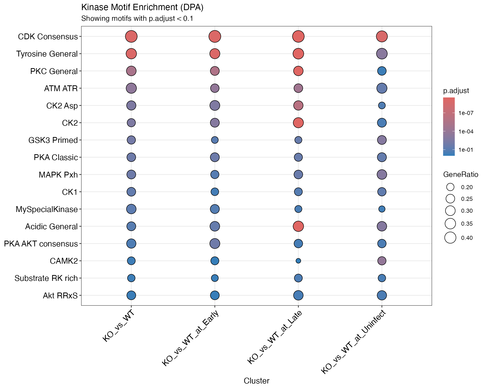
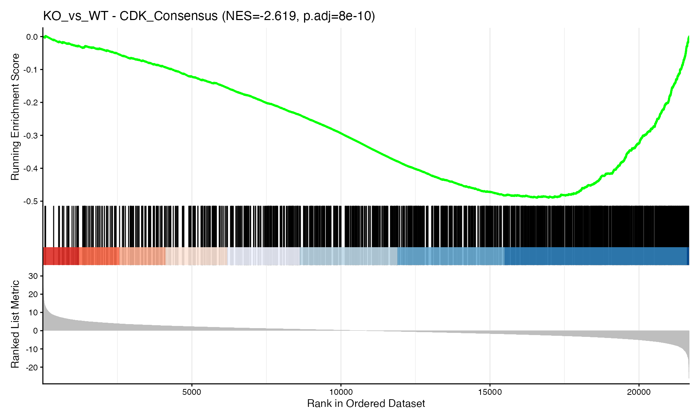

# Motif-Based Enrichment Analysis: Kinase Activity Inference

## Introduction

While PTM-SEA relies on curated databases like PTMsigDB, many
phosphosites do not map to known substrates. Motif-based analysis
provides a complementary approach by scanning the *sequence context* of
observed phosphosites for known kinase consensus motifs (e.g., matching
the `R-x-x-S/T` pattern for Basophilic kinases).

This vignette demonstrates how to: 1. Load a database of kinase regex
motifs. 2. Scan your phosphoproteomics sequence windows for matches. 3.
Perform GSEA to identify enriched kinase motifs in your contrasts.

## Load Data

``` r

library(prophosqua)
library(clusterProfiler)
library(dplyr)
library(enrichplot)
library(fgsea)
library(purrr)

# Load example data (same as PTM-SEA vignette)
example_path <- here::here("data", "combined_test_diff_example.rds")
example_data <- readRDS(example_path)

data_info <- tibble(
  Property = c("Rows", "Columns", "Contrasts"),
  Value = c(nrow(example_data), ncol(example_data),
            paste(unique(example_data$contrast), collapse = ", "))
)
knitr::kable(data_info, caption = "Example Data")
```

| Property | Value |
|:---|:---|
| Rows | 105824 |
| Columns | 56 |
| Contrasts | KO_vs_WT, KO_vs_WT_at_Early, KO_vs_WT_at_Late, KO_vs_WT_at_Uninfect |

Example Data {.table}

## Load and Define Motifs

We use
[`get_kinase_motifs()`](https://prolfqua.github.io/prophosqua/reference/get_kinase_motifs.md)
to retrieve a default set of consensus patterns (e.g., from
literature/Scansite/ELM). You can also add your own.

``` r

# Load kinase motifs (internal database + optional user extensions)
motif_db <- get_kinase_motifs()

# Example of adding a custom motif
my_motif <- data.frame(
  kinase_group = "Custom",
  motif_name = "MySpecialKinase",
  pattern = "R..S..[DE]",
  description = "Custom motif",
  stringsAsFactors = FALSE
)
motif_db <- get_kinase_motifs(extra_motifs = my_motif)

knitr::kable(head(motif_db), caption = paste("Kinase Motifs (", nrow(motif_db), "total)"))
```

| kinase_group | motif_name | pattern | description |
|:---|:---|:---|:---|
| Basophilic | PKA_AKT_consensus | R.R..\[ST\]….. | R-x-R-x-x-S/T (PKA, AKT, etc. - strong basophilic) |
| Basophilic | PKA_Classic | R.\[ST\].. | R-x-S/T (PKA classic) |
| Basophilic | PKC_General | ..\[ST\].\[RK\] | S/T-x-R/K (PKC general) |
| Basophilic | Akt_RRxS | RR.\[ST\]… | R-R-x-S/T (Akt preference) |
| Basophilic | CAMK2 | R..\[ST\]… | R-x-x-S/T (CaMKII) |
| Basophilic | Substrate_RK_rich | \[RK\]\[RK\].\[ST\]… | Basic residues upstream (R/K-R/K-x-S/T) |

Kinase Motifs ( 17 total) {.table}

## Motif Scanning

Instead of relying on exact PTMsigDB matches (which often have low
overlap), we scan our *observed* sequence windows for these kinase
motifs.

``` r

# Get unique sequences from our data
# Ensure we use 15-mers if possible, or whatever length is appropriate.
# Default scanning assumes the central residue (pos 8) is the phosphosite.
our_sequences <- unique(toupper(trimws(example_data$SequenceWindow)))

# Scan for motifs
# center_pos = 8 ensures we only count matches where the motif overlaps the actual phosphosite
motif_matches <- scan_motifs(our_sequences, motif_db = motif_db, center_pos = 8)

scan_info <- tibble(
  Metric = c("Total matches", "Unique sites"),
  Value = c(nrow(motif_matches), length(unique(motif_matches$gene)))
)
knitr::kable(scan_info, caption = "Scanning Results")
```

| Metric        | Value |
|:--------------|------:|
| Total matches | 30454 |
| Unique sites  | 16761 |

Scanning Results {.table}

``` r

# Top motifs
top_motifs <- motif_matches |>
  count(term, name = "Count") |>
  arrange(desc(Count)) |>
  head(10) |>
  rename(Motif = term)
knitr::kable(top_motifs, caption = "Top 10 Motifs by Match Count")
```

| Motif           | Count |
|:----------------|------:|
| Proline_General |  6762 |
| GSK3_Primed     |  3370 |
| CAMK2           |  3250 |
| CK1             |  2580 |
| PKA_Classic     |  2094 |
| CK2             |  2073 |
| PKC_General     |  1633 |
| CDK_Consensus   |  1327 |
| MAPK_Pxh        |  1300 |
| CK2_Asp         |  1266 |

Top 10 Motifs by Match Count {.table}

The result `motif_matches` matches the `TERM2GENE` format required by
`clusterProfiler`: - `term`: The motif/kinase name. - `gene`: The site
ID (Sequence + “-p”).

## Prepare Data (DPA/DPU)

We prepare the data ranking just like in standard PTM-SEA.

``` r

# Prepare DPA data (Differential PTM Abundance)
prep_dpa <- ptmsea_data_prep(
  data = example_data,
  stat_column = "statistic.site",
  seq_window_col = "SequenceWindow",
  contrast_col = "contrast",
  trim_to = "15"
)

# Prepare DPU data (Differential PTM Usage - protein normalized)
prep_dpu <- ptmsea_data_prep(
  data = example_data,
  stat_column = "tstatistic_I",
  seq_window_col = "SequenceWindow",
  contrast_col = "contrast",
  trim_to = "15"
)

print(names(prep_dpu))
```

    ## [1] "ranks"   "dropped"

## Run Motif GSEA

We use `run_motif_gsea` to perform enrichment analysis.

``` r

# Run GSEA using the scanned motif sets
results_motif_dpa <- run_motif_gsea(
  ranks_list = prep_dpa$ranks,
  motif_term2gene = motif_matches, # generated by scan_motifs
  pvalueCutoff = 1.0, # Return ALL results for visualization
  min_size = 3,
  max_size = 5000 # Allow large motif sets (critical!)
)

gsea_summary <- names(results_motif_dpa) |>
  map_dfr(function(name) {
    res <- results_motif_dpa[[name]]
    if (!is.null(res)) {
      tibble(
        Contrast = name,
        `Significant (p < 0.1)` = sum(res@result$p.adjust < 0.1)
      )
    }
  })
knitr::kable(gsea_summary, caption = "Significant Motif Sets (DPA)")
```

| Contrast             | Significant (p \< 0.1) |
|:---------------------|-----------------------:|
| KO_vs_WT             |                     11 |
| KO_vs_WT_at_Early    |                     10 |
| KO_vs_WT_at_Late     |                     10 |
| KO_vs_WT_at_Uninfect |                      9 |

Significant Motif Sets (DPA) {.table}

## Visualize Results

### Dotplot of Significant Motifs

``` r

# Define significance threshold
sig_threshold <- 0.1

if (length(results_motif_dpa) > 0) {
  # Filter out null results
  valid_res <- results_motif_dpa[!sapply(results_motif_dpa, is.null)]

  if (length(valid_res) > 0) {
    # Merge results across contrasts
    merged_res <- merge_result(valid_res)

    # Check if there are any significant results
    has_significant <- any(merged_res@compareClusterResult$p.adjust < sig_threshold)

    if (has_significant) {
      # Dotplot showing significant motifs
      p <- enrichplot::dotplot(merged_res, showCategory = 15) +
        ggplot2::labs(title = "Kinase Motif Enrichment (DPA)",
                      subtitle = paste("Showing motifs with p.adjust <", sig_threshold)) +
        ggplot2::theme(axis.text.x = ggplot2::element_text(angle = 45, hjust = 1))
      print(p)
    }
  }
}
```



### GSEA Plot (Example)

``` r

# Show single example for illustration (gseaplot2 objects don't combine well)
contrast_name <- names(results_motif_dpa)[1]
res <- results_motif_dpa[[contrast_name]]

if (!is.null(res) && nrow(res@result) > 0) {
  top_motif <- res@result |>
    as_tibble() |>
    arrange(pvalue) |>
    slice(1)

  nes <- round(top_motif$NES, 3)
  padj <- signif(top_motif$p.adjust, 3)

  enrichplot::gseaplot2(
    res,
    geneSetID = top_motif$ID,
    title = paste0(contrast_name, " - ", top_motif$ID,
                   " (NES=", nes, ", p.adj=", padj, ")")
  )
}
```



## Session Info

``` r

sessionInfo()
```

    ## R version 4.5.2 (2025-10-31)
    ## Platform: aarch64-apple-darwin20
    ## Running under: macOS Tahoe 26.1
    ## 
    ## Matrix products: default
    ## BLAS:   /System/Library/Frameworks/Accelerate.framework/Versions/A/Frameworks/vecLib.framework/Versions/A/libBLAS.dylib 
    ## LAPACK: /Library/Frameworks/R.framework/Versions/4.5-arm64/Resources/lib/libRlapack.dylib;  LAPACK version 3.12.1
    ## 
    ## locale:
    ## [1] en_US.UTF-8/en_US.UTF-8/en_US.UTF-8/C/en_US.UTF-8/en_US.UTF-8
    ## 
    ## time zone: Europe/Zurich
    ## tzcode source: internal
    ## 
    ## attached base packages:
    ## [1] stats     graphics  grDevices utils     datasets  methods   base     
    ## 
    ## other attached packages:
    ## [1] purrr_1.2.0            fgsea_1.36.0           enrichplot_1.30.3     
    ## [4] dplyr_1.1.4            clusterProfiler_4.18.1 prophosqua_0.2.0      
    ## 
    ## loaded via a namespace (and not attached):
    ##   [1] DBI_1.2.3               gson_0.1.0              rlang_1.1.6            
    ##   [4] magrittr_2.0.4          DOSE_4.4.0              compiler_4.5.2         
    ##   [7] RSQLite_2.4.5           png_0.1-8               systemfonts_1.3.1      
    ##  [10] vctrs_0.6.5             reshape2_1.4.5          stringr_1.6.0          
    ##  [13] pkgconfig_2.0.3         crayon_1.5.3            fastmap_1.2.0          
    ##  [16] XVector_0.50.0          labeling_0.4.3          rmarkdown_2.30         
    ##  [19] ragg_1.5.0              bit_4.6.0               xfun_0.54              
    ##  [22] ggseqlogo_0.2           cachem_1.1.0            aplot_0.2.9            
    ##  [25] jsonlite_2.0.0          blob_1.2.4              BiocParallel_1.44.0    
    ##  [28] parallel_4.5.2          R6_2.6.1                bslib_0.9.0            
    ##  [31] stringi_1.8.7           RColorBrewer_1.1-3      jquerylib_0.1.4        
    ##  [34] GOSemSim_2.36.0         Rcpp_1.1.0              Seqinfo_1.0.0          
    ##  [37] bookdown_0.46           knitr_1.50              ggtangle_0.0.9         
    ##  [40] R.utils_2.13.0          IRanges_2.44.0          Matrix_1.7-4           
    ##  [43] splines_4.5.2           igraph_2.2.1            tidyselect_1.2.1       
    ##  [46] qvalue_2.42.0           yaml_2.3.11             codetools_0.2-20       
    ##  [49] lattice_0.22-7          tibble_3.3.0            plyr_1.8.9             
    ##  [52] withr_3.0.2             Biobase_2.70.0          treeio_1.34.0          
    ##  [55] KEGGREST_1.50.0         S7_0.2.1                evaluate_1.0.5         
    ##  [58] gridGraphics_0.5-1      desc_1.4.3              Biostrings_2.78.0      
    ##  [61] pillar_1.11.1           ggtree_4.0.1            stats4_4.5.2           
    ##  [64] ggfun_0.2.0             generics_0.1.4          rprojroot_2.1.1        
    ##  [67] S4Vectors_0.48.0        ggplot2_4.0.1           scales_1.4.0           
    ##  [70] tidytree_0.4.6          glue_1.8.0              gdtools_0.4.4          
    ##  [73] lazyeval_0.2.2          tools_4.5.2             data.table_1.17.8      
    ##  [76] ggiraph_0.9.2           fs_1.6.6                fastmatch_1.1-6        
    ##  [79] cowplot_1.2.0           grid_4.5.2              tidyr_1.3.1            
    ##  [82] ape_5.8-1               AnnotationDbi_1.72.0    nlme_3.1-168           
    ##  [85] patchwork_1.3.2         cli_3.6.5               rappdirs_0.3.3         
    ##  [88] textshaping_1.0.4       fontBitstreamVera_0.1.1 gtable_0.3.6           
    ##  [91] R.methodsS3_1.8.2       yulab.utils_0.2.2       sass_0.4.10            
    ##  [94] digest_0.6.39           fontquiver_0.2.1        BiocGenerics_0.56.0    
    ##  [97] ggrepel_0.9.6           ggplotify_0.1.3         htmlwidgets_1.6.4      
    ## [100] farver_2.1.2            memoise_2.0.1           htmltools_0.5.9        
    ## [103] pkgdown_2.2.0           R.oo_1.27.1             lifecycle_1.0.4        
    ## [106] here_1.0.2              httr_1.4.7              GO.db_3.22.0           
    ## [109] fontLiberation_0.1.0    bit64_4.6.0-1
