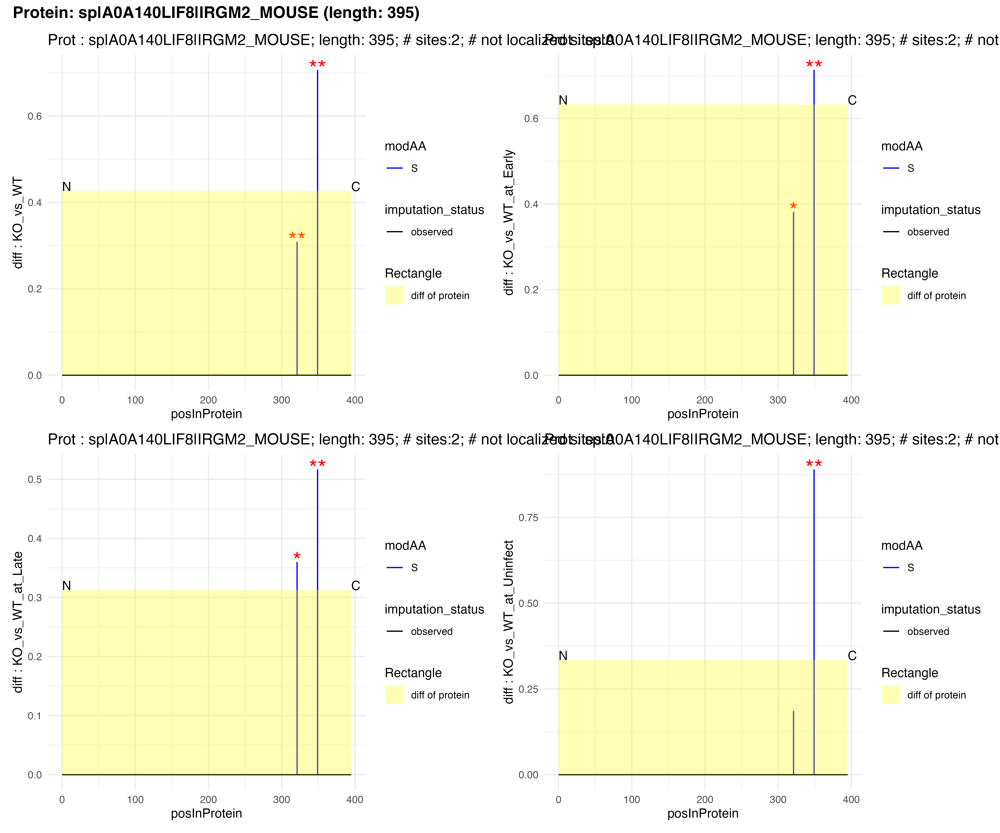

# PTM Analysis - N-to-C Plots

## Introduction

This document generates N-to-C plots for **DPA** analysis.

``` r

desc <- switch(params$analysis_type,
  "dpa" = "**DPA (Differential PTM Abundance)**: Raw PTM signal changes without protein abundance correction. Shows both site-level and protein-level fold changes.",
  "dpu" = "**DPU (Differential PTM Usage)**: Protein-normalized PTM changes (model-first approach). Reflects genuine modification stoichiometry changes.",
  "cf" = "**CF (CorrectFirst)**: Alternative protein-correction approach where abundances are normalized before statistical modeling."
)
cat(desc)
```

**DPA (Differential PTM Abundance)**: Raw PTM signal changes without
protein abundance correction. Shows both site-level and protein-level
fold changes.

## Data Loading

``` r

if (pipeline_mode) {
  message("Loading data from: ", params$xlsx_file, " (sheet: ", params$sheet, ")")
  data <- readxl::read_xlsx(params$xlsx_file, sheet = params$sheet)
  output_dir <- if (!is.null(params$output_dir)) params$output_dir else dirname(params$xlsx_file)
} else {
  # Vignette mode: use example data
  data("combined_test_diff_example", package = "prophosqua")
  data <- combined_test_diff_example
  output_dir <- tempdir()
  max_fig <- 5
  message("Using example data from prophosqua package")
}

data_info <- tibble(
  Property = c("Mode", "Sheet", "Analysis Type", "Rows", "Contrasts"),
  Value = c(
    if (pipeline_mode) basename(params$xlsx_file) else "Example data",
    params$sheet, toupper(params$analysis_type),
    nrow(data), paste(unique(data$contrast), collapse = ", ")
  )
)
knitr::kable(data_info, caption = "Data Summary")
```

| Property | Value |
|:---|:---|
| Mode | Example data |
| Sheet | DPA |
| Analysis Type | DPA |
| Rows | 105824 |
| Contrasts | KO_vs_WT, KO_vs_WT_at_Early, KO_vs_WT_at_Late, KO_vs_WT_at_Uninfect |

Data Summary {.table}

``` r

# Prepare data for plotting using shared function
plot_data <- prepare_ntoc_data(data, params$analysis_type)

all_contrasts <- unique(plot_data$contrast)
cat("Found", length(all_contrasts), "contrasts:", paste(all_contrasts, collapse = ", "), "\n")
```

    ## Found 4 contrasts: KO_vs_WT, KO_vs_WT_at_Early, KO_vs_WT_at_Late, KO_vs_WT_at_Uninfect

## Generate N-to-C Plots

**Filtering criteria:** Proteins are included if they contain at least
one PTM site with FDR \< 0.05 and \|log2 fold change\| \> 0.6.

``` r

if (params$analysis_type == "dpa") {
  # DPA: Use expression plotting (shows protein + site)
  plot_result <- n_to_c_expression_multicontrast(
    plot_data,
    FDR_threshold = params$fdr,
    fc_threshold = params$fc,
    max_plots = max_fig
  )
} else {
  # DPU/CF: Use usage plotting (shows site only)
  plot_result <- n_to_c_usage_multicontrast(
    plot_data,
    FDR_threshold = params$fdr,
    fc_threshold = params$fc,
    max_plots = max_fig
  )
}

n_plots <- nrow(plot_result)
stopifnot("No significant sites found. Adjust fdr/log2fc thresholds in config." = n_plots > 0)
cat("Generated", n_plots, "multi-contrast plots\n")
```

### Example Plots

Showing example plots in the HTML report: one protein WITH protein-level
data and one WITHOUT (if available).

``` r

if (n_plots > 0 && params$analysis_type == "dpa") {
  # For DPA: show examples of proteins with and without protein-level data
  # Find proteins with matched protein data (has diff.protein)
  matched_proteins <- plot_data |>
    dplyr::filter(!is.na(diff.protein)) |>
    dplyr::pull(protein_Id) |>
    unique()

  # Find proteins without matched protein data
  unmatched_proteins <- plot_data |>
    dplyr::filter(is.na(diff.protein)) |>
    dplyr::pull(protein_Id) |>
    unique()

  # Get indices in plot_result for each type
  matched_idx <- which(plot_result$protein_Id %in% matched_proteins)
  unmatched_idx <- which(plot_result$protein_Id %in% unmatched_proteins)

  examples_to_show <- c()

  # Add one matched protein if available
  if (length(matched_idx) > 0) {
    examples_to_show <- c(examples_to_show, matched_idx[1])
  }

  # Add one unmatched protein if available
  if (length(unmatched_idx) > 0) {
    examples_to_show <- c(examples_to_show, unmatched_idx[1])
  }

  # Fallback: if no examples found, use first 2
  if (length(examples_to_show) == 0) {
    examples_to_show <- seq_len(min(2, n_plots))
  }

  cat("\n\n**Note:** ", length(matched_idx), " proteins have protein-level data, ",
      length(unmatched_idx), " proteins do not.\n\n", sep = "")

  for (i in examples_to_show) {
    has_protein <- plot_result$protein_Id[i] %in% matched_proteins
    label <- if (has_protein) "(with protein data)" else "(NO protein data)"
    cat("\n\n### ", plot_result$protein_Id[i], " ", label, "\n\n", sep = "")
    print(plot_result$plot[[i]])
    cat("\n\n")
  }
} else if (n_plots > 0) {
  # DPU/CF: just show first 2
  n_examples <- min(2, n_plots)
  for (i in seq_len(n_examples)) {
    cat("\n\n### ", plot_result$protein_Id[i], "\n\n")
    print(plot_result$plot[[i]])
    cat("\n\n")
  }
} else {
  cat("No significant proteins found with the current filtering criteria.\n")
}
```

**Note:** 5 proteins have protein-level data, 0 proteins do not.

#### sp\|A0A140LIF8\|IRGM2_MOUSE (with protein data)



## Export Plots

``` r

# Use explicit output_dir if provided, otherwise use xlsx directory
pdf_dir <- output_dir

if (!dir.exists(pdf_dir)) {
  dir.create(pdf_dir, recursive = TRUE)
}

# Determine output filename based on analysis type
pdf_name <- switch(params$analysis_type,
  "dpa" = "Site_differential_Expression_MultiContrast.pdf",
  "dpu" = "Site_differential_UsageChange_MultiContrast.pdf",
  "cf"  = "Site_differential_CorrectFirst_MultiContrast.pdf"
)

pdf_path <- file.path(pdf_dir, pdf_name)

if (n_plots > 0) {
  pdf(pdf_path, width = 14, height = 10)
  for (i in seq_len(n_plots)) {
    print(plot_result$plot[[i]])
  }
  dev.off()
  cat("Exported", n_plots, "plots to:", pdf_path, "\n")
} else {
  cat("No plots to export.\n")
}
```

``` r

message("Vignette mode: PDF export skipped.")
pdf_path <- NULL
```

## Results Summary

``` r

summary_info <- tibble(
  Metric = c("Analysis Type", "Total Proteins", "Plots Generated",
             "Shown in HTML", "FDR Threshold", "FC Threshold"),
  Value = c(toupper(params$analysis_type), n_distinct(plot_data$protein_Id),
            n_plots, min(2, n_plots), params$fdr, params$fc)
)
knitr::kable(summary_info, caption = "Analysis Summary")
```

| Metric          | Value |
|:----------------|:------|
| Analysis Type   | DPA   |
| Total Proteins  | 9581  |
| Plots Generated | 5     |
| Shown in HTML   | 2     |
| FDR Threshold   | 0.05  |
| FC Threshold    | 0.6   |

Analysis Summary {.table}

``` r

if (pipeline_mode && n_plots > 0) {
  cat("\nPDF exported to:", pdf_path, "\n")
}
```

## Session Info

``` r

sessionInfo()
```

    ## R version 4.5.2 (2025-10-31)
    ## Platform: aarch64-apple-darwin20
    ## Running under: macOS Tahoe 26.3
    ## 
    ## Matrix products: default
    ## BLAS:   /System/Library/Frameworks/Accelerate.framework/Versions/A/Frameworks/vecLib.framework/Versions/A/libBLAS.dylib 
    ## LAPACK: /Library/Frameworks/R.framework/Versions/4.5-arm64/Resources/lib/libRlapack.dylib;  LAPACK version 3.12.1
    ## 
    ## locale:
    ## [1] en_US.UTF-8/en_US.UTF-8/en_US.UTF-8/C/en_US.UTF-8/en_US.UTF-8
    ## 
    ## time zone: Europe/Zurich
    ## tzcode source: internal
    ## 
    ## attached base packages:
    ## [1] stats     graphics  grDevices utils     datasets  methods   base     
    ## 
    ## other attached packages:
    ## [1] patchwork_1.3.2  readxl_1.4.5     dplyr_1.2.0      prophosqua_0.3.0
    ## 
    ## loaded via a namespace (and not attached):
    ##  [1] gtable_0.3.6       jsonlite_2.0.0     compiler_4.5.2     tidyselect_1.2.1  
    ##  [5] jquerylib_0.1.4    systemfonts_1.3.1  scales_1.4.0       textshaping_1.0.4 
    ##  [9] yaml_2.3.12        fastmap_1.2.0      ggplot2_4.0.2      R6_2.6.1          
    ## [13] labeling_0.4.3     generics_0.1.4     knitr_1.51         htmlwidgets_1.6.4 
    ## [17] forcats_1.0.1      tibble_3.3.1       bookdown_0.46      desc_1.4.3        
    ## [21] RColorBrewer_1.1-3 bslib_0.9.0        pillar_1.11.1      rlang_1.1.7       
    ## [25] cachem_1.1.0       xfun_0.55          S7_0.2.1           fs_1.6.6          
    ## [29] sass_0.4.10        otel_0.2.0         cli_3.6.5          withr_3.0.2       
    ## [33] pkgdown_2.2.0      magrittr_2.0.4     digest_0.6.39      grid_4.5.2        
    ## [37] lifecycle_1.0.5    vctrs_0.7.1        evaluate_1.0.5     glue_1.8.0        
    ## [41] cellranger_1.1.0   farver_2.1.2       ggseqlogo_0.2.2    ragg_1.5.0        
    ## [45] purrr_1.2.1        rmarkdown_2.30     tools_4.5.2        pkgconfig_2.0.3   
    ## [49] htmltools_0.5.9
