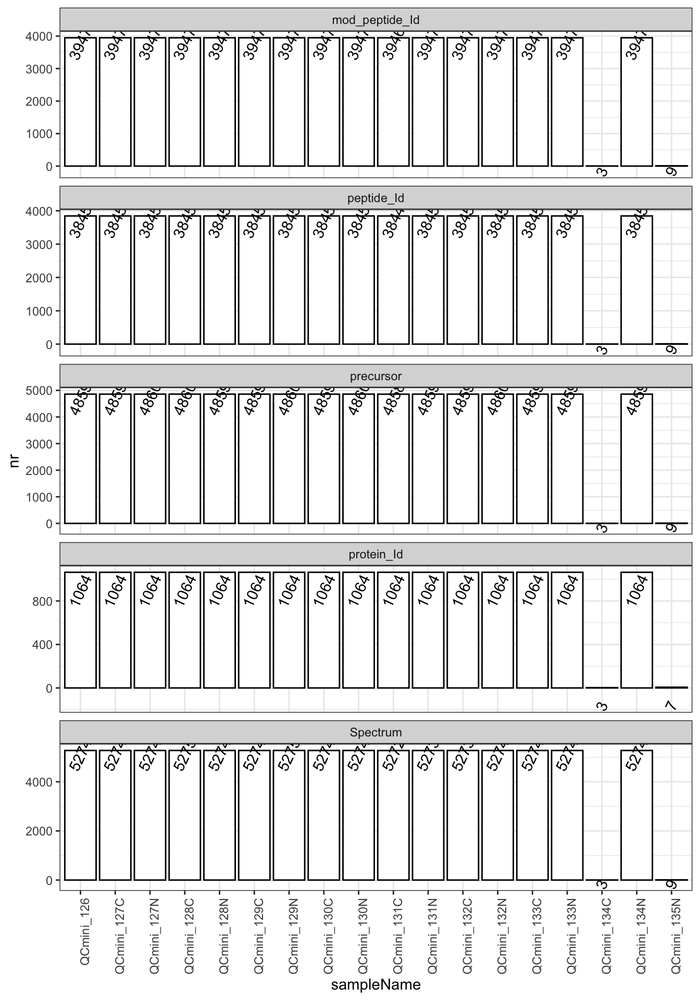
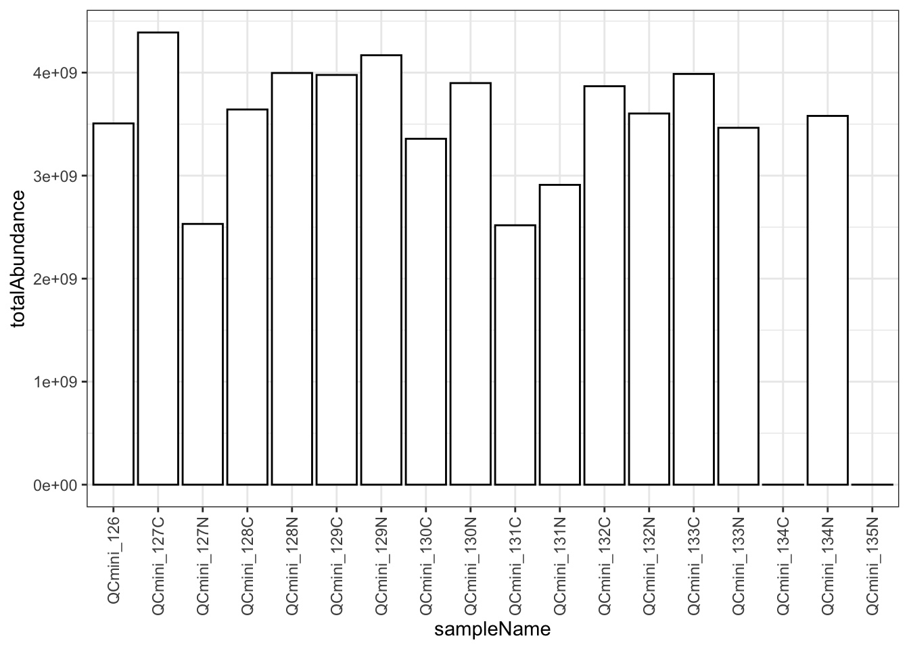
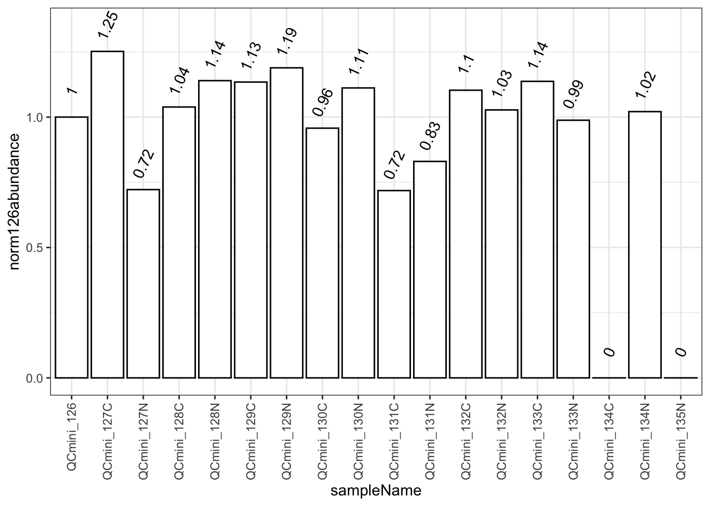
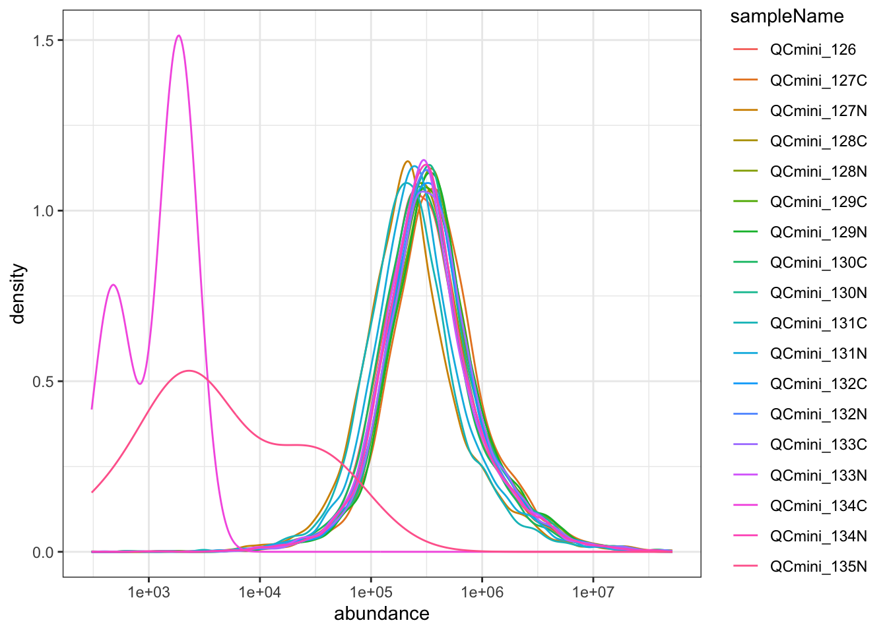

# FragPipe TMT QC

## Configuration

This section shows the key parameters used for this QC analysis. The
report can be parameterized to analyze different datasets by providing
custom file paths and identifiers.

| name | value |
|:---|:---|
| workunit_id | 1234 |
| project_id | 4321 |
| datasetname | ptm_example-main/qc_example_data/QCmini/psm.tsv |
| fastasequence | ptm_example-main/qc_example_data/fgcz_3702_UP000006548_AraUniprot_1spg_d_20231024.fasta |

project information {.table .caption-top}

QC will only use the first psm file.

    using : ptm_example-main/qc_example_data/QCmini/psm.tsv 

## FASTA Database Summary

The FASTA database contains the protein sequences used for peptide
identification. Understanding the composition of your search database is
crucial for interpreting identification results and assessing potential
biases.

**Key metrics to evaluate:**

- **Database size**: Typical sizes vary by organism:
  - Human: ~20,000 proteins
  - Mouse: ~22,000 proteins
  - Yeast: ~6,000 proteins
  - E. coli: ~4,400 proteins
  - Arabidopsis: ~27,000 protein coding genes, ~35,000 proteins
- **Decoy sequences**: Reverse sequences (REV\_) are used to estimate
  false discovery rates
- **Amino acid composition**: Should reflect the expected composition of
  your sample organism

The FASTA database has 55907 sequences including decoys, and 27953
without decoys. The amino acid frequency distribution below shows the
composition of your search database, which should be consistent with the
expected proteome composition.

    nr sequences:
     27953
     length summary:
        Min. 1st Qu.  Median    Mean 3rd Qu.    Max.
         5.0   198.0   348.0   404.8   520.0  5400.0
     AA frequencies:
          [,1]
     A  712383
     B       5
     C  213335
     D  608123
     E  760476
     F  484702
     G  730135
     H  256377
     I  601507
     K  720098
     L 1078566
     M  277709
     N  498002
     P  543057
     Q  395258
     R  609817
     S 1031163
     T  577392
     V  754323
     W  140645
     X      15
     Y  321973
     Z       3

## Data Processing Overview

This analysis processes peptide-spectrum matches (PSMs) from FragPipe
with specific quality filters to ensure reliable quantification.

**Quality filters applied:**

- **Peptide Prophet probability \> 0.9**: Ensures high confidence
  identifications
- **Abundance threshold \> 0**: Removes PSMs without quantitative
  information
- **Purity threshold = 0**: No isolation purity filtering (all PSMs
  included)

    Rows: 5436 Columns: 55
    ── Column specification ────────────────────────────────────────────────────────
    Delimiter: "\t"
    chr (14): Spectrum, Spectrum File, Peptide, Modified Peptide, Prev AA, Next ...
    dbl (38): Peptide Length, Charge, Retention, Observed Mass, Calibrated Obser...
    lgl  (3): Observed Modifications, Is Unique, Quan Usage

    ℹ Use `spec()` to retrieve the full column specification for this data.
    ℹ Specify the column types or set `show_col_types = FALSE` to quiet this message.
    Rows: 5436 Columns: 55
    ── Column specification ────────────────────────────────────────────────────────
    Delimiter: "\t"
    chr (14): Spectrum, Spectrum File, Peptide, Modified Peptide, Prev AA, Next ...
    dbl (38): Peptide Length, Charge, Retention, Observed Mass, Calibrated Obser...
    lgl  (3): Observed Modifications, Is Unique, Quan Usage

    ℹ Use `spec()` to retrieve the full column specification for this data.
    ℹ Specify the column types or set `show_col_types = FALSE` to quiet this message.

For this analysis we are using all PSM (Spectra) reported in the psm.tsv
file with a peptide prophet probability greater than $`0.9`$, and an
abundance value in any of the channels greater then $`0`$. No other
filtering is enabled. This reduces the number of PSM from 5436 to 5275.

The reduction in PSM count reflects the stringency of our quality
filters. A typical reduction of 1-10$`\%`$ is expected and indicates
proper quality control.

    INFO [2025-12-14 21:01:32] get_annot : ptm_example-main/qc_example_data/fgcz_3702_UP000006548_AraUniprot_1spg_d_20231024.fasta
    INFO [2025-12-14 21:01:33] get_annot : finished reading
    INFO [2025-12-14 21:01:34] get_annot : extract headers
    INFO [2025-12-14 21:01:34] get_annot : all seq : 55907
    INFO [2025-12-14 21:01:34] removing decoy sequences usin patter : ^REV_|^rev_
    INFO [2025-12-14 21:01:34] get_annot nr seq after decoy removal: 27954
    INFO [2025-12-14 21:01:34] get_annot : isUniprot : TRUE
    INFO [2025-12-14 21:01:34] get_annot : extracted gene names
    INFO [2025-12-14 21:01:34] get_annot : protein length
    INFO [2025-12-14 21:01:35] get_annot : nr of tryptic peptides per protein computed.

    Warning in prolfquapp::dataset_protein_annot(psm, c(protein_Id = "Protein"), :
    deprecated! use build_protein_annot

    uniprot database : TRUE

    Warning: Expected 2 pieces. Missing pieces filled with `NA` in 20 rows [54, 59, 92, 99,
    178, 287, 288, 307, 357, 379, 475, 476, 554, 611, 754, 892, 893, 940, 967,
    1021].

    creating sampleName from fileName column

    Warning in prolfqua::setup_analysis(psm, config): no isotopeLabel column
    specified in the data, adding column isotopeLabel automatically and setting to
    'light'.

    Warning in prolfqua::setup_analysis(psm, config): no nr_children column
    specified in the data, adding column nr_children and setting to 1.

    completing cases

    completing cases done

    setup done

## Identification Summary

These metrics provide an overview of the depth and breadth of your
proteomic analysis. Higher numbers generally indicate better sample
preparation and instrument performance.

**Understanding the hierarchy:**

- **Proteins**: Unique protein groups identified
- **Peptides**: Unique peptide sequences (without modifications)
- **Peptidoforms**: Unique peptides with specific modifications
- **Precursors**: Unique peptide-charge state combinations
- **PSMs**: Total peptide-spectrum matches

| isotopeLabel | protein_Id | peptide_Id | mod_peptide_Id | precursor | Spectrum |
|:-------------|-----------:|-----------:|---------------:|----------:|---------:|
| light        |       1064 |       3845 |           3947 |      4860 |     5275 |

Table: Nr of proteins, peptides, peptidoforms, precursors, spectrum
peptide matches overall. {.table .caption-top}

The ratio between these levels can indicate data quality:

- **PSMs/Peptides ratio**: Higher ratios suggest good reproducibility
- **Peptidoforms/Peptides ratio**: Indicates the extent of
  post-translational modifications
- **Peptides/Proteins ratio**: Reflects proteolytic efficiency and
  peptide diversity

Figure: Number of proteins, peptides, peptidoforms, ions and precursor
per channel.

This plot shows the identification counts across different TMT channels.
Ideally, all channels should show similar identification numbers,
indicating consistent sample preparation and labeling efficiency.

| isotopeLabel | sampleName | protein_Id | peptide_Id | mod_peptide_Id | precursor | Spectrum |
|:---|:---|---:|---:|---:|---:|---:|
| light | QCmini_126 | 1064 | 3845 | 3947 | 4859 | 5274 |
| light | QCmini_127C | 1064 | 3845 | 3947 | 4859 | 5274 |
| light | QCmini_127N | 1064 | 3845 | 3947 | 4860 | 5274 |
| light | QCmini_128C | 1064 | 3845 | 3947 | 4860 | 5275 |
| light | QCmini_128N | 1064 | 3845 | 3947 | 4859 | 5274 |
| light | QCmini_129C | 1064 | 3845 | 3947 | 4859 | 5274 |
| light | QCmini_129N | 1064 | 3845 | 3947 | 4860 | 5275 |
| light | QCmini_130C | 1064 | 3845 | 3947 | 4859 | 5274 |
| light | QCmini_130N | 1064 | 3845 | 3947 | 4860 | 5274 |
| light | QCmini_131C | 1064 | 3844 | 3946 | 4858 | 5272 |
| light | QCmini_131N | 1064 | 3845 | 3947 | 4859 | 5273 |
| light | QCmini_132C | 1064 | 3845 | 3947 | 4859 | 5273 |
| light | QCmini_132N | 1064 | 3845 | 3947 | 4860 | 5274 |
| light | QCmini_133C | 1064 | 3845 | 3947 | 4859 | 5274 |
| light | QCmini_133N | 1064 | 3845 | 3947 | 4859 | 5274 |
| light | QCmini_134C | 3 | 3 | 3 | 3 | 3 |
| light | QCmini_134N | 1064 | 3845 | 3947 | 4859 | 5274 |
| light | QCmini_135N | 7 | 9 | 9 | 9 | 9 |

Table: Nr of proteins, peptides, peptidoforms, precursors, spectrum
peptide matches per channel. {.table .caption-top style="width:100%;"}

**Quality indicators:**

- **Consistent counts across channels**: Good sample preparation
- **Large variations**: May indicate labeling issues or sample
  degradation
- **Outlier channels**: Should be investigated for technical problems

## Modifications Summary

Post-translational modifications (PTMs) and chemical modifications
provide insights into sample treatment and biological state. TMT
labeling introduces specific modifications that should be monitored for
labeling efficiency.

**Key modifications to monitor:**

- **TMT labels**: N-term(229.1629), K(229.1629) for TMT10plex
- **Oxidation**: M(15.9949) - common artifact
- **Carbamylation**: N-term/K modifications from urea treatment

| Var1             | Freq |
|:-----------------|-----:|
| C(57.0214)       |    2 |
| K(304.2071)      | 2339 |
| M(15.9949)       |  635 |
| N-term(304.2071) | 3904 |
| N-term(42.0106)  |   10 |

Number and type of modifications observed in the data. {.table
.caption-top}

Number and type of modification observed in the data.

The modification landscape reflects both intentional chemical treatments
(TMT labeling) and unintentional modifications (oxidation, deamidation).
High numbers of TMT modifications indicate successful labeling.

## Labelling Efficiency

TMT labeling efficiency is critical for accurate quantification.
Incomplete labeling leads to quantitative errors and reduced dynamic
range.

**Monitoring labeling efficiency:**

- **N-terminal labeling**: Should approach 100% for most peptides
- **Lysine labeling**: Should be \>95% for high-quality samples
- **Unlabeled peptides**: May co-elute and interfere with quantification

### N-term

N-terminal labeling efficiency is typically very high (\>95%) as it’s
kinetically favored.

#### Peptides

- Total number of peptides : 3947
- Number of peptides with modified N-term : 3904
- Percent peptides with modified N-term: 99 %

**Expected range**: 95-100%. Values below 95% may indicate:

- Suboptimal labeling conditions
- Sample degradation
- Buffer incompatibility

#### PSM’s

- Total number of PSMs : 5275
- Number of PSMs with modified N-term : 5227
- Percent PSMs with modified N-term: 99 %

PSM-level statistics weight peptides by their identification frequency,
providing insight into the most abundant species in your sample.

### Lysine Modification

Lysine labeling is more challenging than N-terminal labeling and is more
sensitive to reaction conditions.

#### Peptides

    Warning: Use of .data in tidyselect expressions was deprecated in tidyselect 1.2.0.
    ℹ Please use `"modSeq"` instead of `.data$modSeq`

- Total number of peptides with Lysine: 2339
- Number of peptides with modified Lysine residues : 2339
- Percent peptides with modified Lysine residues: 100 %

**Expected range**: 95-99%. Lower values may indicate:

- Insufficient reagent concentration
- Competing reactions (e.g., formaldehyde crosslinking)
- pH optimization needed

#### PSM’s with Lysine

- Total number of PSMs with Lysine: 3200
- Number of PSMs with modified Lysine residues : 3200
- Percent PSMs with modified Lysine residues: 100 %

    Warning: Use of .data in tidyselect expressions was deprecated in tidyselect 1.2.0.
    ℹ Please use `"n"` instead of `.data$n`

    Warning: Use of .data in tidyselect expressions was deprecated in tidyselect 1.2.0.
    ℹ Please use `"n1"` instead of `.data$n1`

#### Peptidoforms

- Total number of Lysine residues: 2344
- Number of modified Lysine residues : 2339
- Percent modified Lysine residues: 100 %

#### Total number of Lysine residues in PSM’s

- Total number of Lysine residues: 3205
- Number of modified Lysine residues : 3200
- Percent modified Lysine residues when taking number of PSMs into
  account: 100 %

## Quantitative information per channel

TMT quantification relies on consistent labeling and equal loading
across channels. These plots help identify technical issues that could
bias quantitative comparisons.

**Quality indicators:**

- **Similar total abundances**: Good sample preparation and loading
- **Outlier channels**: May indicate pipetting errors or sample loss
- **Systematic patterns**: Could suggest batch effects or labeling
  issues

Total abundance per channel (Sum of all abundances).

Total abundance reflects both sample amount and ionization efficiency.
Large variations (\>2-fold) should be investigated.

Ralative to chanell 126 total abundance per chanel.

Normalization to a reference channel (126) helps identify systematic
biases. Values should typically be within 0.5-2.0 fold of the reference.

    Warning: `aes_string()` was deprecated in ggplot2 3.0.0.
    ℹ Please use tidy evaluation idioms with `aes()`.
    ℹ See also `vignette("ggplot2-in-packages")` for more information.
    ℹ The deprecated feature was likely used in the prolfqua package.
      Please report the issue at <https://github.com/wolski/prolfqua/issues>.

Density of abundance values per channel.

The abundance distribution should be similar across channels. Shifted
distributions may indicate: - Unequal sample loading - Different sample
complexity - Technical artifacts in specific channels

## Missed cleavage

Missed cleavage analysis provides insights into proteolytic efficiency
and sample quality. Excessive missed cleavages can reduce identification
rates and affect quantification accuracy.

Missed cleavage site: Is a residue after which trypsin should have
cleaved but did not.

**Factors affecting missed cleavages:**

- **Protein denaturation**: Incomplete unfolding reduces accessibility
- **Digestion time/temperature**: Insufficient conditions lead to
  incomplete digestion
- **Enzyme activity**: Old or inhibited trypsin reduces efficiency
- **Chemical modifications**: Modified residues may resist cleavage

To determine the number of missed cleavages we compute: - The number of
all potential cleavage sites (i.e., number of K or R residues) - The
number of actual cleavage sites (K or R at peptide C-terminus) -
Modified residues that may resist cleavage

### Missed Lysine residues

We compute the total number of K residues, and the number of K cleavage
sites (nr of potential cleavage sites). Then we compute the number of K
at the C-term

- The number of K residues 3205
- The number of unmodified K at C term 0
- The number of modified K at C term 3025
- The number of any K at C term 3025
- The number of any modified K: 3200
- Missed cleavage sites : number of K residues - number of any K at C
  term = 180,
- and in % of number of K residues : 6

**Expected range**: 5-15% missed cleavages are typical. Higher rates may
indicate:

- Incomplete protein denaturation
- Insufficient digestion time
- Trypsin inhibitors present
- High protein concentration

### Missed Arginine residues

- The number of R residues 2401
- The number of unmodified R at C term 2189
- The number of modified R at C term 0
- The number of any R at C term 2189
- The number of any modified R: 0
- Missed cleavage sites : number of R residues - number of any R at C
  term = 212,
- and in % of number of R residues : 9

Arginine cleavage is generally more efficient than lysine cleavage.
Similar missed cleavage rates between K and R suggest consistent
digestion conditions.

## Session Info

**R version 4.5.2 (2025-10-31)**

**Platform:** aarch64-apple-darwin20

**locale:**
en_US.UTF-8\|\|en_US.UTF-8\|\|en_US.UTF-8\|\|C\|\|en_US.UTF-8\|\|en_US.UTF-8

**attached base packages:** *stats*, *graphics*, *grDevices*, *utils*,
*datasets*, *methods* and *base*

**other attached packages:** *here(v.1.0.2)*, *ggseqlogo(v.0.2)*,
*lubridate(v.1.9.4)*, *forcats(v.1.0.1)*, *stringr(v.1.6.0)*,
*dplyr(v.1.1.4)*, *purrr(v.1.2.0)*, *readr(v.2.1.6)*, *tidyr(v.1.3.1)*,
*tibble(v.3.3.0)*, *ggplot2(v.4.0.1)*, *tidyverse(v.2.0.0)*,
*prophosqua(v.0.1.0)* and *prolfquapp(v.0.1.8)*

**loaded via a namespace (and not attached):**
*AhoCorasickTrie(v.0.1.3)*, *gtable(v.0.3.6)*, *xfun(v.0.54)*,
*prozor(v.0.3.1)*, *htmlwidgets(v.1.6.4)*, *ggrepel(v.0.9.6)*,
*lattice(v.0.22-7)*, *tzdb(v.0.5.0)*, *vctrs(v.0.6.5)*,
*tools(v.4.5.2)*, *generics(v.0.1.4)*, *parallel(v.4.5.2)*,
*pkgconfig(v.2.0.3)*, *pheatmap(v.1.0.13)*, *Matrix(v.1.7-4)*,
*data.table(v.1.17.8)*, *RColorBrewer(v.1.1-3)*, *S7(v.0.2.1)*,
*lifecycle(v.1.0.4)*, *prolfqua(v.1.4.0)*, *compiler(v.4.5.2)*,
*farver(v.2.1.2)*, *codetools(v.0.2-20)*, *htmltools(v.0.5.9)*,
*lazyeval(v.0.2.2)*, *yaml(v.2.3.11)*, *plotly(v.4.11.0)*,
*pillar(v.1.11.1)*, *crayon(v.1.5.3)*, *seqinr(v.4.2-36)*,
*MASS(v.7.3-65)*, *cachem(v.1.1.0)*, *tidyselect(v.1.2.1)*,
*conflicted(v.1.2.0)*, *digest(v.0.6.39)*, *stringi(v.1.8.7)*,
*pander(v.0.6.6)*, *labeling(v.0.4.3)*, *ade4(v.1.7-23)*,
*rprojroot(v.2.1.1)*, *fastmap(v.1.2.0)*, *grid(v.4.5.2)*,
*cli(v.3.6.5)*, *logger(v.0.4.1)*, *magrittr(v.2.0.4)*,
*patchwork(v.1.3.2)*, *withr(v.3.0.2)*, *scales(v.1.4.0)*,
*bit64(v.4.6.0-1)*, *timechange(v.0.3.0)*, *httr(v.1.4.7)*,
*rmarkdown(v.2.30)*, *bit(v.4.6.0)*, *gridExtra(v.2.3)*, *hms(v.1.1.4)*,
*memoise(v.2.0.1)*, *evaluate(v.1.0.5)*, *knitr(v.1.50)*,
*viridisLite(v.0.4.2)*, *dtplyr(v.1.3.2)*, *rlang(v.1.1.6)*,
*Rcpp(v.1.1.0)*, *docopt(v.0.7.2)*, *glue(v.1.8.0)*, *vroom(v.1.6.7)*,
*jsonlite(v.2.0.0)* and *R6(v.2.6.1)*
