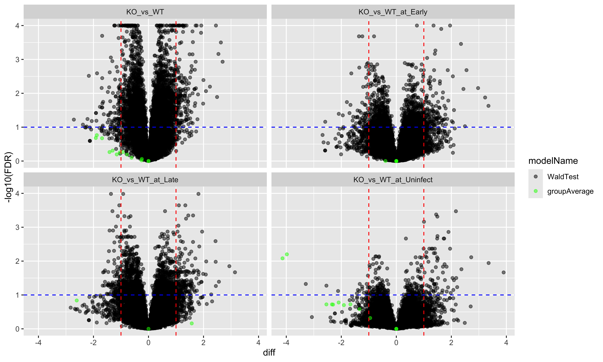

# Integrated Analysis of Post-Translational Modifications and Total Proteome: Methods for Distinguishing Abundance from Usage Changes

| Author          | Affiliation(s) | Corresponding Author Email    |
|-----------------|----------------|-------------------------------|
| Witold Wolski   | FGCZ, SIB      | <witold.wolski@fgcz.uzh.ch>   |
| Antje Dittmann  | FGCZ           | <antje.dittmann@fgcz.uzh.ch>  |
| Laura Kunz      | FGCZ           |                               |
| Christian Panse | FGCZ, SIB      |                               |
| Jonas Grossmann | FGCZ, SIB      | <jonas.grossmann@fgcz.uzh.ch> |

- FGCZ - Functional Genomics Center Zurich, Winterthurerstrasse 190,
  CH-8057 Zurich,
- SIB - Swiss Institute of Bioinformatics, Winterthurerstrasse 190,
  CH-8057 Zurich

### **Abstract**

Post-translational modifications (PTMs), particularly phosphorylation,
regulate protein function at substoichiometric levels, making their
quantitative analysis technically challenging. A critical limitation in
PTM studies is distinguishing between changes in modification abundance
due to altered protein expression versus genuine changes in modification
stoichiometry (the fraction of protein molecules that are modified).

This chapter presents a comprehensive workflow integrating
Tandem-Mass-Tag (TMT)-based quantitative proteomics with specialized
computational analysis to distinguish differential PTM abundance (DPA)
from differential PTM usage (DPU) using the `prolfqua`, `prolfquapp`,
and `prophosqua` *R* packages. The workflow introduces a robust
statistical framework for integrated PTM-protein analysis, comprehensive
visualization tools including N-terminus to C-terminus (N-to-C) plots
for protein-centric PTM mapping, and sequence motif analysis for kinase
prediction.

This integrated approach enables researchers to identify actual
signaling changes in PTM studies, prioritize functionally relevant
modification sites, understand pathway-level regulation in disease
contexts, and generate robust datasets suitable for publication in
high-impact journals.

### Key Words

Post-translational modifications, phosphoproteomics, TMT labeling,
differential PTM abundance analysis, differential PTM usage analysis,
mass spectrometry, data integration, kinase activity

## Introduction

### Biological Significance of Post-Translational Modifications

Protein phosphorylation is a reversible PTM that modulates a protein’s
conformation, enzymatic activity, subcellular localization, or binding
interactions. Because this modification can be reversed rapidly, it acts
as a molecular switch in cellular signaling networks. As a result, cells
respond to environmental cues without requiring new protein synthesis.
Dysregulation of phosphorylation is implicated in cancer,
neurodegeneration, and metabolic disorders
\[[1](#ref-10.1080/14789450.2021.1976152)\]. Large-scale
phosphoproteomic profiling by high-throughput mass spectrometry (MS)
(e.g., TMT-based workflows) is therefore crucial for dissecting
disease-associated signaling alterations and identifying candidate
therapeutic targets.

### Technical Challenges in PTM Analysis

The analysis of PTMs, such as phosphorylation, presents significant
analytical challenges due to the low abundance of modified peptides.
Typically, phosphorylated peptides represent less than 1–5% of the total
peptide population \[[2](#ref-10.1186/1477-5956-4-15)\]. Additionally,
phosphopeptides generally exhibit poorer ionization efficiency in
MS-based proteomics compared to non-modified peptides, further
complicating their detection and quantification. This low abundance and
challenging ionization behavior necessitate specialized experimental
workflows and computational strategies to achieve accurate
quantification \[[3](#ref-10.1016/j.mcpro.2024.100754)\].

A key analytical challenge is distinguishing genuine changes in PTM
levels, due to altered kinase and phosphatase activity, from changes
caused by altered protein abundance
\[[4](#ref-10.1016/j.mcpro.2022.100477),
[5](#ref-10.1016/j.mcpro.2023.100708)\]. Without proper correction, this
confounding factor can lead researchers to misinterpret PTM data,
incorrectly attributing higher phosphorylation signals solely to
increased modification efficiency or pathway activation, rather than to
elevated protein expression \[[6](#ref-10.1039/c5mb00024f)\].
Controlling for this confounder is critical to discern rapid,
signaling-driven phosphorylation events from slower, transcriptionally
or translationally regulated changes in protein abundance.

Because phosphorylation is substoichiometric, only a small fraction of
protein molecules carry the modification; therefore, enrichment is
required to isolate phosphopeptides. Enrichment steps (such as
Immobilized Metal Affinity Chromatography (IMAC) or Metal Oxide Affinity
Chromatography (MOAC)) introduce additional sample handling and
technical variability
\[[6](#ref-10.1039/c5mb00024f)–[8](#ref-10.1038/nbt.3327)\]. Therefore,
each stage, from digestion to cleanup to MS acquisition, must be
carefully optimized to improve reproducibility
\[[9](#ref-10.1038/s41467-018-03309-6)\]. Effective experimental design
combined with tailored normalization strategies is therefore essential
to recover reliable, biologically meaningful PTM signals.

Isobaric TMT labeling enables multiplexed PTM analysis of up to 35
samples in a single run, reducing inter-sample variability and missing
values to improve statistical power
\[[10](#ref-10.1021/acs.jproteome.4c00668),
[11](#ref-10.1021/ac0262560)\]. Phosphopeptides are typically enriched
by IMAC or Metal Oxide Affinity Chromatography (MOAC), which provide
complementary selectivity and broaden coverage
\[[12](#ref-10.1074/mcp.m114.045609),
[13](#ref-10.1101/2020.04.13.038810)\]. Adding offline fractionation
before liquid chromatography–tandem mass spectrometry (LC–MS/MS) further
increases phosphosite depth and distributes peptide load, improving
quantification consistency across fractions and conditions
\[[14](#ref-10.1002/pmic.202100245)\].

In TMT-based proteomics, a *plex* refers to the complete set of
isobarically tagged samples analyzed together in a single LC–MS/MS run.
When the total number of samples exceeds the available TMT channels,
each plex should include at least one biological replicate from every
experimental group and a common reference or pooled channel for
normalization \[[15](#ref-10.1021/acs.jproteome.0c00536)\]. Replicates
of the same group are then distributed across different plexes rather
than clustered within a single run, preventing any group’s replicates
from being confined to one batch. If all samples fit within the channel
capacity of a single plex, these balancing measures are inherently
satisfied in that run.

### Computational Tools and Workflows

The computational landscape for quantitative protein PTM analysis has
undergone significant evolution, with numerous specialized software
platforms supporting bottom-up proteomics workflows. Following MS data
acquisition, spectra undergo database searching to identify peptide
sequences, which is subsequently followed by protein inference to
determine protein identities based on these identified peptides. The
ecosystem of PTM analysis includes several well-established
data-dependent acquisition (DDA)-TMT compatible software suites, both
free and commercial, such as *Andromeda* integrated within *MaxQuant*
\[[16](#ref-10.1021/acs.jproteome.4c00869)\], *Proteome Discoverer*
(Thermo Fisher Scientific), *FragPipe*
\[[17](#ref-10.1038/s41467-023-39891-7)\], or *PeptideShaker*
\[[18](#ref-10.1021/acs.jproteome.1c00678)\].

Among the analytical steps following peptide identification, PTM site
localization scoring represents a particularly crucial computational
challenge. Site localization determines the confidence with which a
modification can be assigned to a specific amino acid residue within a
peptide sequence. This process is especially challenging when peptides
contain multiple potential modification sites, necessitating algorithms
to evaluate the quality and specificity of site-determining fragment
ions. Specialized tools have been developed explicitly for robust PTM
site localization, including *PTMProphet*
\[[19](#ref-10.1038/s41467-020-17914-x)\], *PhosphoRS*
\[[20](#ref-10.1021/pr200611n)\], and *Ascore*
\[[21](#ref-10.1038/nbt1240)\]. Accurate localization is essential, as
incorrect site assignments can lead to biological misinterpretations,
particularly in signaling pathway analyses and kinase-substrate
predictions.

In DDA workflows, *FragPipe* \[[22](#ref-10.1101/2025.05.27.656447)\]
represents a widely adopted and integrated platform that comprehensively
addresses PTM analysis, including site localization challenges.
*FragPipe* integrates the *MSFragger* search engine
\[[23](#ref-10.1038/nmeth.4256)\], enabling highly sensitive peptide
identification, and employs *PTMProphet*
\[[24](#ref-10.1021/acs.jproteome.9b00205)\] functionality for site
localization scoring. It also generates detailed quantitative outputs,
including site-level quantification reports and multisite feature
reports that group peptides sharing identical modification patterns. A
detailed description of the *FragPipe* workflow is provided in the
experimental methods section (see Section @ref(fragpipeparams)).

While the above discussion has focused primarily on DDA workflows,
data-independent acquisition (DIA)-based approaches represent
alternative strategies with distinct computational considerations for
PTM analysis. Specialized DIA platforms such as *Spectronaut*
\[[25](#ref-10.1002/pmic.202300088)\],
\[[26](#ref-10.1074/mcp.m114.044305)\] and *DIA-NN*
\[[27](#ref-10.1038/s41592-019-0638-x)\] offer PTM support through
dedicated site-localization scoring algorithms and site-level
quantification capabilities. Unlike DDA, DIA workflows require
specialized computational approaches to extract and quantify
modification-specific information from highly multiplexed fragmentation
spectra. Both *Spectronaut* and *DIA-NN* incorporate advanced
statistical frameworks designed explicitly for PTM identification and
quantification in DIA workflows.

### Data Analysis Frameworks

Proteomic data analysis can be conducted at multiple levels of
granularity, each providing distinct analytical perspectives. A
peptidoform represents a specific peptide sequence with a particular set
of modifications, while site-level analysis aggregates signals for each
residue position across multiple peptides. Differential analysis can
therefore target either peptidoforms or individual modification sites,
with each approach offering unique advantages for different research
questions.

*FragPipe* introduces an additional analytical concept through multisite
features, which refers to the set of all identified peptide-forms
sharing the same set of modification sites under investigation,
regardless of sequence derivatives, cleavage state, or whether the
modifications are unambiguously localized. This approach groups
peptidoforms with different sequences, which can arise from missed
cleavages or alternative cleavage patterns, but identical possible
modification sites into the same multisite feature, providing a balanced
approach between peptidoform specificity and site-level aggregation.
Discarding all peptidoforms with ambiguous localization would result in
the loss of a large fraction of PTM information. Furthermore, multisite
features preserve information about phosphorylation sites that occur
together on the same peptide molecule, revealing co-modification
patterns that indicate coordinated regulation by kinases or functional
relationships between sites. Traditional site-level analysis treats each
phosphorylation site independently, losing this valuable information
about which specific combinations of sites are modified together in
biological samples.

Site-level reports collapse signals from all peptidoforms mapping to the
same PTM at an amino acid residue into a single quantitative value,
ensuring each site has exactly one intensity measurement per sample. In
downstream analysis, site-level intensities integrate seamlessly with
site-centric enrichment tools and kinase-activity inference platforms
(`PhosR` \[[28](#ref-10.1016/j.celrep.2021.108771)\], `PTM-SEA`
\[[29](#ref-10.1074/mcp.TIR118.000943)\], `RoKAI`
\[[30](#ref-10.1038/s41467-021-21211-6)\], etc.), streamlining
biological interpretation and network reconstruction analyses
\[[31](#ref-10.1186/s12014-020-09290-x)\].

### Statistical Analysis of PTM Data

Statistical analysis of PTM data requires specialized methods due to
confounding effects between PTM levels and protein abundances. Several
statistical packages have emerged to address the critical issue of
integrating PTM-feature quantifications with protein abundance data.
Notable examples include `MSstatsPTM`
\[[4](#ref-10.1016/j.mcpro.2022.100477)\] and `msqrob2PTM`
\[[5](#ref-10.1016/j.mcpro.2023.100708)\], which explicitly model both
modified peptide and protein-level changes to distinguish genuine PTM
regulation from protein abundance effects accurately.

The `msqrob2PTM` framework exemplifies the statistical approaches now
available for PTM analysis, defining two complementary analytical
strategies: DPA and DPU \[[5](#ref-10.1016/j.mcpro.2023.100708)\]. DPA
directly models the $`log^2`$ intensities of each modified peptide
(peptidoform), detecting absolute changes in PTM levels between
experimental conditions. In contrast, DPU adjusts the PTM intensities by
the corresponding protein-level changes, effectively testing for changes
in the relative usage or stoichiometry of a modification site. This dual
approach enables researchers to distinguish between PTM changes driven
by protein abundance differences (DPA) versus those reflecting genuine
changes in modification efficiency or regulatory activity (DPU).

These two frameworks differ in their analytical approaches for
addressing confounding between PTM and changes in protein abundance.
`MSstatsPTM` employs a “model then correct” strategy, separately fitting
linear models to modified and unmodified peptide data, and then
combining statistical inferences post-modeling. In contrast,
`msqrob2PTM` follows a “correct then model” approach, first adjusting
PTM intensities by their corresponding protein abundances at the data
level, and subsequently performing statistical testing on these
normalized values.

A further option, discussed in
\[[32](#ref-10.1007/978-1-0716-1967-4_12)\], is to model the PTM and
total proteome data as a factorial design that jointly includes a
biologically relevant explanatory variable, e.g., genotype, and a
“component” indicator, i.e., modified peptide and its total proteome
parent protein, and fits a linear model with their interaction. It then
tests the statistical significance of the interaction term to flag
modified peptides whose dynamics deviate from the corresponding total
proteome protein abundance. Here, the package `limma` is used to fit the
model and perform the testing.

While all three methodologies ultimately estimate PTM abundance changes
corrected for protein-level effects, each method can yield different
test results due to varying assumptions about the relationship between
PTMs and protein abundances within a sample, as well as differences in
how variance and degrees of freedom are estimated.

- `MSstatsPTM` fits the PTM and the protein in separate models, then
  computes an adjusted effect as a difference of estimated contrasts:
  $`\Delta_{adj} = \Delta_{PTM} - \Delta_{protein}`$ with standard error
  combined in quadrature for the test statistic, and Welch’s
  approximation to estimate the degrees of freedom, which yields
  p-values for the adjusted fold change directly on the contrast scale.
  `MSstatsPTM` assumes that there is no correlation between PTM and the
  protein abundances within the samples.
- The single-model approach \[[32](#ref-10.1007/978-1-0716-1967-4_12)\]
  uses `limma` moderated (empirical-Bayes) variances for the interaction
  contrast within one fit, which shrinks feature-wise variances toward a
  common prior; $`df`$ are moderated accordingly. The single-model
  formulation can capture shared covariance by adding a sample
  blocking/random effect. Still, as illustrated
  \[[32](#ref-10.1007/978-1-0716-1967-4_12)\], the baseline model omits
  a sample term, effectively treating PTM and protein measurements as
  independent.
- `msqrob2PTM` assumes that the PTM and the protein abundances within a
  sample are correlated and therefore corrects PTM abundances with the
  matched protein abundances. Then, for modelling, only the corrected
  PTM intensities are used.

The three pipelines target the PTM-vs-protein effect through different
modeling paths and make different assumptions about within-sample
covariance, and differ in variance moderation. Therefore, even with the
same raw data and contrasts, we can expect differences in estimated
effects, standard errors, and p-values.

To offer researchers additional flexibility, we developed `prophosqua`
\[[33](#ref-10.5281/zenodo.15845272)\], an *R* package designed to
streamline statistical analysis of phosphoproteomics and other PTM
datasets. Using `prophosqua` and the `prolfqua` package
\[[34](#ref-10.1021/acs.jproteome.2c00441)\], the `MStatsPTM`
*model-first* and `msqrob2PTM` *correct first* approaches can be
executed to obtain protein-corrected PTM data and provide intuitive
visualizations for comprehensive exploratory analysis.

### The Protein Assignment Problem in Differential PTM-feature Usage

Identification and quantification tools need to assign peptides to
proteins, i.e., find the leading or representative protein identifier
(ID). This assignment may be dataset-specific and may differ between the
PTM and the total proteome dataset. Therefore, using protein IDs to
match PTM features with proteins from the total run may lead to a loss
of information due to differing representative IDs
\[[35](#ref-10.1093/bib/bbr065)\]. For example, a phosphopeptide might
be assigned, by protein inference, to protein isoform A in the PTM
dataset. In contrast, in the total proteome dataset, protein abundance
is quantified under isoform B, which prevents proper integration and DPU
analysis.

A robust solution involves matching stripped peptide sequences from the
PTM dataset to peptide sequences of proteins quantified in the total
proteome dataset, bypassing protein ID dependency entirely. When
peptides are shared among multiple protein isoforms, the averaged
protein abundance across all matching isoforms provides a more stable
reference for normalization. While this sequence-based matching approach
requires additional computational implementation, it reduces the loss of
valuable information due to protein assignment differences between
datasets.

### Chapter Overview and Learning Objectives

This chapter introduces an analytical workflow that addresses the
biological challenge of accurately distinguishing DPA from DPU.
Distinguishing between protein-level effects and genuine
modification-specific changes is critical for meaningful interpretation
of PTM data. The workflow emphasizes reproducibility, automation, and
biological interpretation.

DPA tests raw PTM signal changes between experimental conditions,
identifying any modification abundance changes regardless of underlying
protein-level effects. This analysis captures the total impact of
experimental perturbations on PTM levels, including both direct
modification effects and indirect effects mediated through changes in
protein abundance.

DPU evaluates protein-normalized PTM changes, explicitly identifying
modification sites where stoichiometry is genuinely altered independent
of protein abundance. This analysis pinpoints sites where experimental
conditions directly impact modification efficiency, kinase activity, or
phosphatase activity, thereby highlighting specific regulatory events.

Learning objectives include: 1. Conducting integrated statistical
analysis of PTM and total proteome data using `prolfquapp` and
`prophosqua` *R* packages 2. Interpreting DPA vs. DPU results for
biological insights and generating publication-quality visualizations 3.
Performing sequence motif analysis for kinase prediction and pathway
reconstruction

## Materials

### Demonstration Dataset

This protocol utilizes the Atg16l1 macrophage dataset from Maculins et
al. \[[36](#ref-10.7554/elife.62320)\] to demonstrate the bioinformatics
workflow and integrated statistical analysis. The dataset comprises
TMT-11-plex measurements from six conditions (WT/KO ×
uninfected/early/late infection) with both phospho-enriched and total
proteome samples, making it ideal for illustrating the principles of
integrated PTM analysis. In the original publication, the authors also
performed ubiquitin remnant enrichment, although we focus on the
phosphoproteome and total proteome datasets for demonstration purposes.
This same dataset was previously used in the `MSstatsPTM` publication
\[[4](#ref-10.1016/j.mcpro.2022.100477)\], providing additional
validation of the analytical approaches.

As discussed below, TMT enables high-precision quantification across
many conditions, particularly when combined with fractionation. In
contrast, DIA is well suited when avoiding fractionation or scaling to
larger sample numbers (see Note @ref(notelfq)).

### System Requirements

1.  Search and quantification software: *FragPipe* 22.0 (free download
    for academic use from
    [fragpipe.nesvilab.org](https://fragpipe.nesvilab.org); system
    requirements: 32GB+ RAM, 50GB+ storage)
2.  Statistical platform: *R* version $`\ge`$ 4.0.0
    (<https://www.r-project.org/>) and RStudio (<https://posit.co/>)

- **System requirements**: 16GB+ RAM, 20 GB+ storage
- **Expected runtime**: 10 minutes to 1 hours depending on dataset size
  and number of fractions

### R packages

Most relevant *R* packages used for the analysis are:

- `tidyverse` \[[37](#ref-10.21105/joss.01686)\] - Data manipulation and
  visualization tools
- `ggseqlogo` \[[38](#ref-10.32614/cran.package.ggseqlogo)\] - Sequence
  motif visualization
- `prolfqua` \[[34](#ref-10.1021/acs.jproteome.2c00441)\] - Core
  statistical framework for proteomics data analysis
- `prolfquapp` \[[39](#ref-10.1021/acs.jproteome.4c00911)\] -
  Streamlined differential expression analysis pipeline
- `prolfquappPTMreaders` \[[40](#ref-10.5281/zenodo.15845243)\] -
  Specialized readers for PTM data formats
- `prophosqua` \[[33](#ref-10.5281/zenodo.15845272)\] - Integration and
  visualization of PTM and protein data

For detailed installation instructions, see the package documentation on

- [github.com/fgcz/prolfqua](https://github.com/fgcz/prolfqua),
- [github.com/prolfqua/prolfquapp](https://github.com/prolfqua/prolfquapp),
- [github.com/prolfqua/prophosqua](https://github.com/prolfqua/prophosqua).

### Mass Spectrometry Data Processing

Raw MS data acquired using DDA combined with TMT labeling are processed
using specialized software to:

1.  Search spectra against a protein sequence database including
    species-specific sequences, common contaminants, and decoy sequences
2.  to extract reporter ion intensities
3.  and to compute site localization probabilities

The section (see Methods @ref(fragpipeparams)) describes in detail how
we parameterized the *FragPipe* software
\[[17](#ref-10.1038/s41467-023-39891-7)\].

## Methods

A key challenge, when analysing PTMs, is to distinguish changes in PTM
abundance that are due to altered protein expression from those that
reflect a change in the modification stoichiometry (i.e., the fraction
of the protein pool that is modified). This protocol provides a
step-by-step computational workflow to analyze PTM data in the context
of total protein abundance changes. We leverage the *R* packages
`prolfquapp` \[[39](#ref-10.1021/acs.jproteome.4c00911)\] for
streamlined differential expression analysis
\[[34](#ref-10.1021/acs.jproteome.2c00441)\] and `prophosqua`
\[[33](#ref-10.5281/zenodo.15845272)\] for the integration, analysis,
and visualization of PTM and total proteome data. The workflow comprises
three parts: 1) analysing the raw mass spectrometric data with
*FragPipe*, 2) performing differential expression analysis for the
PTM-enriched and total proteome datasets, and 3) integrating the PTM and
total proteome data.

### Analysing TMT raw data with *FragPipe*

We used the TMT 11-plex phospho workflow in *FragPipe* 22.0
\[[17](#ref-10.1038/s41467-023-39891-7)\] with *MSFragger* (version 4.1)
\[[23](#ref-10.1038/nmeth.4256)\]. Database searching was performed
against a species-specific protein sequence database supplemented with
common contaminants and reversed decoy sequences. The search parameters
included:

- Fixed modifications:
- Carbamidomethylation of cysteine (+57.0215 Da)
- TMT labeling of lysine residues and peptide N-termini (+229.1629 Da)
- Variable modifications:
- Phosphorylation on serine, threonine, and tyrosine residues (+79.9663
  Da)
- Oxidation of methionine (+15.9949 Da)
- Acetylation at protein N-termini (+42.0106 Da)

Reporter ions are quantified by *IonQuant* (version 1.10.27), with
downstream processing in *TMTIntegrator* (version 1.10.27).
*TMTIntegrator* \[[22](#ref-10.1101/2025.05.27.656447)\] performs
quantification and normalization specifically tailored for multiplexed
TMT experiments.

Selected *TMTIntegrator* parameters are:

- Best PSM selection: OFF
- Outlier removal enabled: OFF
- Allow overlabel/underlabel: OFF
- Use MS1 intensity: OFF
- Aggregation method: Median

For phospho-enriched samples, PTM sites are scored using *PTMProphet*
\[[24](#ref-10.1021/acs.jproteome.9b00205)\] localization scores $`\ge`$
0.75 are retained. *FragPipe* workflow parameters are stored in
configuration files (`fragpipe.workflow`). The workflow file used to
parametrize *FragPipe* can be downloaded from
\[[41](#ref-10.5281/zenodo.15850770)\].

*FragPipe* provides two types of PTM-features reports for the
phospho-enriched samples:

- Multisite features: groups peptidoforms sharing identical modification
  sites, as described in Section @ref(data-analysis-frameworks).

- Site-level reports collapse signals from all peptidoforms mapping to
  the same amino acid position into a single quantitative value per PTM
  site, ensuring each site has exactly one intensity per sample. In
  downstream analysis, site-level intensities can be fed into
  site-centric enrichment or kinase-activity inference tools (`PhosR`,
  `PTM-SEA`, `RoKAI`, etc.), streamlining biological interpretation and
  network reconstruction.

An essential step in the data preprocessing is the quality control (QC)
of the quantified samples, which involves estimating the missed cleavage
rates or labeling efficiency (see Note @ref(automatedqc)).

### Data Setup for Statistical Analysis

The following sections demonstrate the computational workflow through
*R* code snippets that implement each step of the integrated PTM
analysis. All code examples are also available within the `prophosqua`
package \[[33](#ref-10.5281/zenodo.15845272)\] and can be easily adapted
to different datasets by modifying file paths and experimental
parameters.

The first step is to download the example PTM dataset, which serves as a
comprehensive demonstration of integrated PTM analysis. This dataset is
derived from the Atg16l1 macrophage study by Maculins et al.
\[[36](#ref-10.7554/elife.62320)\], which investigates the role of
autophagy in bacterial infection responses. The dataset contains both
total proteome and PTM-enriched measurements from a well-designed
factorial experiment with the following characteristics:

- Experimental design: $`2\times 3`$ factorial (Genotype: WT/KO;
  Timepoint: Uninfected/Early/Late infection)
- Biological context: Macrophage responses to Shigella infection in
  wild-type vs Atg16l1-knockout cells
- Technical approach: TMT 11-plex labeling for precise quantification
  across conditions
- Data types: Total proteome protein-level and phospho-enriched
  phospho-site quantification results.

This dataset is particularly valuable for demonstrating PTM analysis
concepts because the Atg16l1 knockout creates both direct protein
abundance changes (loss of Atg16l1 itself) and secondary effects on
autophagy-related signaling pathways.

The first step involves obtaining the *FragPipe* 22 mass spectrometry
output files \[[41](#ref-10.5281/zenodo.15850770)\] and setting up the
analysis environment in *R*. Depending on the sample type, different
*FragPipe* output files are required:

- total proteome samples: `psm.tsv` files, containing peptide-spectrum
  match (PSM) information
- phospho-enriched samples: `abundance_single-site.tsv` files for
  individual modification site analysis

This dataset is available from Zenodo
[10.5281/zenodo.15879865](http://doi.org/10.5281/zenodo.15879865). The
code below downloads the data, extracts it into a folder, and removes
the zip archive.

``` r

need_download <- !dir.exists("PTM_example")
```

``` r

zenodo_url <- "https://zenodo.org/records/15879865/files/PTM_experiment_FP_22_Maculins_and_QC.zip"

destfile <- basename(zenodo_url)
# Download, unzip and delete
download.file(zenodo_url, destfile, mode = "wb")
unzip(destfile, exdir = ".")
unlink(destfile)
```

### Setting up `prolfquapp` scripts

This section demonstrates how to perform **differential expression
analysis (DEA)** on both total proteome and PTM-enriched proteome data
using the `prolfquapp` package. The analysis provides the foundation for
subsequent integration by preprocessing, normalizing the data, and
establishing which proteins and PTM-features show significant changes
between experimental conditions.

The `prolfquapp` \[[39](#ref-10.1021/acs.jproteome.4c00911)\] package
provides a set of shell scripts that automate the analysis workflow.
These scripts are copied into the working directory by running the
command in the Linux shell and are used in subsequent steps.

``` bash
R --vanilla -e "library(prolfquapp); copy_shell_script(workdir = '.')"
```

### Creating sample annotation

Sample annotation is the foundation of any meaningful DEA, serving as
the bridge between raw mass spectrometry files and biological
interpretation. The annotation file maps each raw data file to its
corresponding experimental conditions (WT or KO) and additional
explanatory variables, such as Time.

We start by reading the sample names from the *FragPipe* output files
using the `prolfqua_dataset.sh` script to create a dataset annotation
file compatible with `prolfquapp`, that maps sample names to their
experimental conditions (see Table @ref(tab:showAnnotTable)).

``` bash
./prolfqua_dataset.sh --indir PTM_example/data_total/FP_22/ \
--dataset "PTM_example/data_total/dataset.tsv" \
--software prolfquapp.FP_TMT
```

We use *R* to extract experimental factors, the Genotype and Timepoint,
from the channel labels using the
[`tidyr::separate`](https://tidyr.tidyverse.org/reference/separate.html)
function. If the channel names do not encode the experimental
conditions, the explanatory variables must be provided by adding columns
to the annotation file using a text editor.

``` r

annot <- readr::read_tsv("PTM_example/data_total/dataset.tsv")
annot <- annot |> tidyr::separate("name", c("Genotype", "Timepoint", NA),
                                  sep = "_", remove = FALSE)
annot$group <- NULL
annot$subject <- NULL
annot$CONTROL <- NULL
```

We then call the `annotation_add_contrasts` function in the `prolfqua`
\[[34](#ref-10.1021/acs.jproteome.2c00441)\] to generate factorial
contrasts automatically. The `annotation_add_contrasts` function adds
two key columns to the sample annotation:

- `ContrastName`: A descriptive name for each statistical contrast
- `Contrast`: The mathematical formula defining the contrast in terms of
  group means

``` r

annot2 <- prolfqua::annotation_add_contrasts(
  annot, primary_col = "Genotype", secondary_col = "Timepoint" ,
  decreasing = TRUE, interactions = FALSE)$annot

write_tsv(annot2, "dataset_with_contrasts.tsv")
```

Note that setting the argument `interactions=FALSE` in the
`annotation_add_contrasts` function disables the generation of
interaction contrasts for factor level combinations. Interaction
contrasts assess whether the effect of one factor depends on the level
of another, thereby capturing non‑additive interplay between factors.
The file `dataset_with_contrasts.tsv` is the final dataset file that
will be used for the DEA (see Table @ref(tab:showannotation)).

For the experimental design in this protocol ($`2\times3`$ factorial:
Genotype \[KO/WT\] $`\times`$ Time \[Uninfected/Early/Late\]), the
function generated four distinct contrasts:

1.  `KO_vs_WT` (Main effect):
    `( (G_KO_Uninfect + G_KO_Late + G_KO_Early)/3 - (G_WT_Uninfect + G_WT_Late + G_WT_Early)/3 )` -
    Compares overall genotype effects across all timepoints
2.  `KO_vs_WT_at_Uninfect`: `G_KO_Uninfect - G_WT_Uninfect` - Compares
    genotypes specifically in the *uninfected* condition
3.  `KO_vs_WT_at_Late`: `G_KO_Late - G_WT_Late` - Compares genotypes
    specifically in the *late* infection condition  
4.  `KO_vs_WT_at_Early`: `G_KO_Early - G_WT_Early` - Compares genotypes
    specifically in the *early* infection condition

If we want to compare timepoints instead of genotypes, we set:
`primary_col="Timepoint"` and `secondary_col = "Genotype"`.

### Execution of Differential Abundance Analysis

Before performing DEA, we generate a YAML configuration file using the
`prolfqua_yaml.sh` script. The configuration file (`config.yaml`)
defines key analysis parameters, including the normalization method
(variance stabilization normalization (VSN) by default), protein
summarization strategy (Tukey’s median polish by default), and
quality-filtering thresholds such as q-value cutoffs for peptide or
protein-level evidence.

``` bash
./prolfqua_yaml.sh -y config.yaml
```

Once the sample annotation and configuration files are prepared, DEA is
executed via the `prolfqua_dea.sh` script. This script reads the
experimental design (sample IDs, group labels, and contrasts) alongside
the configuration file. Single-site or protein intensities are
$`\log_2`$-transformed and variance-stabilized before modeling,
improving homoscedasticity across conditions.

Linear models are fitted and contrasts are tested using the `prolfqua`
*R*-package’s contrast API. Rather than imputing missing values, the
model adjusts the degrees of freedom based on the number of actual
observations per feature, which naturally down-weights features with
high missingness and improves the reliability of the fold-change and
p-value estimates. Empirical Bayes variance moderation is applied to
stabilize variance estimates, particularly when sample size is limited.

First, we run the DEA analysis of the total proteome quantification
results. The script uses *FragPipe* `psm.tsv` file as input, aggregates
reporter ions abundances to the peptide level, and then estimates the
protein abundances. The code below demonstrates how the
`prolfqua_dea.sh` shell script can be executed on the Linux command
line.

``` bash
./prolfqua_dea.sh -i PTM_example/data_total/FP_22 \
-d dataset_with_contrasts.tsv \
-y config.yaml \
-w total_proteome \
-s prolfquapp.FP_TMT
```

The `prolfqua_dea` application expects the following paramater:

- `-i`: Specifies input directory with *FragPipe* results
- `-d`: Uses the annotated dataset file
- `-y`: Applies configuration settings in the `config.yaml` file.
- `-w`: Sets the name of the work unit
- `-s`: Specifies software format (*FragPipe* TMT)

After running the DEA, the results are stored in a time-stamped
directory. This code constructs the path to the results directory using
the
[`prolfquapp::zipdir_name()`](https://rdrr.io/pkg/prolfquapp/man/zipdir_name.html)
function, which follows the standard naming convention for DEA results.

``` r

prolfquapp::zipdir_name("DEA", workunit_id = "total_proteome")
```

    ## [1] "DEA_20251214_WUtotal_proteome_vsn"

The DEA of the single-site output of enriched phosphoproteome examines
changes at individual modification sites and is performed by running the
code below. The analysis provides site-specific information about which
particular amino acids are modified under different conditions. The
`abundance_single-site_None.tsv` file generated by *FragPipe* is used as
input.

``` bash
./prolfqua_dea.sh -i PTM_example/data_ptm/FP_22 \
-d dataset_with_contrasts.tsv \
-y config.yaml \
-w singlesite_PTM \
-s prolfquappPTMreaders.FP_singlesite
```

Please note that using the `-s` argument, we point to the correct reader
function in the `prolfquappPTMreaders` *R* package to read the
*FragPipe* single-site output.

For each data type, `prolfquapp` generates a comprehensive suite of
outputs:

- Dynamic HTML reports containing interactive PCA plots, boxplots,
  volcano plots, and heatmaps for quality control and exploratory
  analysis
- XLSX tables (DE\_.xlsx) summarizing $`\log_2`$ fold changes, moderated
  t-statistics, raw p-values, and Benjamini–Hochberg–adjusted p-values
- GSEA rank files (GSEA\_.rnk) for downstream gene-set enrichment
  analysis
- SummarizedExperiment objects (.rds) for seamless import into
  Shiny-based visualization tools

These results can be integrated using the `prophosqua` package for
combined analysis of total proteome and PTM data. However, it is
essential to note that there are scenarios where performing differential
PTM-feature abundance analysis is the only practical option (see Note
@ref(useofDPADPU)).

### Integrated PTM Analysis using `prophosqua`

The `prophosqua` package \[[33](#ref-10.5281/zenodo.15845272)\] provides
tools for integrating and analyzing PTM data with total proteome
measurements. It enables researchers to distinguish between changes in
protein abundance and changes in the usage of modification sites. This
section explains how to load the results of the differential abundance
analysis, integrate the PTM and total proteome data, and determine
differential PTM-feature usage.

Differential expression results from `prolfquapp`, provided in Excel
format, for the total proteome and the multi- or single-site PTM
analyses are imported into *R*. These datasets are then integrated by
performing a left join on protein identifiers, merging PTM-level
statistics with the corresponding protein-level values for each
condition.

We start by defining the project name and analysis type.

``` r

library(prophosqua)
wu_id <- "CustomPhosphoAnalysis"
fgcz_project <- "PTM_analysis"
oid_fgcz <- "fgcz_project"
datetoday <- format(Sys.Date(), "%Y%m%d") 
project_dir <- "."
```

We also create a results directory to store the PTM/total proteome
integration results:

``` r

descri <- wu_id
res_dir <- file.path(
  project_dir,
  paste0(fgcz_project, "_", datetoday, "_singlesite_", descri)
)
if (!dir.exists(res_dir)) {
  dir.create(res_dir, recursive = TRUE)
}
```

In the code below, we define the paths to the DEA results in the XLSX
files stored by `prolfquapp`. We need to specify the workunit names and
the date when the DEA analysis was run.

``` r

# Use today's date if running DEA, otherwise use existing results
datedea <- if(do_dea) datetoday else "20251207"

tot_file <- prophosqua::dea_xlsx_path(project_dir, "total_proteome", datedea)
ptm_file <- prophosqua::dea_xlsx_path(project_dir, "singlesite_PTM", datedea)

# Directory paths
stopifnot(file.exists(tot_file))
stopifnot(file.exists(ptm_file))
```

Finally, we load the differential expression results into the *R*
session.

``` r

required_cols <- c("protein_Id", "protein_length", "contrast")
tot_res <- prophosqua::load_and_preprocess_data(tot_file, required_cols)
tot_res <- prophosqua::filter_contaminants(tot_res)
phospho_res <- prophosqua::load_and_preprocess_data(ptm_file, required_cols)
phospho_res <- prophosqua::filter_contaminants(phospho_res)
```

The data integration step is critical for enabling DPU analysis and
represents one of the most important technical aspects of the workflow.
This step joins phosphorylation site data with total protein data to
create a unified dataset where each PTM-feature is linked to its
corresponding protein-level measurements.

The `left_join` operation used here ensures that all PTM-features are
retained in the analysis, even if their parent proteins were not
detected in the total proteome experiment. This approach maximizes the
information content by allowing protein normalization where possible,
while also reporting PTM-features that cannot be mapped to total
proteome measurements.

``` r

join_column <- c(
  "fasta.id" = "protein_Id", 
  "contrast", 
  "description", 
  "protein_length"
)
suffix_a <- ".site"
suffix_b <- ".protein"

combined_site_prot <- dplyr::left_join(
  phospho_res,
  tot_res,
  by = join_column,
  suffix = c(suffix_a, suffix_b)
)
```

We also need to check the match rate between PTM sites and proteins,
that is, the number of PTM sites that have a protein match divided by
the total number of PTM sites. Currently, `prolfquapp` matches PTM and
protein features using exact protein IDs, which introduces a limitation:
discrepancies in representative protein identifiers between the
PTM-enriched and total proteome datasets may result in the loss of
mapping information (see Note @ref(matchrates)).

``` r

# Calculate match rate by contrast
match_rates <- combined_site_prot |>
  group_by(contrast) |>
  summarize(
    total_sites = n(),
    matched_sites = sum(!is.na(diff.protein)),
    match_rate = round(matched_sites / total_sites * 100, 1)
  )
```

The Table @ref(tab:b5matchrate) shows the match rates for each contrast.

### Visualizing PTM-feature Abundance (DPA)

DPA tests the raw PTM-feature signal change between conditions, without
any correction for its parent protein’s expression level. This analysis
is used to flag any PTM-feature whose abundance changes, even if the
parent protein itself is also up- or down-regulated.

DPA results are visualized using N-to-C plots, generated by the
`prophosqua` \[[33](#ref-10.5281/zenodo.15845272)\]
`n_to_c_expression_multicontrast` function. These multi-panel plots map
both the $`\log_2`$ fold changes of individual modification sites along
the primary sequence of the protein and the $`\log_2`$ fold change of
the protein abundance from the total proteome experiment across all
contrasts simultaneously. This representation provides a clear visual
summary of both site-specific and overall protein expression changes
across multiple experimental comparisons. The N-to-C expression plot
(see Figure @ref(fig:fig1Q64337)) shows that the protein SQSTM1 (UniProt
id Q64337) and the phosphorylation sites are upregulated in the KO vs WT
comparison across different timepoints.

Because generating N-to-C plots is computationally intensive, we
generate plots only for proteins with at least one significant
phosphorylation site in any contrast. The False Discovery Rate (FDR)
threshold for determining significance can be adjusted in the
`n_to_c_expression_multicontrast` or `n_to_c_usage_multicontrast`
functions, allowing researchers to balance computational efficiency with
comprehensive visualization based on their specific considerations. When
no significant PTM sites are detected despite biological expectations,
one possible reason is insufficient statistical power, which can be
mitigated by increasing the sample size (see Note
@ref(nosignificantPTM)).

``` r

plot_data <- n_to_c_expression_multicontrast(
  combined_site_prot, FDR_threshold = 0.01,
  max_plots = 100, include_proteins = c("Q64337"))
```

``` r

x1 <- which(plot_data$protein_Id == "Q64337")
fig1_plot <- plot_data$plot[[x1]]
```

The next code snippet exports $`100`$`N-to-C` expression plots to a PDF
file for further analysis and presentation (see also Note @ref(compperf)
why we limit the number of `N-to-C` plots written into a file).

``` r

pdf(file.path(res_dir, "Site_differential_Expression_multicontrast.pdf"),
    width = 14, height = 10)
for (i in seq_len(min(100, nrow(plot_data)))) {
  print(plot_data$plot[[i]])
}
dev.off()
```

### Analysis of Differential PTM-feature Usage (DPU) - model-first

DPU tests the protein-normalized changes of PTM-features. This analysis
is essential for determining whether the fraction of a protein that is
modified at a specific site changes between conditions. It isolates
changes in modification stoichiometry from changes in overall protein
abundance.

In the model-first approach, DPU is calculated by subtracting the total
proteome protein $`\log_2`$ fold change from the PTM-feature’s
$`\log_2`$ fold change. The associated p-values are recalculated using a
method that combines the variance from both the PTM and protein-level
models, as implemented in `prophosqua`
\[[33](#ref-10.5281/zenodo.15845272)\] `test_diff` function, or in the
`MSstatsPTM` *R*-package \[[4](#ref-10.1016/j.mcpro.2022.100477)\].

The analysis involves three key mathematical components:

1.  Effect Size Calculation ($`\Delta_I`$)
2.  Standard Error Propagation ($`SE_I`$)
3.  Degrees of Freedom Calculation ($`df_I`$)

The differential PTM usage effect size is calculated as the difference
between PTM and total proteome protein $`\log_2`$ fold changes for each
comparison:

``` math
\Delta_I = \log_2FC_{PTM} - \log_2FC_{Protein}
```

This difference represents the protein-normalized change in PTM
abundance, where:

- Positive values - indicate increased modification stoichiometry
  (higher fraction of protein is modified)
- Negative values - indicate decreased modification stoichiometry (lower
  fraction of protein is modified)
- Zero values - indicate no change in modification stoichiometry
  relative to protein expression

The combined standard error accounts for uncertainty in both PTM and
protein measurements:

``` math
SE_I = \sqrt{SE_{PTM}^2 + SE_{Protein}^2}
```

The error propagation ensures that the statistical significance of usage
changes reflects uncertainty from both datasets, providing a more robust
assessment of the reliability of the observed changes.

The effective degrees of freedom for the combined test are calculated
using Welch’s approximation:

``` math
df_I = \frac{(SE_{PTM}^2 + SE_{Protein}^2)^2}{\frac{SE_{PTM}^4}{DF_{PTM}} + \frac{SE_{Protein}^4}{DF_{Protein}}}
```

, which provides appropriate degrees of freedom. The Welch approximation
is essential when the two datasets have different experimental designs
or sample sizes.

Using these calculated parameters, the t-statistic is computed:

``` math
t = \frac{\Delta_I}{SE_I}
```

The p-value is determined using the t-distribution with $`df_I`$ degrees
of freedom. Multiple testing correction (e.g., Benjamini-Hochberg FDR)
is applied across all tested sites.

The `test_diff` function calculates the difference of differences
between PTM and total proteome data, revealing site-specific usage
changes.

``` r

combined_test_diff <- prophosqua::test_diff(phospho_res, tot_res, join_column = join_column)
```

The PTM-feature usage $`\log_2`$ fold changes, p-values, and FDR
estimates are added to the dataframe `combined_test_diff`.

The DPU results are visualized using N-to-C plots generated by
[`prophosqua::n_to_c_usage_multicontrast`](https://prolfqua.github.io/prophosqua/reference/n_to_c_usage_multicontrast.md),
which display the protein-normalized PTM-feature abundance changes
across all contrasts simultaneously and highlight sites with significant
changes in usage. These multi-panel plots reveal which sites are being
used more or less actively, independent of total protein changes,
enabling comparison across all experimental conditions.

``` r

plot_data_usage <- n_to_c_usage_multicontrast(
  combined_test_diff, FDR_threshold = 0.05,
  max_plots = 100, include_proteins = c("Q64337"))
```

In the *Atg16l1* macrophage dataset \[[36](#ref-10.7554/elife.62320)\],
SQSTM1 (uniprot id Q64337) protein levels are markedly increased in
Atg16l1-knockout (KO) versus wild-type (WT), reflecting loss of
autophagy-mediated turnover. Phosphosite analysis reveals that the raw
phosphopeptide intensities at $`Ser_{28}`$, $`Ser_{308}`$, and
$`Ser_{368}`$ are similarly elevated in cKO compared to WT (DPA),
consistent with higher protein abundance (see Figure
@ref(fig:fig1Q64337)). However, when applying DPU normalization, which
subtracts the total proteome protein $`\log_2`$ fold change from each
site’s phospho $`\log_2`$ fold change, these apparent phosphorylation
increases are substantially reduced, indicating that most of the
phosphosite abundance changes arise from protein accumulation rather
than genuine changes in modification stoichiometry (see Figure
@ref(fig:fig2usageQ64337)). This example highlights how DPU effectively
isolates regulatory events on SQSTM1 from confounding protein-level
effects.

Additionally, individual high-confidence DPA/DPU sites should be
carefully inspected for technical quality, including verification of
protein coverage and assessment of missing values across treatment
groups (see Note @ref(qcrecommend)).

``` r

x1_usage <- which(plot_data_usage$protein_Id == "Q64337")
fig2_plot <- plot_data_usage$plot[[x1_usage]]
```

When evaluating statistical significance in DPU analysis, it is
essential to avoid overinterpreting results (see Note
@ref(overinterpret)). Statistical significance does not guarantee
biological relevance; effect sizes should be considered alongside FDR
values when prioritizing sites for further investigation. Key findings
should be validated through orthogonal methods to confirm biological
relevance.

### Protein PTM Integration Report Generation

The integrated analysis results are compiled into a comprehensive HTML
report using an *R* markdown template
`_Overview_PhosphoAndIntegration_site.Rmd`. The report includes:

- Overview statistics on identified phosphorylation sites
- Interactive scatter plots comparing protein vs PTM-feature changes
- Volcano plots highlighting differential PTM-feature usage

The report includes data tables that allow searching for a specific
protein and phosphorylation feature, and highlighting it in the scatter
plot showing the total proteome protein $`log_2(FC)`$ as a function of
the PTM-site $`log_2(FC)`$, as well as in volcano plots. When analyzing
the interactive reports, different combinations of DPA and DPU results
provide distinct biological insights that guide interpretation. For
instance, **DPA+ only** indicates changes driven primarily by protein
abundance alterations, where PTM increases reflect higher protein levels
rather than enhanced modification efficiency (see Note @ref(dpuvsdpa)).

To generate the HTML report, we begin by creating a report configuration
that includes the project ID, order ID, and a work unit description to
be displayed in the interactive HTML report.

``` r

drumm <- prolfquapp::make_DEA_config_R6(
  PROJECTID = fgcz_project,
  ORDERID = oid_fgcz,
  WORKUNITID = descri
)
# Copy integration files
prophosqua::copy_phospho_integration()
```

    ## [1] "/Users/wolski/projects/prophosqua/inst/PTM_example_analysis_v2/_Overview_PhosphoAndIntegration_site.Rmd"
    ## [2] "/Users/wolski/projects/prophosqua/inst/PTM_example_analysis_v2/bibliography2025.bib"

Next, we can render the interactive HTML report with comprehensive
analysis results, including tables, plots, and statistical summaries.
This report is available for download from Zenodo
\[[42](#ref-10.5281/zenodo.15830988)\].

``` r

# Render HTML report
rmarkdown::render(
  "_Overview_PhosphoAndIntegration_site.Rmd",
  params = list(
    data = combined_test_diff,
    grp = drumm
  ),
  output_format = bookdown::html_document2(
    toc = TRUE,
    toc_float = TRUE
  ),
  envir = new.env(parent = globalenv())
)
```

``` r

# Copy HTML report to results directory (uses existing if not re-rendered)
if (file.exists("_Overview_PhosphoAndIntegration_site.html")) {
  file.copy(
    from = "_Overview_PhosphoAndIntegration_site.html",
    to = file.path(res_dir, "Result_phosphoAndTotalIntegration.html"),
    overwrite = TRUE
  )
}
```

    ## [1] TRUE

In addition, the analysis results are exported to an Excel file for
further analysis and sharing. The Excel file contains two worksheets:

- combinedSiteProteinData: Contains the merged PTM and protein-level
  data used for the DPA analysis.
- combinedStats: Contains the differential PTM-feature usage statistics
  (DPU), including $`\log_2`$ fold changes, p-values, and FDR estimates
  for each phosphorylation site.

This Excel format facilitates downstream analysis, data sharing with
collaborators, and integration with other bioinformatics tools. The file
is automatically saved with a timestamped filename in the results
directory.

``` r

excel_result_list <- list(
  combinedStats = combined_test_diff,
  combinedSiteProteinData = combined_site_prot
)
writexl::write_xlsx(
  excel_result_list,
  path = file.path(
    res_dir,
    "Result_phosphoAndTotalIntegration.xlsx"
  )
)

# Save example data for PTM-SEA
saveRDS(combined_test_diff,
        here::here("data", "combined_test_diff_example.rds"))
```

The produced XLSX file can be downloaded from
\[[42](#ref-10.5281/zenodo.15830988)\]. This comprehensive integrated
analysis framework provides key advantages for PTM research, including
the ability to distinguish genuine signaling changes from protein
abundance effects (see Note @ref(keyinsight)).

### Estimating PTM-feature usage by the correct first approach

Here we show how to estimate the DPU using the correct first approach.
We first correct the PTM site abundances, using the total proteome, and
then model the differential usage changes. This analysis starts by
loading the `prolfquapp` outputs. This time, we read the transformed and
normalized total proteome protein abundances.

``` r

tot_res_dir <- prophosqua::dea_res_dir(project_dir, "total_proteome", datedea)
ldata <- arrow::read_parquet(file.path(tot_res_dir,"lfqdata_normalized.parquet"))
ldata <- ldata |> filter(!grepl("^rev_",protein_Id) )
ldata <- prolfqua::get_UniprotID_from_fasta_header(ldata )
tot_d <- ldata |> 
  dplyr::select(channel, UniprotID, normalized_abundance)
```

We are also loading normalized single-site abundances. In addition to
loading the data, we create a
[`prolfqua::LFQData`](https://rdrr.io/pkg/prolfqua/man/LFQData.html)
object using the `LFQData$new` constructor. The `LFQData` object
provides numerous methods for analyzing and visualizing quantitative
proteomics data \[[34](#ref-10.1021/acs.jproteome.2c00441)\].

``` r

ptm_res_dir <- prophosqua::dea_res_dir(project_dir, "singlesite_PTM", datedea)
ldata <- arrow::read_parquet(file.path(ptm_res_dir,"lfqdata_normalized.parquet"))
list <- yaml::read_yaml(file.path(ptm_res_dir,"lfqdata.yaml"))
config <- prolfqua::list_to_AnalysisConfiguration(list)
ptm_data <- prolfqua::LFQData$new(ldata,config)
```

We merge the data for the single-site and total proteome protein
abundances by protein identifier and sample. Then we subtract the total
proteome protein abundances from the single-site abundances. The Density
plot (see Figure @ref(fig:fig3densityCorrected)) shows the distribution
of the corrected single-site abundances.

``` r

ptm_data$data <- dplyr::inner_join(
  ptm_data$data, tot_d, 
  by = c("channel", protein_Id = "UniprotID"), suffix = c(".site",".total"))
ptm_data$data <- ptm_data$data |> 
  dplyr::mutate(ptm_usage = normalized_abundance.site - normalized_abundance.total)
```

``` r

ptm_data$config$table$set_response("ptm_usage")
pl <- ptm_data$get_Plotter()
fig3_plot <- pl$intensity_distribution_density()
```

Next, we fit a linear model for each PTM, which explains the corrected
PTM site abundances using the grouping of the samples. The model is
fitted for each site using the
[`prolfqua::build_model`](https://rdrr.io/pkg/prolfqua/man/build_model.html)
function.

``` r

strategy_lm <- prolfqua::strategy_lm("ptm_usage ~ G_")
models <- prolfqua::build_model(data = ptm_data, model_strategy = strategy_lm)
```

To compute the contrasts, we construct an array of contrasts from the
annotation table, which we built in Section @ref(contrasts).

``` r

contrasts <- annot2$Contrast 
names(contrasts) <- annot2$ContrastName
contrasts <- contrasts[!is.na(contrasts)]
```

The following code fragment computes contrasts from the linear models.
In the presence of missing values, some PTMs cannot be fitted by the
model. Therefore, we also estimate contrast using the `ContrastsMissing`
method, which estimates missing values based on the inferred limit of
detection (for more details, see
\[[34](#ref-10.1021/acs.jproteome.2c00441)\]).

``` r

ctr <- prolfqua::Contrasts$new(models, contrasts)
x <- ctr$get_contrasts()
ctr_m <- prolfqua::ContrastsMissing$new(ptm_data, contrasts)
ctr_all <- prolfqua::merge_contrasts_results(ctr, ctr_m)$merged
ctr_df <- ctr_all$get_contrasts()
```

Finally, we can create a volcano plot of the DPU results using the
`ctr_plotter` variable, which is an instance of the
[`prolfqua::ContrastsPlotter`](https://rdrr.io/pkg/prolfqua/man/ContrastsPlotter.html)
class (see Figure @ref(fig:fig4FDRcorrfirst)).

``` r

ctr_plotter <- ctr_all$get_Plotter()
fig4_plot <- ctr_plotter$volcano()$FDR
```

To enable downstream analyses such as sequence motif analysis and
PTM-SEA, we need to enrich the contrast results with sequence window
information. The `phospho_res` dataframe loaded earlier contains all the
annotation data we need.

``` r

# Select relevant columns from phospho_res for joining
site_annotations <- phospho_res |>
  dplyr::select(
    site_Id = protein_Id,
    SequenceWindow,
    posInProtein,
    modAA,
    fasta.id,
    description,
    protein_length
  ) |>
  dplyr::distinct()

# Join to contrast results
ctr_df_annotated <- ctr_df |>
  dplyr::left_join(site_annotations, by = c("modelName" = "site_Id"))

# Rename columns to match the model-first output format
ctr_df_annotated <- ctr_df_annotated |>
  dplyr::rename(
    diff_diff = diff,
    FDR_I = FDR
  )
```

The `ctr_df_annotated` dataframe now contains both the DPU statistics
($`\log_2`$ fold changes, p-values, FDR) and the sequence annotations
needed for motif analysis and kinase activity inference.

### Sequence Logo Analysis of Modified Sites

This section guides the biological interpretation of PTM changes by
analyzing sequence motifs surrounding significantly modified sites to
identify potential kinase recognition patterns. This analysis bridges
the gap between statistical significance and biological mechanism (see
Note @ref(overinterpret)) by leveraging the well-established principle
that kinases recognize specific amino acid sequence patterns around
their target sites.

Protein kinases exhibit sequence specificity, preferentially
phosphorylating sites that match their recognition motifs. These motifs
typically encompass positions -5 to +4 relative to the phosphorylation
site, with specific positions being more critical than others. By
analyzing the sequence patterns of significantly regulated sites, we
can:

- Identify active kinases: Sites that share similar motifs likely
  represent targets of the same kinase or kinase family. Table
  @ref(tab:tablesites) shows examples of kinase-specific sequence
  motives.
- Understand pathway activation: Different kinase families are
  associated with different signaling pathways
- Predict functional consequences: Kinase-specific phosphorylation often
  has predictable effects on protein function
- Generate testable hypotheses: Motif predictions can guide follow-up
  experiments with kinase inhibitors or knockdowns

To identify potential kinases responsible for the observed
phosphorylation changes, sequence motif analysis is performed on
significantly regulated PTM sites identified in the DPU analysis. For
each contrast, amino acid sequences flanking the significantly regulated
sites (i.e., $`FDR < 0.01`$ and $`|\log_2(FC)| > 0.58`$) are extracted
and grouped by regulation status (i.e., upregulated or downregulated).
The `ggseqlogo` *R* package is then used to generate sequence logo plots
for each group. These plots visualize conserved amino acid patterns
around the modification site, facilitating comparison to known kinase
recognition motifs and enabling inference of upstream regulatory kinases
(see Table @ref(tab:tablesites)).

The analysis focuses on sites with strong statistical evidence to ensure
that motif patterns reflect genuine biological changes rather than
technical artifacts. For this dataset, this stringent filtering yields
many sites (see Table @ref(tab:tableSignificantContrasts)). However, for
other datasets, the number of sites might be insufficient for creating
sequence logos (see Note @ref(nosignificantPTM)).

We start by filtering the DPU data by $`|\log_2(FC)| > 0.58`$ and
$`FDR \le 0.05`$. The Table @ref(tab:tableSignificantContrasts)
summarizes the number of PTM-features for each contrast, modification
site, and up- or down-regulation. We observe that for serine (S) and
threonine (T), there are many up- and downregulated sites, while for
tyrosine (Y), there are only a few.

``` r

log_2FC_threshold <- 0.58


significant_sites <- combined_test_diff |>
  dplyr::filter(
    FDR_I < 0.05, 
    abs(diff_diff) > log_2FC_threshold, 
    !is.na(posInProtein), 
    !grepl("^_", SequenceWindow),
    !grepl("_$", SequenceWindow)
  ) |>
  dplyr::mutate(
    regulation = dplyr::case_when(
      diff_diff > 0 ~ "upregulated",
      diff_diff < 0 ~ "downregulated",
      TRUE ~ "no_change"
    )
  )
```

Before generating sequence logos, we must ensure that the sequence
windows are properly centered on the phosphorylation site. This code
validates that the 8th character (center position) of each sequence
window matches the reported modified amino acid (Note @ref(seqwindow)).

``` r

significant_sites$seventh_chars <- toupper(substr(significant_sites$SequenceWindow, 8, 8))
significant_sites <- significant_sites |> filter(seventh_chars == modAA)
```

We generate sequence logos for sites of significantly regulated serine
and threonine phosphorylation. The plots are organized by contrast in a
3-column layout showing upregulated sites, downregulated sites, and
their difference (Up - Down). The difference column highlights amino
acids that are enriched in upregulated sites (positive, above baseline)
versus downregulated sites (negative, below baseline), helping to
identify kinase-specific motifs (see Figure @ref(fig:fig5seqlogoST)).

``` r

sig_sites_ST <- significant_sites |>
  dplyr::filter(modAA == "S" | modAA == "T")

fig5_plot <- plot_seqlogo_with_diff(sig_sites_ST)
```

This analysis helps identify the signaling pathways and kinases
responsible for the observed changes in phosphorylation under your
experimental conditions. When motif analysis yields weak or absent
sequence patterns, several factors may require optimization, including
the number of significant sites, the sequence window size used for motif
extraction (see Note @ref(motiflimit)).

### Kinase Activity Inference Using PTM-SEA

Beyond sequence logo visualization, kinase activity can be inferred
quantitatively using PTM-SEA (Post-Translational Modification Signature
Enrichment Analysis) \[[29](#ref-10.1074/mcp.TIR118.000943)\]. This
approach applies the Gene Set Enrichment Analysis (GSEA) methodology
\[[43](#ref-10.1073/pnas.0506580102)\] to phosphoproteomics data,
treating phosphosites (or their flanking sequence windows) as “genes”
and kinase substrate signatures as “gene sets.”

GSEA tests whether members of a defined set tend to appear toward the
top or bottom of a ranked list rather than being randomly distributed.
In PTM-SEA, phosphosites are ranked by their differential abundance
(e.g., $`\log_2`$ fold change or t-statistic), and the null hypothesis
states that sites associated with a given kinase are uniformly
distributed across this ranked list. The algorithm calculates an
enrichment score by walking down the ranked list and incrementing a
running sum when encountering a set member, decrementing otherwise.
Significant positive enrichment is consistent with increased kinase
activity (substrates are preferentially upregulated), while negative
enrichment is consistent with reduced activity.

Defining kinase-substrate relationships, i.e., determining whether a
phosphosite belongs to a particular kinase, can be achieved through
several complementary approaches. The Broad Institute’s PTMsigDB
provides curated phosphosite-centered sequence windows (typically
15-mers) with experimentally validated kinase assignments. However, this
requires exact sequence matching and provides limited organism coverage:
approximately 20,000 annotated sites for human, only about 2,000 for
mouse, and essentially none for other species.

As an alternative, motif-based analysis uses regular expressions derived
from consensus phosphorylation motifs to scan observed sequences. These
motifs are typically derived by aligning known kinase substrates and
identifying conserved residue positions. For example, the basophilic
motif R-x-x-S/T characteristic of PKA and CaMKII emerges from the
positively charged substrate-binding groove in these kinases.

A more comprehensive resource is The Kinase Library
\[[44](#ref-10.1038/s41586-022-05575-3)\], which provides an atlas of
substrate specificities for the human serine/threonine kinome. This
resource used synthetic peptide libraries to profile the substrate
sequence specificity of 303 Ser/Thr kinases, comprising more than
$`84\%`$ of those predicted to be active in humans. The Kinase Library
enables position-specific scoring matrix (PSSM)-based prediction of
kinase-substrate relationships and is freely accessible at
[kinase-library.phosphosite.org](https://kinase-library.phosphosite.org).

The combination of curated PTMsigDB signatures, motif-based scanning,
and comprehensive kinase specificity atlases like The Kinase Library
provides robust inference of kinase activity. PTMsigDB offers high
confidence for well-studied kinases with experimentally validated
substrates, while motif analysis and The Kinase Library extend coverage
to the broader phosphoproteome and enable quantitative scoring of
kinase-substrate relationships. Detailed implementation examples are
provided in the `prophosqua` package vignettes `Analysis_PTMSEA` and
`Analysis_Motif_Enrichment`.

## Notes

### Label-free quantification vs. TMT-based approach

TMT-based quantification offers several advantages, including higher
throughput, reduced missing values, and improved quantitative precision,
while also enabling efficient use of fractionation since all samples are
represented within each fraction. In contrast, label-free approaches
avoid labeling-related artifacts, can handle an unlimited number of
samples, and typically have lower per-sample costs. Fractionation
strategies benefit particularly from TMT, as all samples can be compared
directly within each fraction with reliable cross-fraction integration.
In contrast, data-independent acquisition (DIA) is often preferred when
avoiding fractionation altogether. Overall, we recommend TMT for studies
requiring high precision across multiple conditions, particularly when
fractionation can be leveraged to increase depth. In contrast,
label-free or DIA workflows are well-suited for discovery-phase studies
or experiments where the number of samples exceeds the multiplexing
capacity.

### Automated QC reporting with *FragPipe* TMT QC script

The `prophosqua`\[[33](#ref-10.5281/zenodo.15845272)\] package vignette
`QCReport.qmd` can be used to generate a comprehensive TMT labeling
efficiency report, directly from *FragPipe* PSM `psm.tsv` output file.
The script evaluates labeling completeness at both peptide and PSM
levels for N-terminal and lysine modifications, calculates missed
cleavage rates for tryptic digestion efficiency, and provides
quantitative balance assessment across all TMT channels. Key metrics
include the percentage of modified N-termini and lysine residues
(expected to be $`\ge 95\%`$), missed cleavage rates for lysine and
arginine residues, and relative abundance distributions across channels
to detect loading imbalances. To assess labeling efficiency, the TMT
labeling of lysine residues and peptide N-termini must be specified as a
variable modification in the search.

### Use of the integrated DPA/DPU approach

The integrated DPA/DPU approach is most suitable when the biological
system under study exhibits substantial changes in protein expression.
In such cases, distinguishing between signaling effects and
expression-driven effects is essential, and including protein abundance
measurements as part of the study design allows these two sources of
variation to be effectively separated.

In contrast, enriched phosphoproteome measurements without corresponding
protein data can be considered when protein expression is expected to
remain stable across conditions, for example, in experiments with very
short timescales where transcriptional or translational changes are
unlikely. This strategy may also be justified when budget limitations
make comprehensive protein quantification infeasible.

### Match Rates

When evaluating integration between PTM and protein datasets, match
rates above $`80\%`$ generally indicate good consistency. In contrast,
lower rates may reflect differences in protein assignment between the
PTM-enriched and total proteome analyses. In cases where match rates
fall below $`60\%`$, the underlying cause is often inconsistent protein
identifiers between the two datasets. To address this, it is essential
to verify that both analyses utilized the same FASTA database and
identical protein inference settings, with particular attention to
database versions and the inclusion of contaminant sequences. As a
preventative measure, identical search parameters and databases should
always be applied to both total proteome and PTM analyses, while
sequence-based matching can further improve alignment across datasets.

### No significant PTM sites detected despite biological expectation

The absence of significant PTM sites, even when biological regulation is
expected, can arise from several factors. Error propagation from both
PTM and protein measurements may amplify overall uncertainty, masking
accurate signals. Insufficient statistical power is another common
cause, emphasizing the need for at least three biological replicates per
group and, where possible, increasing sample size or reducing technical
variability. In some cases, stringent statistical thresholds may obscure
true positives, and adopting a more permissive cutoff (e.g., FDR = 0.25
instead of 0.05) during exploratory analysis can be informative.
Normalization problems, such as batch effects or inconsistent sample
loading, may also contribute and should be checked carefully. Outliers
in the data can further distort inference, making it useful to inspect
density or scatter plots, for example, in `prolfquapp` reports. Finally,
examining the distribution of p-values in quality-control summaries can
help assess whether the statistical model adequately explains the
variance in the data.

When no significant differential peptidoform usage (DPU) sites are
detected despite clear changes in PTMs, one possible explanation is that
the PTM changes are proportional to changes in the parent protein,
indicating no alteration in modification stoichiometry. In many cases,
this represents a valid biological result rather than a technical issue,
and it is advisable to verify it by inspecting individual examples where
protein and PTM changes are closely correlated. Alternatively, such an
outcome may suggest that the experimental perturbation primarily
influences protein expression rather than signaling activity.

### Computational Performance Issues

Long processing times for N-to-C plots often occur because generating
individual plots for hundreds of proteins is computationally intensive.
A practical solution is to limit plot generation to proteins of
particular interest, such as those with small FDR values and substantial
$`\log_2`$ fold changes, rather than producing plots for all detected
proteins.

### Quality Control Recommendations

When focusing on specific phosphorylation sites, it is essential to
validate key findings by carefully inspecting high-confidence DPU sites
to ensure both technical and biological plausibility. For example, this
can be achieved by verifying the number of missing values in each
treatment group. In addition, protein coverage should be verified, since
meaningful interpretation of phosphorylation changes requires that the
corresponding proteins have sufficient coverage in the total proteome.
The number of peptides identified per protein, as reported in the
`prolfquapp` output, can serve as a filtering criterion.

### Overinterpretation of statistical significance

Overinterpretation of statistical significance can occur when FDR
estimates are reported without considering the design of the experiment
or its biological context. A statistically significant finding does not
necessarily imply biological relevance; therefore, it is essential to
evaluate effect sizes alongside p-values to assess the magnitude and
potential impact of a change. Key findings should also be validated with
orthogonal methods to ensure that they reflect genuine biological
regulation rather than statistical or technical artifacts.

### DPA vs DPU Interpretation

Conflicting results between DPA and DPU analyses can be due to:

- DPA+ only: Changes driven by protein abundance alterations
- DPU+ only: True signaling changes with stable protein levels
- DPA+ and DPU+: Amplified signaling (both protein and modification
  efficiency increase)
- DPA- and DPU+: Compensatory regulation (modification increases despite
  protein decrease)

Such discrepancies between DPA and DPU are often informative rather than
problematic. Sites that are significant in DPA but not in DPU typically
reflect protein-driven changes, whereas DPU-only sites indicate genuine
signaling regulation independent of protein abundance. To assess their
biological plausibility, these results should be cross-referenced with
known biology and supporting literature.

### Key Insights from This Analysis

This integrated analysis distinguishes PTM feature abundance from usage
changes, enabling site-specific insights into how phosphorylation and
other PTMs are regulated. By linking DPA and DPU results, it clarifies
whether observed changes reflect protein-level expression or signaling
pathway activity, and it highlights key regulatory sites for functional
validation. Visualization in sequence context and rigorous statistical
modeling further support interpretation, allowing researchers to
generate mechanistic hypotheses, identify pathway-level regulation, and
prioritize targeted follow-up experiments.

### Extracting sequence windows with `prophosqua`

Although *FragPipe* reports the sequence windows in the single-site
report, we observed that some of the extracted windows are not correctly
aligned, making the filtering step necessary. Some upstream
quantification applications only report the modified amino acid and the
position in the protein sequence. For those cases, the `prophosqua`
function `get_sequence_windows` can be used. The function expects a
dataframe with two columns: the protein sequences and the position of
the modified amino acid. For details, see `prophosqua` documentation
\[[33](#ref-10.5281/zenodo.15845272)\].

### Motif Analysis Limitations

Weak or absent sequence motifs in significantly regulated sites can
arise for several reasons. One possibility is that too few significant
sites were detected, which limits the statistical power of motif
discovery. In such cases, it can be helpful to lower the threshold
specifically for motif analysis to increase the number of sites
included. Mixed kinase activities may also obscure motifs, and
separating upregulated from downregulated sites often clarifies distinct
regulatory patterns. Additionally, regulation may occur through
non-canonical mechanisms, such as phosphatases or protein–protein
interactions, rather than through specific kinase recognition motifs.
Other technical considerations, such as the choice of sequence window
size (e.g., $`\pm 5`$ versus $`\pm 7`$ amino acids), and biological
factors like PTM crosstalk, can also influence motif detection and
interpretation.

Overall, weak motif signals can result from an insufficient number of
significant sites, the presence of multiple overlapping regulatory
activities, or regulation by mechanisms that do not rely on canonical
sequence motifs. To address these issues, one can lower the significance
threshold for motif analysis to capture more sites. If no clear kinase
sequence pattern emerges, keep in mind that regulation may involve
non-kinase pathways, which underscores the importance of considering
both statistical and biological explanations when interpreting motif
analysis results.

## References

1\.

Gerritsen JS, White FM (2021) Phosphoproteomics: A valuable tool for
uncovering molecular signaling in cancer cells. Expert Review of
Proteomics 18:661–674. <https://doi.org/10.1080/14789450.2021.1976152>

2\.

Delom F, Chevet E (2006). Proteome Science 4:15.
<https://doi.org/10.1186/1477-5956-4-15>

3\.

Bortel P, Piga I, Koenig C, et al (2024) Systematic optimization of
automated phosphopeptide enrichment for high-sensitivity
phosphoproteomics. Molecular & Cellular Proteomics 23:100754.
<https://doi.org/10.1016/j.mcpro.2024.100754>

4\.

Kohler D, Tsai T-H, Verschueren E, et al (2023) MSstatsPTM: Statistical
relative quantification of posttranslational modifications in bottom-up
mass spectrometry-based proteomics. Molecular & Cellular Proteomics
22:100477. <https://doi.org/10.1016/j.mcpro.2022.100477>

5\.

Demeulemeester N, Gbelin M, Caldi Gomes L, et al (2024) msqrob2PTM:
Differential abundance and differential usage analysis of MS-based
proteomics data at the posttranslational modification and peptidoform
level. Molecular & Cellular Proteomics 23:100708.
<https://doi.org/10.1016/j.mcpro.2023.100708>

6\.

Solari FA, Dell’Aica M, Sickmann A, Zahedi RP (2015) Why
phosphoproteomics is still a challenge. Molecular BioSystems
11:1487–1493. <https://doi.org/10.1039/c5mb00024f>

7\.

Wentzell PD, Gonalves TR, Matsushita M, Valderrama P (2021)
Combinatorial projection pursuit analysis for exploring multivariate
chemical data. Analytica Chimica Acta 1174:338716.
<https://doi.org/10.1016/j.aca.2021.338716>

8\.

Humphrey SJ, Azimifar SB, Mann M (2015) High-throughput
phosphoproteomics reveals in vivo insulin signaling dynamics. Nature
Biotechnology 33:990–995. <https://doi.org/10.1038/nbt.3327>

9\.

Hogrebe A, Stechow L von, Bekker-Jensen DB, et al (2018) Benchmarking
common quantification strategies for large-scale phosphoproteomics.
Nature Communications 9: <https://doi.org/10.1038/s41467-018-03309-6>

10\.

Zuniga NR, Frost DC, Kuhn K, et al (2024) Achieving a 35-plex tandem
mass tag reagent set through deuterium incorporation. Journal of
Proteome Research 23:5153–5165.
<https://doi.org/10.1021/acs.jproteome.4c00668>

11\.

Thompson A, Schfer J, Kuhn K, et al (2003) Tandem mass tags: A novel
quantification strategy for comparative analysis of complex protein
mixtures by MS/MS. Analytical Chemistry 75:1895–1904.
<https://doi.org/10.1021/ac0262560>

12\.

Rauniyar N, Subramanian K, Lavalle-Adam M, et al (2015) Quantitative
proteomics of human fibroblasts with I1061T mutation in niemann–pick C1
(NPC1) protein provides insights into the disease pathogenesis\*.
Molecular & Cellular Proteomics 14:1734–1749.
<https://doi.org/10.1074/mcp.m114.045609>

13\.

Diez IA, Govender I, Naicker P, et al (2020) Zirconium(IV)-IMAC for
phosphopeptide enrichment in phosphoproteomics.
<https://doi.org/10.1101/2020.04.13.038810>

14\.

Koenig C, MartinezVal A, Franciosa G, Olsen JV (2022) Optimal analytical
strategies for sensitive and quantitative phosphoproteomics using
TMTbased multiplexing. PROTEOMICS 22:
<https://doi.org/10.1002/pmic.202100245>

15\.

Burger B, Vaudel M, Barsnes H (2020) Importance of block randomization
when designing proteomics experiments. Journal of Proteome Research
20:122–128. <https://doi.org/10.1021/acs.jproteome.0c00536>

16\.

Ferretti D, Kyriakidou P, Xiao J, et al (2025) Isobaric labeling update
in MaxQuant. Journal of Proteome Research 24:1219–1229.
<https://doi.org/10.1021/acs.jproteome.4c00869>

17\.

Marini G, Poland B, Leininger C, et al (2023) Structural journey of an
insecticidal protein against western corn rootworm. Nature
Communications 14: <https://doi.org/10.1038/s41467-023-39891-7>

18\.

Farag YM, Horro C, Vaudel M, Barsnes H (2021) PeptideShaker online: A
user-friendly web-based framework for the identification of mass
spectrometry-based proteomics data. Journal of Proteome Research
20:5419–5423. <https://doi.org/10.1021/acs.jproteome.1c00678>

19\.

Im JH, Buzzelli JN, Jones K, et al (2020) FGF2 alters macrophage
polarization, tumour immunity and growth and can be targeted during
radiotherapy. Nature Communications 11:
<https://doi.org/10.1038/s41467-020-17914-x>

20\.

Taus T, Kcher T, Pichler P, et al (2011) Universal and confident
phosphorylation site localization using phosphoRS. Journal of Proteome
Research 10:5354–5362. <https://doi.org/10.1021/pr200611n>

21\.

Beausoleil SA, Villn J, Gerber SA, et al (2006) A probability-based
approach for high-throughput protein phosphorylation analysis and site
localization. Nature Biotechnology 24:1285–1292.
<https://doi.org/10.1038/nbt1240>

22\.

Chang H-Y, Deng Y, Li R, et al (2025) Analysis of isobaric quantitative
proteomic data using TMT-integrator and FragPipe computational platform.
<https://doi.org/10.1101/2025.05.27.656447>

23\.

Kong AT, Leprevost FV, Avtonomov DM, et al (2017) MSFragger: Ultrafast
and comprehensive peptide identification in mass spectrometry–based
proteomics. Nature Methods 14:513–520.
<https://doi.org/10.1038/nmeth.4256>

24\.

Shteynberg DD, Deutsch EW, Campbell DS, et al (2019) PTMProphet: Fast
and accurate mass modification localization for the trans-proteomic
pipeline. Journal of Proteome Research 18:4262–4272.
<https://doi.org/10.1021/acs.jproteome.9b00205>

25\.

Joyce AW, Searle BC (2023) Computational approaches to identify sites of
phosphorylation. PROTEOMICS 24: <https://doi.org/10.1002/pmic.202300088>

26\.

Bruderer R, Bernhardt OM, Gandhi T, et al (2015) Extending the limits of
quantitative proteome profiling with data-independent acquisition and
application to acetaminophen-treated three-dimensional liver
microtissues. Molecular & Cellular Proteomics 14:1400–1410.
<https://doi.org/10.1074/mcp.m114.044305>

27\.

Demichev V, Messner CB, Vernardis SI, et al (2019) DIA-NN: Neural
networks and interference correction enable deep proteome coverage in
high throughput. Nature Methods 17:41–44.
<https://doi.org/10.1038/s41592-019-0638-x>

28\.

Kim HJ, Kim T, Hoffman NJ, et al (2021) PhosR enables processing and
functional analysis of phosphoproteomic data. Cell Reports 34:108771.
<https://doi.org/10.1016/j.celrep.2021.108771>

29\.

Krug K, Mertins P, Zhang B, et al (2019) A curated resource for
phosphosite-specific signature analysis. Molecular & Cellular Proteomics
18:576–593. <https://doi.org/10.1074/mcp.TIR118.000943>

30\.

Ylmaz S, Ayati M, Schlatzer D, et al (2021) Robust inference of kinase
activity using functional networks. Nature Communications 12:
<https://doi.org/10.1038/s41467-021-21211-6>

31\.

Savage SR, Zhang B (2020) Using phosphoproteomics data to understand
cellular signaling: A comprehensive guide to bioinformatics resources.
Clinical Proteomics 17: <https://doi.org/10.1186/s12014-020-09290-x>

32\.

Giai Gianetto Q (2021) [Statistical analysis of post-translational
modifications quantified by label-free proteomics across multiple
biological conditions with r: Illustration from SARS-CoV-2 infected
cells](https://doi.org/10.1007/978-1-0716-1967-4_12). In: Statistical
analysis of proteomic data. Springer US, pp 267–302

33\.

Grossmann Jonas, Witold Wolski (2025) [Prolfqua/prophosqua:
0.1.0](https://doi.org/10.5281/zenodo.15845272)

34\.

Wolski WE, Nanni P, Grossmann J, et al (2023) Prolfqua: A comprehensive
r-package for proteomics differential expression analysis. Journal of
Proteome Research 22:1092–1104.
<https://doi.org/10.1021/acs.jproteome.2c00441>

35\.

Schlatter R, Philippi N, Wangorsch G, et al (2011) Integration of
boolean models exemplified on hepatocyte signal transduction. Briefings
in Bioinformatics 13:365–376. <https://doi.org/10.1093/bib/bbr065>

36\.

Maculins T, Verschueren E, Hinkle T, et al (2021) Multiplexed proteomics
of autophagy-deficient murine macrophages reveals enhanced antimicrobial
immunity via the oxidative stress response. eLife 10:
<https://doi.org/10.7554/elife.62320>

37\.

Wickham H, Averick M, Bryan J, et al (2019) Welcome to the tidyverse.
Journal of Open Source Software 4:1686.
<https://doi.org/10.21105/joss.01686>

38\.

\(2017\) [Ggseqlogo: A "ggplot2" extension for drawing publication-ready
sequence logos](https://doi.org/10.32614/cran.package.ggseqlogo). CRAN:
Contributed Packages

39\.

Wolski WE, Grossmann J, Schwarz L, et al (2025) Prolfquapp a
user-friendly command-line tool simplifying differential expression
analysis in quantitative proteomics. Journal of Proteome Research
24:955–965. <https://doi.org/10.1021/acs.jproteome.4c00911>

40\.

Witold Wolski (2025) [Prolfqua/prolfquappPTMreaders:
0.1.0](https://doi.org/10.5281/zenodo.15845243)

41\.

Dittmann A, Grossmann J, Wolski WE (2025) [FragPipe v22.0 analysis
outputs for phosphoproteomics & total proteome of ATG16L1-deficient
murine macrophages (maculins et al., eLife
2021)](https://doi.org/10.5281/zenodo.15850770)

42\.

Wolski WE, Grossmann J, Dittmann A (2025) [Complete computational
workflow for integrated PTM and total proteome analysis: Distinguishing
expression from usage changes](https://doi.org/10.5281/zenodo.15830988)

43\.

Subramanian A, Tamayo P, Mootha VK, et al (2005) Gene set enrichment
analysis: A knowledge-based approach for interpreting genome-wide
expression profiles. Proceedings of the National Academy of Sciences
102:15545–15550. <https://doi.org/10.1073/pnas.0506580102>

44\.

Johnson JL, Yaron TM, Huntsman EM, et al (2023) An atlas of substrate
specificities for the human serine/threonine kinome. Nature 613:759–766.
<https://doi.org/10.1038/s41586-022-05575-3>

## Figures

(ref:fig1Q64337) Multi-panel N-to-C expression plot showing differential
expression of total protein abundance (light yellow rectangle) and
phosphorylation sites (vertical lines, color coded by type of residue)
along protein sequences across all contrasts. Each panel represents a
different experimental contrast, enabling direct comparison of protein
and PTM expression changes across conditions. The vertical lines are
either dashed or solid, depending on the site’s imputation status. The
x-axis represents amino acid position from N to C terminus, while the
y-axis shows $`\log_2`$ fold changes. Significantly regulated sites (FDR
\< 0.05 and FDR \< 0.01) are highlighted with one or two red asterisks,
respectively.


(ref:fig1Q64337)

(ref:fig2usageQ64337) Multi-panel N-to-C usage plot showing differential
usage of phosphorylation sites (vertical lines, color-coded by type of
residue) along the protein sequences across all contrasts. Each panel
represents a different experimental contrast, enabling direct comparison
of protein-normalized PTM changes across conditions. The vertical lines
are either dashed or solid, depending on the site’s imputation status.
The x-axis represents amino acid position from N to C terminus, while
the y-axis shows $`\log_2`$ fold changes. Significantly regulated sites
(FDR \< 0.05 and FDR \< 0.01) are highlighted with one or two red
asterisks, respectively.


(ref:fig2usageQ64337)

(ref:fig3densityCorrected) Density plot of the total proteome corrected
PTM site abundances.


(ref:fig3densityCorrected)

(ref:fig4FDRcorrfirst) Volcano plot showing the $`-\log_{10}(FDR)`$ as a
function of the PTM site $`\log_2`$ fold change.



(ref:fig4FDRcorrfirst)

(ref:fig5seqlogoST) Sequence logo plots showing amino acid motifs
surrounding significantly regulated phosphorylation at serine and
threonine residues. Each row represents a contrast with three columns:
upregulated sites (left), downregulated sites (center), and the
difference (right). In the difference column, letters above the baseline
indicate amino acids enriched in upregulated sites, while letters below
the baseline indicate enrichment in downregulated sites. Letter height
corresponds to relative frequency at each position surrounding the
phosphorylation site (position 8).


(ref:fig5seqlogoST)

## Tables

``` r

annot <- readr::read_tsv("PTM_example/data_total/dataset.tsv")
knitr::kable(head(annot), caption = "Annotation table created from FragPipe outputs, with a set of columns required by prolfquapp")
```

| channel       | name          | group | subject | CONTROL |
|:--------------|:--------------|:------|:--------|:--------|
| KO_Early_1    | KO_Early_1    | NA    | NA      | NA      |
| KO_Early_2    | KO_Early_2    | NA    | NA      | NA      |
| KO_Late_1     | KO_Late_1     | NA    | NA      | NA      |
| KO_Late_2     | KO_Late_2     | NA    | NA      | NA      |
| KO_Uninfect_1 | KO_Uninfect_1 | NA    | NA      | NA      |
| KO_Uninfect_2 | KO_Uninfect_2 | NA    | NA      | NA      |

Annotation table created from FragPipe outputs, with a set of columns
required by prolfquapp {.table}

| channel | name | Group | ContrastName | Contrast |
|:---|:---|:---|:---|:---|
| KO_Early_1 | KO_Early_1 | KO_Early | KO_vs_WT | ( (G_KO_Uninfect + G_KO_Late + G_KO_Early)/3 - (G_WT_Uninfect + G_WT_Late + G_WT_Early)/3 ) |
| KO_Early_2 | KO_Early_2 | KO_Early | KO_vs_WT_at_Uninfect | G_KO_Uninfect - G_WT_Uninfect |
| KO_Late_1 | KO_Late_1 | KO_Late | KO_vs_WT_at_Late | G_KO_Late - G_WT_Late |
| KO_Late_2 | KO_Late_2 | KO_Late | KO_vs_WT_at_Early | G_KO_Early - G_WT_Early |
| KO_Uninfect_1 | KO_Uninfect_1 | KO_Uninfect | NA | NA |
| KO_Uninfect_2 | KO_Uninfect_2 | KO_Uninfect | NA | NA |

Annotation table with explanatory variables and contrasts. {.table
.table style="font-size: 9px; margin-left: auto; margin-right: auto;"}

| Contrast             | Total Sites | Matched Sites | Match Rate |
|:---------------------|------------:|--------------:|-----------:|
| KO_vs_WT             |       21733 |         21000 |       96.6 |
| KO_vs_WT_at_Early    |       21733 |         21000 |       96.6 |
| KO_vs_WT_at_Late     |       21733 |         21000 |       96.6 |
| KO_vs_WT_at_Uninfect |       21733 |         21000 |       96.6 |

Match rates between PTM sites and proteins. {.table}

| Kinase  | Consensus_motif | Positional_notes     |
|:--------|:----------------|:---------------------|
| PKA/PKG | R-R-X-S/T       | Arg at -3 and -2     |
| PKC     | R-X-S/T-X-R     | Arg at -3 and +2     |
| CK2     | S/T-X-X-E/D     | Acidic residue at +3 |
| MAPK    | P-X-S/T-P       | Pro at -2 and +1     |

Consensus phosphorylation motifs of representative serine/threonine
kinases. Motifs are defined relative to the phosphorylated residue (S/T
at position 0). X = any residue; positions are relative to the
phospho-acceptor serine/threonine (S/T). {.table}

| contrast             | regulation    | modAA | Freq |
|:---------------------|:--------------|:------|-----:|
| KO_vs_WT             | downregulated | S     |  309 |
| KO_vs_WT_at_Early    | downregulated | S     |  170 |
| KO_vs_WT_at_Late     | downregulated | S     |  221 |
| KO_vs_WT_at_Uninfect | downregulated | S     |   72 |
| KO_vs_WT             | upregulated   | S     |  499 |
| KO_vs_WT_at_Early    | upregulated   | S     |  236 |
| KO_vs_WT_at_Late     | upregulated   | S     |  315 |
| KO_vs_WT_at_Uninfect | upregulated   | S     |  140 |
| KO_vs_WT             | downregulated | T     |   85 |
| KO_vs_WT_at_Early    | downregulated | T     |   32 |
| KO_vs_WT_at_Late     | downregulated | T     |   79 |
| KO_vs_WT_at_Uninfect | downregulated | T     |   12 |
| KO_vs_WT             | upregulated   | T     |   97 |
| KO_vs_WT_at_Early    | upregulated   | T     |   52 |
| KO_vs_WT_at_Late     | upregulated   | T     |   65 |
| KO_vs_WT_at_Uninfect | upregulated   | T     |   14 |
| KO_vs_WT             | downregulated | Y     |   10 |
| KO_vs_WT_at_Early    | downregulated | Y     |    7 |
| KO_vs_WT_at_Late     | downregulated | Y     |    5 |
| KO_vs_WT_at_Uninfect | downregulated | Y     |    1 |
| KO_vs_WT             | upregulated   | Y     |   42 |
| KO_vs_WT_at_Early    | upregulated   | Y     |   43 |
| KO_vs_WT_at_Late     | upregulated   | Y     |   41 |
| KO_vs_WT_at_Uninfect | upregulated   | Y     |    1 |

Number of significantly regulated sites, for each contrast, amino acid
residue, and up- or down-regulation. {.table .table
style="font-size: 9px; margin-left: auto; margin-right: auto;"}
