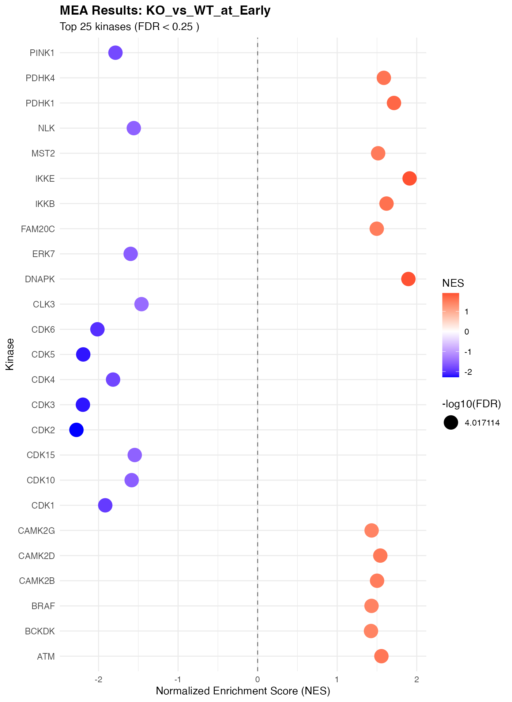
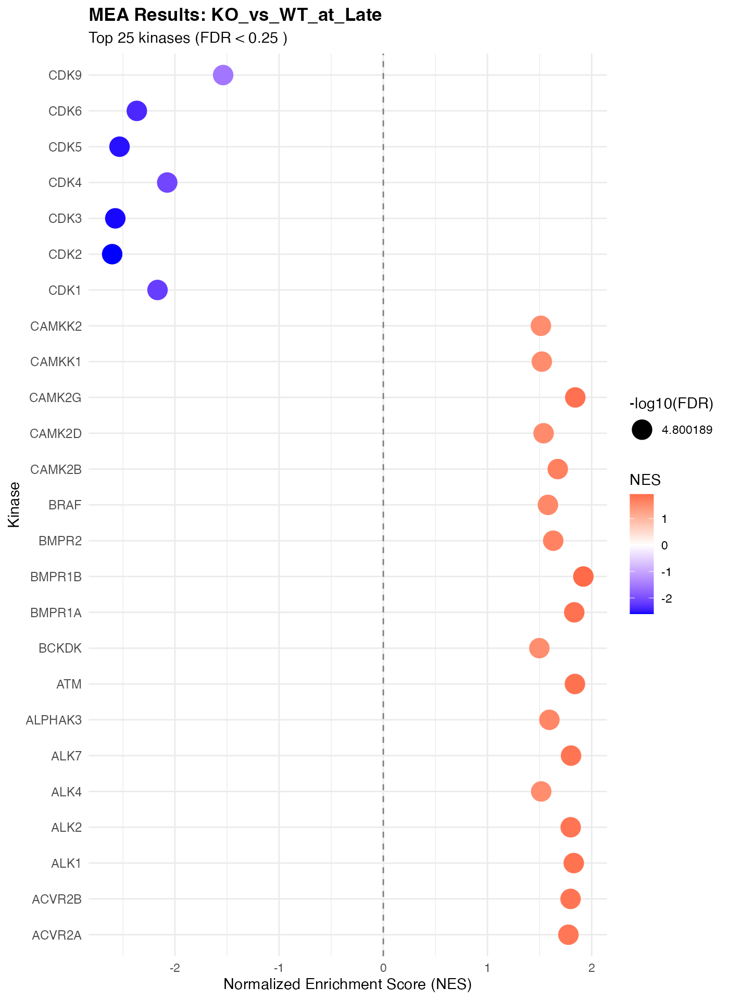
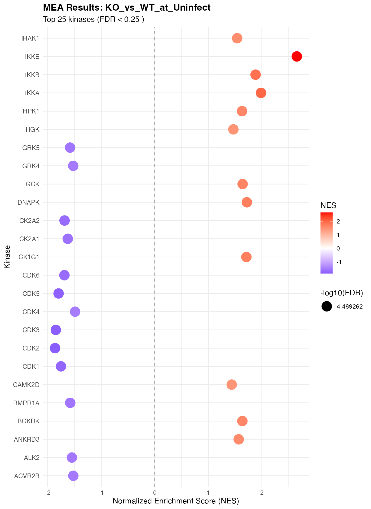
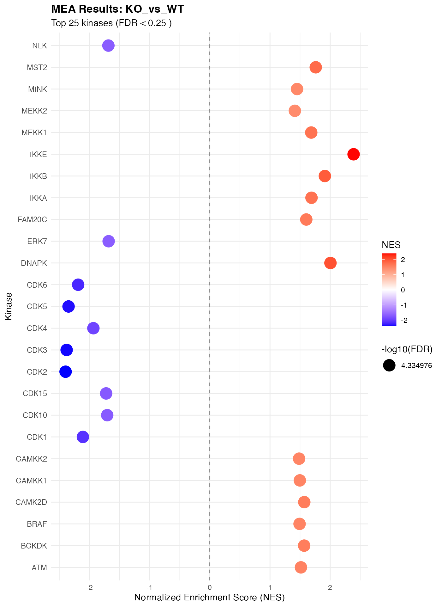
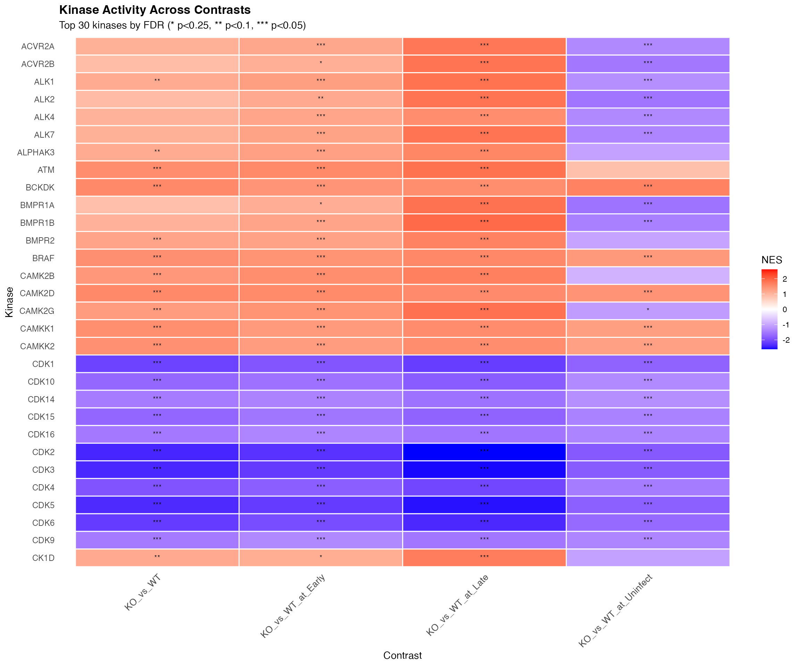
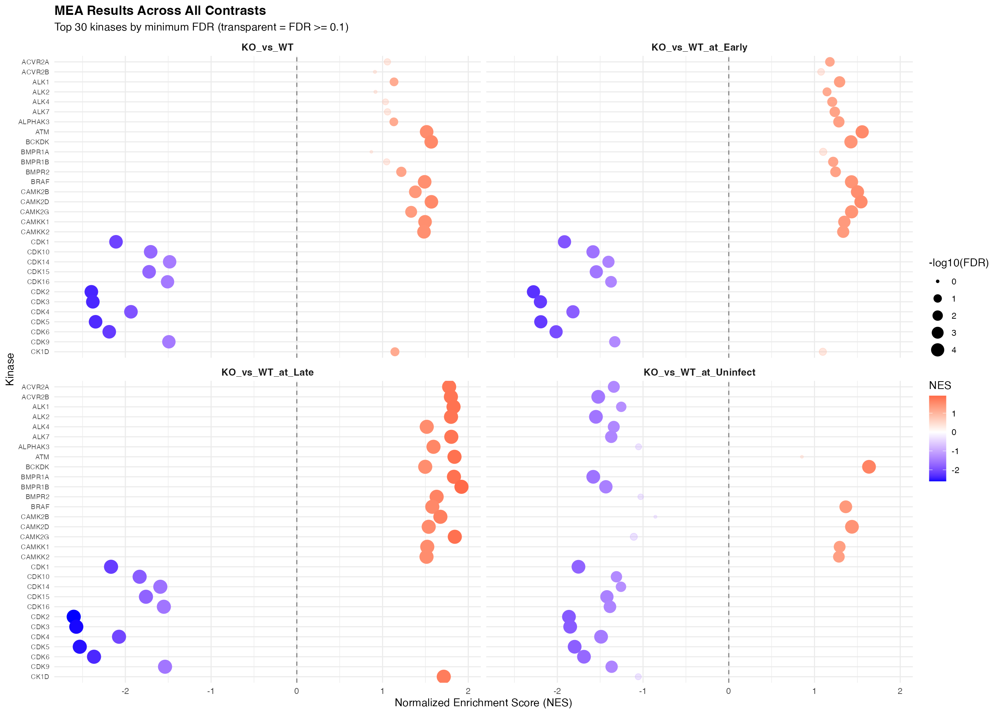
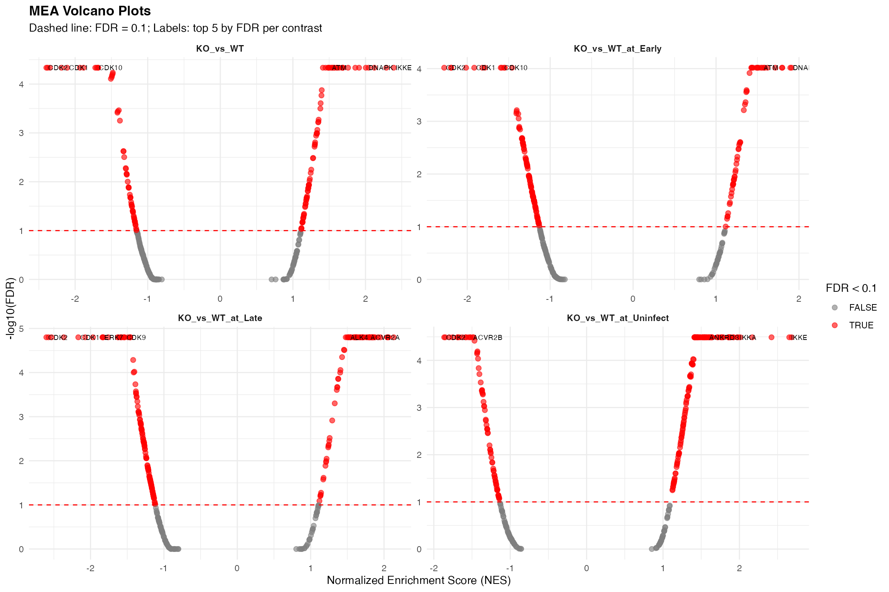

# Visualizing Kinase Library MEA Results

## Introduction

This vignette demonstrates how to visualize Motif Enrichment Analysis
(MEA) results from the Kinase Library CLI tools. We’ll create dotplots
for individual contrasts and combined views across all contrasts.

## Load Libraries and Data

``` r

library(dplyr)
library(forcats)
library(ggplot2)
library(purrr)
library(tidyr)
```

``` r

# Load all MEA results from zip file in inst/extdata
zip_path <- system.file("extdata", "mea_results.zip", package = "prophosqua")
mea_files <- unzip(zip_path, list = TRUE)$Name

# Read and combine all MEA results
mea_results <- mea_files |>
  map_dfr(function(f) {
    contrast_name <- gsub("^mea_|\\.csv$", "", f)
    read.csv(unz(zip_path, f)) |>
      mutate(contrast = contrast_name)
  })

load_info <- tibble(
  Metric = c("MEA result files", "Total rows", "Contrasts"),
  Value = c(length(mea_files), nrow(mea_results),
            paste(unique(mea_results$contrast), collapse = ", "))
)
knitr::kable(load_info, caption = "Data Loaded")
```

| Metric | Value |
|:---|:---|
| MEA result files | 4 |
| Total rows | 1244 |
| Contrasts | KO_vs_WT_at_Early, KO_vs_WT_at_Late, KO_vs_WT_at_Uninfect, KO_vs_WT |

Data Loaded {.table}

``` r

# Preview the data structure
mea_results |>
  select(Kinase, ES, NES, `p.value`, FDR, contrast) |>
  head()
```

    ##   Kinase         ES       NES     p.value        FDR          contrast
    ## 1   AAK1 -0.2147255 -1.153435 0.031195841 0.06762887 KO_vs_WT_at_Early
    ## 2 ACVR2A  0.2177526  1.179734 0.029850746 0.02678547 KO_vs_WT_at_Early
    ## 3 ACVR2B  0.1979541  1.076529 0.174129353 0.20103144 KO_vs_WT_at_Early
    ## 4   AKT1 -0.2182856 -1.213511 0.001626016 0.02398590 KO_vs_WT_at_Early
    ## 5   AKT2 -0.2155801 -1.196881 0.001689189 0.03171077 KO_vs_WT_at_Early
    ## 6   AKT3 -0.2237104 -1.243654 0.001000000 0.01365129 KO_vs_WT_at_Early

## Data Preparation

``` r

# Clean up and prepare data for plotting
mea_clean <- mea_results |>
  rename(
    kinase = Kinase,
    pvalue = `p.value`
  ) |>
  mutate(
    neg_log10_fdr = -log10(FDR + 1e-10),
    neg_log10_pval = -log10(pvalue + 1e-10),
    significant = FDR < 0.1,
    direction = case_when(
      NES > 0 ~ "Up",
      NES < 0 ~ "Down",
      TRUE ~ "None"
    )
  )

# Summary of significant results
sig_summary <- mea_clean |>
  filter(significant) |>
  group_by(contrast, direction) |>
  summarise(n = n(), .groups = "drop") |>
  pivot_wider(names_from = direction, values_from = n, values_fill = 0)
knitr::kable(sig_summary, caption = "Significant Results (FDR < 0.1)")
```

| contrast             | Down |  Up |
|:---------------------|-----:|----:|
| KO_vs_WT             |   58 |  79 |
| KO_vs_WT_at_Early    |  118 |  55 |
| KO_vs_WT_at_Late     |  130 |  74 |
| KO_vs_WT_at_Uninfect |   75 | 136 |

Significant Results (FDR \< 0.1) {.table}

## Individual Contrast Dotplots

``` r

# Function to create dotplot for a single contrast
plot_mea_dotplot <- function(data, contrast_name, top_n = 20, fdr_cutoff = 0.25) {
  plot_data <- data |>
    filter(contrast == contrast_name, FDR < fdr_cutoff) |>
    arrange(FDR) |>
    head(top_n) |>
    mutate(kinase = fct_reorder(kinase, -FDR))


  if (nrow(plot_data) == 0) {
    return(ggplot() +
             annotate("text", x = 0.5, y = 0.5,
                      label = paste("No significant results for", contrast_name,
                                    "\n(FDR <", fdr_cutoff, ")")) +
             theme_void())
  }

  ggplot(plot_data, aes(x = NES, y = kinase)) +
    geom_point(aes(size = neg_log10_fdr, color = NES)) +
    scale_color_gradient2(
      low = "blue", mid = "white", high = "red", midpoint = 0,
      name = "NES"
    ) +
    scale_size_continuous(name = "-log10(FDR)", range = c(2, 8)) +
    geom_vline(xintercept = 0, linetype = "dashed", color = "gray50") +
    labs(
      title = paste("MEA Results:", contrast_name),
      subtitle = paste("Top", min(top_n, nrow(plot_data)), "kinases (FDR <", fdr_cutoff, ")"),
      x = "Normalized Enrichment Score (NES)",
      y = "Kinase"
    ) +
    theme_minimal() +
    theme(
      axis.text.y = element_text(size = 9),
      plot.title = element_text(face = "bold"),
      legend.position = "right"
    )
}
```

``` r

# Generate dotplot for each contrast
contrasts <- unique(mea_clean$contrast)

walk(contrasts, function(ct) {
  p <- plot_mea_dotplot(mea_clean, ct, top_n = 25, fdr_cutoff = 0.25)
  print(p)
})
```



## Combined Heatmap Across All Contrasts

``` r

# Get top kinases across all contrasts
top_kinases <- mea_clean |>
  filter(FDR < 0.25) |>
  group_by(kinase) |>
  summarise(
    min_fdr = min(FDR),
    mean_abs_nes = mean(abs(NES)),
    n_contrasts = n()
  ) |>
  arrange(min_fdr) |>
  head(30) |>
  pull(kinase)

# Prepare data for heatmap
heatmap_data <- mea_clean |>
  filter(kinase %in% top_kinases) |>
  select(kinase, contrast, NES, FDR) |>
  mutate(
    kinase = factor(kinase, levels = rev(top_kinases)),
    significance = case_when(
      FDR < 0.05 ~ "***",
      FDR < 0.1 ~ "**",
      FDR < 0.25 ~ "*",
      TRUE ~ ""
    )
  )

# Create heatmap
ggplot(heatmap_data, aes(x = contrast, y = kinase, fill = NES)) +
  geom_tile(color = "white", linewidth = 0.5) +
  geom_text(aes(label = significance), color = "black", size = 3) +
  scale_fill_gradient2(
    low = "blue", mid = "white", high = "red", midpoint = 0,
    name = "NES",
    limits = c(-max(abs(heatmap_data$NES)), max(abs(heatmap_data$NES)))
  ) +
  labs(
    title = "Kinase Activity Across Contrasts",
    subtitle = "Top 30 kinases by FDR (* p<0.25, ** p<0.1, *** p<0.05)",
    x = "Contrast",
    y = "Kinase"
  ) +
  theme_minimal() +
  theme(
    axis.text.x = element_text(angle = 45, hjust = 1, size = 10),
    axis.text.y = element_text(size = 9),
    plot.title = element_text(face = "bold"),
    panel.grid = element_blank()
  )
```



## Combined Dotplot (Faceted)

``` r

# Top kinases for faceted plot
plot_data_facet <- mea_clean |>
  filter(kinase %in% top_kinases) |>
  mutate(kinase = factor(kinase, levels = rev(top_kinases)))

ggplot(plot_data_facet, aes(x = NES, y = kinase)) +
  geom_point(aes(size = neg_log10_fdr, color = NES, alpha = significant)) +
  scale_color_gradient2(
    low = "blue", mid = "white", high = "red", midpoint = 0,
    name = "NES"
  ) +
  scale_size_continuous(name = "-log10(FDR)", range = c(1, 6)) +
  scale_alpha_manual(values = c("TRUE" = 1, "FALSE" = 0.3), guide = "none") +
  geom_vline(xintercept = 0, linetype = "dashed", color = "gray50") +
  facet_wrap(~contrast, ncol = 2) +
  labs(
    title = "MEA Results Across All Contrasts",
    subtitle = "Top 30 kinases by minimum FDR (transparent = FDR >= 0.1)",
    x = "Normalized Enrichment Score (NES)",
    y = "Kinase"
  ) +
  theme_minimal() +
  theme(
    axis.text.y = element_text(size = 7),
    strip.text = element_text(face = "bold", size = 10),
    plot.title = element_text(face = "bold"),
    legend.position = "right"
  )
```



## Volcano-style Plot

``` r

# Volcano plot for each contrast
ggplot(mea_clean, aes(x = NES, y = neg_log10_fdr)) +

geom_point(aes(color = significant), alpha = 0.6, size = 2) +
  geom_hline(yintercept = -log10(0.1), linetype = "dashed", color = "red") +
  geom_text(
    data = mea_clean |>
      filter(FDR < 0.05) |>
      group_by(contrast) |>
      slice_min(FDR, n = 5),
    aes(label = kinase),
    size = 2.5,
    hjust = -0.1,
    check_overlap = TRUE
  ) +
  scale_color_manual(
    values = c("TRUE" = "red", "FALSE" = "gray50"),
    name = "FDR < 0.1"
  ) +
  facet_wrap(~contrast, scales = "free") +
  labs(
    title = "MEA Volcano Plots",
    subtitle = "Dashed line: FDR = 0.1; Labels: top 5 by FDR per contrast",
    x = "Normalized Enrichment Score (NES)",
    y = "-log10(FDR)"
  ) +
  theme_minimal() +
  theme(
    strip.text = element_text(face = "bold"),
    plot.title = element_text(face = "bold")
  )
```



## Summary Table

``` r

# Summary of significant kinases
summary_table <- mea_clean |>
  filter(FDR < 0.1) |>
  select(contrast, kinase, NES, FDR) |>
  arrange(contrast, FDR) |>
  mutate(
    NES = round(NES, 3),
    FDR = signif(FDR, 3)
  )

if (nrow(summary_table) > 0) {
  knitr::kable(
    summary_table,
    caption = "Significant Kinases (FDR < 0.1)",
    col.names = c("Contrast", "Kinase", "NES", "FDR")
  )
}
```

| Contrast             | Kinase   |    NES |      FDR |
|:---------------------|:---------|-------:|---------:|
| KO_vs_WT             | ATM      |  1.514 | 4.62e-05 |
| KO_vs_WT             | BCKDK    |  1.568 | 4.62e-05 |
| KO_vs_WT             | BRAF     |  1.491 | 4.62e-05 |
| KO_vs_WT             | CAMK2D   |  1.570 | 4.62e-05 |
| KO_vs_WT             | CAMKK1   |  1.496 | 4.62e-05 |
| KO_vs_WT             | CAMKK2   |  1.483 | 4.62e-05 |
| KO_vs_WT             | CDK1     | -2.109 | 4.62e-05 |
| KO_vs_WT             | CDK2     | -2.397 | 4.62e-05 |
| KO_vs_WT             | CDK3     | -2.379 | 4.62e-05 |
| KO_vs_WT             | CDK4     | -1.935 | 4.62e-05 |
| KO_vs_WT             | CDK5     | -2.347 | 4.62e-05 |
| KO_vs_WT             | CDK6     | -2.188 | 4.62e-05 |
| KO_vs_WT             | CDK10    | -1.705 | 4.62e-05 |
| KO_vs_WT             | CDK15    | -1.723 | 4.62e-05 |
| KO_vs_WT             | DNAPK    |  2.005 | 4.62e-05 |
| KO_vs_WT             | ERK7     | -1.681 | 4.62e-05 |
| KO_vs_WT             | FAM20C   |  1.603 | 4.62e-05 |
| KO_vs_WT             | IKKA     |  1.690 | 4.62e-05 |
| KO_vs_WT             | IKKB     |  1.911 | 4.62e-05 |
| KO_vs_WT             | IKKE     |  2.389 | 4.62e-05 |
| KO_vs_WT             | MEKK1    |  1.685 | 4.62e-05 |
| KO_vs_WT             | MEKK2    |  1.413 | 4.62e-05 |
| KO_vs_WT             | MINK     |  1.449 | 4.62e-05 |
| KO_vs_WT             | MST2     |  1.760 | 4.62e-05 |
| KO_vs_WT             | NLK      | -1.685 | 4.62e-05 |
| KO_vs_WT             | PDHK1    |  2.042 | 4.62e-05 |
| KO_vs_WT             | PDHK4    |  1.860 | 4.62e-05 |
| KO_vs_WT             | PINK1    | -1.884 | 4.62e-05 |
| KO_vs_WT             | PRPK     |  1.537 | 4.62e-05 |
| KO_vs_WT             | RAF1     |  1.613 | 4.62e-05 |
| KO_vs_WT             | STLK3    |  1.543 | 4.62e-05 |
| KO_vs_WT             | TBK1     |  2.287 | 4.62e-05 |
| KO_vs_WT             | TLK2     |  1.680 | 4.62e-05 |
| KO_vs_WT             | YSK4     |  2.122 | 4.62e-05 |
| KO_vs_WT             | ZAK      |  1.639 | 4.62e-05 |
| KO_vs_WT             | ERK2     | -1.481 | 5.84e-05 |
| KO_vs_WT             | CDK14    | -1.484 | 6.23e-05 |
| KO_vs_WT             | CDK9     | -1.493 | 6.67e-05 |
| KO_vs_WT             | CLK3     | -1.496 | 7.19e-05 |
| KO_vs_WT             | CDK16    | -1.508 | 7.79e-05 |
| KO_vs_WT             | MEKK3    |  1.397 | 1.33e-04 |
| KO_vs_WT             | NEK4     |  1.393 | 1.71e-04 |
| KO_vs_WT             | CAMK2B   |  1.382 | 2.47e-04 |
| KO_vs_WT             | TAK1     |  1.378 | 3.17e-04 |
| KO_vs_WT             | LRRK2    | -1.398 | 3.44e-04 |
| KO_vs_WT             | CDK13    | -1.414 | 3.63e-04 |
| KO_vs_WT             | CLK1     | -1.417 | 3.85e-04 |
| KO_vs_WT             | TLK1     |  1.354 | 5.36e-04 |
| KO_vs_WT             | HASPIN   | -1.383 | 5.61e-04 |
| KO_vs_WT             | MEK2     |  1.351 | 5.92e-04 |
| KO_vs_WT             | RIPK2    |  1.348 | 6.09e-04 |
| KO_vs_WT             | CK1G1    |  1.337 | 8.67e-04 |
| KO_vs_WT             | CAMK2G   |  1.334 | 1.01e-03 |
| KO_vs_WT             | DSTYK    |  1.327 | 1.01e-03 |
| KO_vs_WT             | PLK4     |  1.330 | 1.04e-03 |
| KO_vs_WT             | COT      |  1.320 | 1.14e-03 |
| KO_vs_WT             | GCK      |  1.306 | 1.56e-03 |
| KO_vs_WT             | TGFBR2   |  1.303 | 1.69e-03 |
| KO_vs_WT             | MASTL    |  1.302 | 1.76e-03 |
| KO_vs_WT             | ATR      |  1.298 | 1.91e-03 |
| KO_vs_WT             | SRPK1    | -1.335 | 2.36e-03 |
| KO_vs_WT             | CDK12    | -1.333 | 2.38e-03 |
| KO_vs_WT             | BIKE     | -1.324 | 3.13e-03 |
| KO_vs_WT             | MLK4     |  1.279 | 3.25e-03 |
| KO_vs_WT             | SMG1     |  1.276 | 3.30e-03 |
| KO_vs_WT             | CDKL5    | -1.303 | 5.26e-03 |
| KO_vs_WT             | CLK4     | -1.301 | 5.42e-03 |
| KO_vs_WT             | MEK1     |  1.253 | 5.65e-03 |
| KO_vs_WT             | MARK4    |  1.245 | 6.58e-03 |
| KO_vs_WT             | AAK1     | -1.292 | 6.86e-03 |
| KO_vs_WT             | HIPK3    | -1.290 | 6.96e-03 |
| KO_vs_WT             | SRPK2    | -1.288 | 7.18e-03 |
| KO_vs_WT             | DLK      |  1.234 | 8.71e-03 |
| KO_vs_WT             | CK1G3    |  1.229 | 9.53e-03 |
| KO_vs_WT             | CLK2     | -1.276 | 9.96e-03 |
| KO_vs_WT             | MLK2     |  1.222 | 1.15e-02 |
| KO_vs_WT             | BMPR2    |  1.219 | 1.16e-02 |
| KO_vs_WT             | NEK9     |  1.220 | 1.16e-02 |
| KO_vs_WT             | TTBK1    |  1.220 | 1.18e-02 |
| KO_vs_WT             | CDK17    | -1.264 | 1.29e-02 |
| KO_vs_WT             | ERK1     | -1.263 | 1.31e-02 |
| KO_vs_WT             | MARK1    |  1.214 | 1.32e-02 |
| KO_vs_WT             | SRPK3    | -1.261 | 1.33e-02 |
| KO_vs_WT             | ANKRD3   |  1.212 | 1.36e-02 |
| KO_vs_WT             | KHS1     |  1.211 | 1.37e-02 |
| KO_vs_WT             | NEK2     |  1.206 | 1.54e-02 |
| KO_vs_WT             | PLK2     |  1.206 | 1.56e-02 |
| KO_vs_WT             | EEF2K    | -1.247 | 1.84e-02 |
| KO_vs_WT             | MARK2    |  1.195 | 1.98e-02 |
| KO_vs_WT             | ICK      | -1.237 | 2.09e-02 |
| KO_vs_WT             | CDKL1    | -1.239 | 2.09e-02 |
| KO_vs_WT             | ULK1     |  1.191 | 2.12e-02 |
| KO_vs_WT             | MARK3    |  1.191 | 2.12e-02 |
| KO_vs_WT             | CK1G2    |  1.190 | 2.12e-02 |
| KO_vs_WT             | P38A     | -1.239 | 2.14e-02 |
| KO_vs_WT             | ULK3     |  1.188 | 2.18e-02 |
| KO_vs_WT             | NEK5     |  1.185 | 2.30e-02 |
| KO_vs_WT             | NEK7     |  1.183 | 2.43e-02 |
| KO_vs_WT             | ERK5     | -1.228 | 2.62e-02 |
| KO_vs_WT             | TTBK2    |  1.176 | 2.80e-02 |
| KO_vs_WT             | PLK3     |  1.176 | 2.82e-02 |
| KO_vs_WT             | MTOR     | -1.224 | 2.91e-02 |
| KO_vs_WT             | CDK18    | -1.223 | 2.97e-02 |
| KO_vs_WT             | MLK1     |  1.170 | 3.16e-02 |
| KO_vs_WT             | PBK      | -1.219 | 3.19e-02 |
| KO_vs_WT             | PKCE     | -1.217 | 3.23e-02 |
| KO_vs_WT             | GRK1     |  1.168 | 3.29e-02 |
| KO_vs_WT             | P38G     | -1.208 | 3.89e-02 |
| KO_vs_WT             | DYRK1A   | -1.206 | 3.99e-02 |
| KO_vs_WT             | MNK1     | -1.204 | 4.08e-02 |
| KO_vs_WT             | CAMLCK   | -1.202 | 4.24e-02 |
| KO_vs_WT             | ULK2     |  1.154 | 4.54e-02 |
| KO_vs_WT             | MAPKAPK2 |  1.152 | 4.74e-02 |
| KO_vs_WT             | PERK     |  1.150 | 4.86e-02 |
| KO_vs_WT             | GSK3B    | -1.194 | 5.01e-02 |
| KO_vs_WT             | AURC     | -1.190 | 5.32e-02 |
| KO_vs_WT             | CK1D     |  1.144 | 5.36e-02 |
| KO_vs_WT             | TAO3     |  1.145 | 5.41e-02 |
| KO_vs_WT             | KIS      | -1.187 | 5.60e-02 |
| KO_vs_WT             | NEK11    |  1.141 | 5.65e-02 |
| KO_vs_WT             | AURB     | -1.185 | 5.78e-02 |
| KO_vs_WT             | CDKL2    | -1.179 | 6.45e-02 |
| KO_vs_WT             | PAK5     | -1.178 | 6.47e-02 |
| KO_vs_WT             | HIPK1    | -1.177 | 6.49e-02 |
| KO_vs_WT             | ALK1     |  1.134 | 6.61e-02 |
| KO_vs_WT             | LATS2    |  1.133 | 6.69e-02 |
| KO_vs_WT             | ALPHAK3  |  1.132 | 6.79e-02 |
| KO_vs_WT             | GCN2     |  1.131 | 6.85e-02 |
| KO_vs_WT             | BUB1     | -1.174 | 6.95e-02 |
| KO_vs_WT             | PKCI     | -1.169 | 7.58e-02 |
| KO_vs_WT             | WNK3     | -1.169 | 7.66e-02 |
| KO_vs_WT             | NIM1     |  1.118 | 8.89e-02 |
| KO_vs_WT             | JNK3     | -1.161 | 8.92e-02 |
| KO_vs_WT             | CAMK2A   |  1.118 | 8.97e-02 |
| KO_vs_WT             | TGFBR1   |  1.115 | 9.28e-02 |
| KO_vs_WT             | TAO2     | -1.156 | 9.78e-02 |
| KO_vs_WT             | PAK1     | -1.155 | 9.79e-02 |
| KO_vs_WT_at_Early    | ATM      |  1.556 | 9.61e-05 |
| KO_vs_WT_at_Early    | BCKDK    |  1.425 | 9.61e-05 |
| KO_vs_WT_at_Early    | BRAF     |  1.432 | 9.61e-05 |
| KO_vs_WT_at_Early    | CAMK2B   |  1.501 | 9.61e-05 |
| KO_vs_WT_at_Early    | CAMK2D   |  1.542 | 9.61e-05 |
| KO_vs_WT_at_Early    | CAMK2G   |  1.433 | 9.61e-05 |
| KO_vs_WT_at_Early    | CDK1     | -1.916 | 9.61e-05 |
| KO_vs_WT_at_Early    | CDK2     | -2.278 | 9.61e-05 |
| KO_vs_WT_at_Early    | CDK3     | -2.197 | 9.61e-05 |
| KO_vs_WT_at_Early    | CDK4     | -1.818 | 9.61e-05 |
| KO_vs_WT_at_Early    | CDK5     | -2.193 | 9.61e-05 |
| KO_vs_WT_at_Early    | CDK6     | -2.014 | 9.61e-05 |
| KO_vs_WT_at_Early    | CDK10    | -1.584 | 9.61e-05 |
| KO_vs_WT_at_Early    | CDK15    | -1.545 | 9.61e-05 |
| KO_vs_WT_at_Early    | CLK3     | -1.460 | 9.61e-05 |
| KO_vs_WT_at_Early    | DNAPK    |  1.895 | 9.61e-05 |
| KO_vs_WT_at_Early    | ERK7     | -1.596 | 9.61e-05 |
| KO_vs_WT_at_Early    | FAM20C   |  1.497 | 9.61e-05 |
| KO_vs_WT_at_Early    | IKKB     |  1.620 | 9.61e-05 |
| KO_vs_WT_at_Early    | IKKE     |  1.911 | 9.61e-05 |
| KO_vs_WT_at_Early    | MST2     |  1.515 | 9.61e-05 |
| KO_vs_WT_at_Early    | NLK      | -1.557 | 9.61e-05 |
| KO_vs_WT_at_Early    | PDHK1    |  1.714 | 9.61e-05 |
| KO_vs_WT_at_Early    | PDHK4    |  1.587 | 9.61e-05 |
| KO_vs_WT_at_Early    | PINK1    | -1.787 | 9.61e-05 |
| KO_vs_WT_at_Early    | PRPK     |  1.448 | 9.61e-05 |
| KO_vs_WT_at_Early    | STLK3    |  1.486 | 9.61e-05 |
| KO_vs_WT_at_Early    | TBK1     |  1.799 | 9.61e-05 |
| KO_vs_WT_at_Early    | TLK2     |  1.578 | 9.61e-05 |
| KO_vs_WT_at_Early    | YSK4     |  1.795 | 9.61e-05 |
| KO_vs_WT_at_Early    | ZAK      |  1.404 | 1.21e-04 |
| KO_vs_WT_at_Early    | ATR      |  1.367 | 2.56e-04 |
| KO_vs_WT_at_Early    | IKKA     |  1.371 | 2.69e-04 |
| KO_vs_WT_at_Early    | MEKK1    |  1.364 | 2.79e-04 |
| KO_vs_WT_at_Early    | RAF1     |  1.356 | 4.34e-04 |
| KO_vs_WT_at_Early    | CAMKK1   |  1.348 | 4.80e-04 |
| KO_vs_WT_at_Early    | CAMKK2   |  1.335 | 6.14e-04 |
| KO_vs_WT_at_Early    | CDK14    | -1.403 | 6.15e-04 |
| KO_vs_WT_at_Early    | HASPIN   | -1.406 | 6.59e-04 |
| KO_vs_WT_at_Early    | CLK1     | -1.408 | 7.10e-04 |
| KO_vs_WT_at_Early    | PKCE     | -1.385 | 7.21e-04 |
| KO_vs_WT_at_Early    | PKCI     | -1.381 | 8.82e-04 |
| KO_vs_WT_at_Early    | RIPK3    | -1.373 | 1.27e-03 |
| KO_vs_WT_at_Early    | CDK16    | -1.374 | 1.34e-03 |
| KO_vs_WT_at_Early    | LRRK2    | -1.374 | 1.35e-03 |
| KO_vs_WT_at_Early    | CDKL1    | -1.363 | 1.43e-03 |
| KO_vs_WT_at_Early    | PHKG2    | -1.339 | 2.07e-03 |
| KO_vs_WT_at_Early    | RIPK1    | -1.340 | 2.11e-03 |
| KO_vs_WT_at_Early    | SRPK3    | -1.337 | 2.13e-03 |
| KO_vs_WT_at_Early    | TAO2     | -1.342 | 2.15e-03 |
| KO_vs_WT_at_Early    | WNK3     | -1.337 | 2.17e-03 |
| KO_vs_WT_at_Early    | TGFBR1   |  1.291 | 2.47e-03 |
| KO_vs_WT_at_Early    | ALK1     |  1.293 | 2.51e-03 |
| KO_vs_WT_at_Early    | CDK9     | -1.330 | 2.51e-03 |
| KO_vs_WT_at_Early    | CDKL5    | -1.331 | 2.52e-03 |
| KO_vs_WT_at_Early    | STK33    | -1.329 | 2.59e-03 |
| KO_vs_WT_at_Early    | ALPHAK3  |  1.284 | 2.60e-03 |
| KO_vs_WT_at_Early    | MNK1     | -1.326 | 2.77e-03 |
| KO_vs_WT_at_Early    | TLK1     |  1.279 | 2.81e-03 |
| KO_vs_WT_at_Early    | SRPK1    | -1.324 | 2.83e-03 |
| KO_vs_WT_at_Early    | AMPKA1   | -1.321 | 2.96e-03 |
| KO_vs_WT_at_Early    | PLK3     |  1.273 | 3.30e-03 |
| KO_vs_WT_at_Early    | ERK2     | -1.317 | 3.32e-03 |
| KO_vs_WT_at_Early    | MEKK2    |  1.270 | 3.39e-03 |
| KO_vs_WT_at_Early    | NIK      | -1.315 | 3.39e-03 |
| KO_vs_WT_at_Early    | PKCA     | -1.309 | 3.76e-03 |
| KO_vs_WT_at_Early    | MAPKAPK2 |  1.257 | 4.70e-03 |
| KO_vs_WT_at_Early    | NUAK2    | -1.298 | 4.87e-03 |
| KO_vs_WT_at_Early    | PHKG1    | -1.293 | 5.18e-03 |
| KO_vs_WT_at_Early    | SRPK2    | -1.295 | 5.21e-03 |
| KO_vs_WT_at_Early    | IRE2     | -1.293 | 5.28e-03 |
| KO_vs_WT_at_Early    | PLK2     |  1.252 | 5.37e-03 |
| KO_vs_WT_at_Early    | IRAK4    | -1.287 | 5.80e-03 |
| KO_vs_WT_at_Early    | CDKL2    | -1.283 | 6.25e-03 |
| KO_vs_WT_at_Early    | PKCH     | -1.282 | 6.37e-03 |
| KO_vs_WT_at_Early    | BMPR2    |  1.246 | 6.41e-03 |
| KO_vs_WT_at_Early    | WNK4     | -1.280 | 6.61e-03 |
| KO_vs_WT_at_Early    | PKCZ     | -1.280 | 6.71e-03 |
| KO_vs_WT_at_Early    | MELK     | -1.277 | 6.82e-03 |
| KO_vs_WT_at_Early    | CDK13    | -1.277 | 6.87e-03 |
| KO_vs_WT_at_Early    | AMPKA2   | -1.277 | 7.02e-03 |
| KO_vs_WT_at_Early    | PAK5     | -1.274 | 7.23e-03 |
| KO_vs_WT_at_Early    | QIK      | -1.270 | 7.91e-03 |
| KO_vs_WT_at_Early    | ALK7     |  1.237 | 8.42e-03 |
| KO_vs_WT_at_Early    | SMG1     |  1.233 | 9.15e-03 |
| KO_vs_WT_at_Early    | CAMLCK   | -1.259 | 1.06e-02 |
| KO_vs_WT_at_Early    | PKCT     | -1.258 | 1.08e-02 |
| KO_vs_WT_at_Early    | MRCKB    | -1.254 | 1.11e-02 |
| KO_vs_WT_at_Early    | NUAK1    | -1.255 | 1.11e-02 |
| KO_vs_WT_at_Early    | CAMK2A   |  1.224 | 1.12e-02 |
| KO_vs_WT_at_Early    | WNK1     | -1.256 | 1.12e-02 |
| KO_vs_WT_at_Early    | PAK2     | -1.253 | 1.12e-02 |
| KO_vs_WT_at_Early    | PKN2     | -1.255 | 1.12e-02 |
| KO_vs_WT_at_Early    | GRK1     |  1.223 | 1.14e-02 |
| KO_vs_WT_at_Early    | CLK4     | -1.251 | 1.18e-02 |
| KO_vs_WT_at_Early    | MNK2     | -1.248 | 1.22e-02 |
| KO_vs_WT_at_Early    | BMPR1B   |  1.218 | 1.25e-02 |
| KO_vs_WT_at_Early    | TAK1     |  1.214 | 1.28e-02 |
| KO_vs_WT_at_Early    | GRK7     |  1.215 | 1.31e-02 |
| KO_vs_WT_at_Early    | IRE1     | -1.245 | 1.33e-02 |
| KO_vs_WT_at_Early    | AKT3     | -1.244 | 1.37e-02 |
| KO_vs_WT_at_Early    | PKCG     | -1.239 | 1.53e-02 |
| KO_vs_WT_at_Early    | MEKK3    |  1.207 | 1.53e-02 |
| KO_vs_WT_at_Early    | ALK4     |  1.207 | 1.56e-02 |
| KO_vs_WT_at_Early    | NEK4     |  1.205 | 1.56e-02 |
| KO_vs_WT_at_Early    | BIKE     | -1.236 | 1.59e-02 |
| KO_vs_WT_at_Early    | TGFBR2   |  1.202 | 1.63e-02 |
| KO_vs_WT_at_Early    | EEF2K    | -1.231 | 1.72e-02 |
| KO_vs_WT_at_Early    | PAK3     | -1.230 | 1.73e-02 |
| KO_vs_WT_at_Early    | PAK1     | -1.231 | 1.74e-02 |
| KO_vs_WT_at_Early    | PKCD     | -1.228 | 1.83e-02 |
| KO_vs_WT_at_Early    | GRK6     |  1.194 | 1.96e-02 |
| KO_vs_WT_at_Early    | HRI      | -1.221 | 2.16e-02 |
| KO_vs_WT_at_Early    | MYO3A    | -1.220 | 2.16e-02 |
| KO_vs_WT_at_Early    | NEK11    | -1.219 | 2.16e-02 |
| KO_vs_WT_at_Early    | MST3     | -1.220 | 2.18e-02 |
| KO_vs_WT_at_Early    | MYO3B    | -1.217 | 2.26e-02 |
| KO_vs_WT_at_Early    | COT      |  1.187 | 2.31e-02 |
| KO_vs_WT_at_Early    | AKT1     | -1.214 | 2.40e-02 |
| KO_vs_WT_at_Early    | MST4     | -1.208 | 2.61e-02 |
| KO_vs_WT_at_Early    | HIPK3    | -1.208 | 2.63e-02 |
| KO_vs_WT_at_Early    | MEKK6    | -1.209 | 2.66e-02 |
| KO_vs_WT_at_Early    | ICK      | -1.209 | 2.67e-02 |
| KO_vs_WT_at_Early    | ACVR2A   |  1.180 | 2.68e-02 |
| KO_vs_WT_at_Early    | SGK3     | -1.206 | 2.71e-02 |
| KO_vs_WT_at_Early    | DYRK1A   | -1.205 | 2.76e-02 |
| KO_vs_WT_at_Early    | CAMK1G   | -1.204 | 2.78e-02 |
| KO_vs_WT_at_Early    | MRCKA    | -1.203 | 2.80e-02 |
| KO_vs_WT_at_Early    | PAK4     | -1.198 | 3.14e-02 |
| KO_vs_WT_at_Early    | AKT2     | -1.197 | 3.17e-02 |
| KO_vs_WT_at_Early    | CDK12    | -1.195 | 3.18e-02 |
| KO_vs_WT_at_Early    | TAO1     | -1.196 | 3.18e-02 |
| KO_vs_WT_at_Early    | SNRK     | -1.194 | 3.19e-02 |
| KO_vs_WT_at_Early    | AURB     | -1.194 | 3.20e-02 |
| KO_vs_WT_at_Early    | PKR      | -1.195 | 3.21e-02 |
| KO_vs_WT_at_Early    | TNIK     | -1.192 | 3.30e-02 |
| KO_vs_WT_at_Early    | MTOR     | -1.190 | 3.44e-02 |
| KO_vs_WT_at_Early    | MINK     |  1.168 | 3.48e-02 |
| KO_vs_WT_at_Early    | PKN1     | -1.189 | 3.53e-02 |
| KO_vs_WT_at_Early    | BRSK2    | -1.188 | 3.57e-02 |
| KO_vs_WT_at_Early    | GCK      |  1.164 | 3.72e-02 |
| KO_vs_WT_at_Early    | SKMLCK   | -1.182 | 4.02e-02 |
| KO_vs_WT_at_Early    | TSSK2    | -1.179 | 4.22e-02 |
| KO_vs_WT_at_Early    | ULK3     | -1.179 | 4.24e-02 |
| KO_vs_WT_at_Early    | DMPK1    | -1.177 | 4.28e-02 |
| KO_vs_WT_at_Early    | PIM2     | -1.177 | 4.32e-02 |
| KO_vs_WT_at_Early    | CLK2     | -1.175 | 4.53e-02 |
| KO_vs_WT_at_Early    | ROCK1    | -1.173 | 4.64e-02 |
| KO_vs_WT_at_Early    | CAMK4    | -1.168 | 5.11e-02 |
| KO_vs_WT_at_Early    | CRIK     | -1.167 | 5.17e-02 |
| KO_vs_WT_at_Early    | ALK2     |  1.146 | 5.53e-02 |
| KO_vs_WT_at_Early    | BUB1     | -1.161 | 5.94e-02 |
| KO_vs_WT_at_Early    | CDK17    | -1.158 | 6.35e-02 |
| KO_vs_WT_at_Early    | LATS2    |  1.138 | 6.36e-02 |
| KO_vs_WT_at_Early    | MEK1     |  1.139 | 6.40e-02 |
| KO_vs_WT_at_Early    | MYLK4    | -1.157 | 6.50e-02 |
| KO_vs_WT_at_Early    | AAK1     | -1.153 | 6.76e-02 |
| KO_vs_WT_at_Early    | SIK      | -1.154 | 6.78e-02 |
| KO_vs_WT_at_Early    | DCAMKL2  | -1.153 | 6.79e-02 |
| KO_vs_WT_at_Early    | LOK      | -1.153 | 6.82e-02 |
| KO_vs_WT_at_Early    | PBK      | -1.151 | 6.96e-02 |
| KO_vs_WT_at_Early    | DSTYK    |  1.133 | 7.06e-02 |
| KO_vs_WT_at_Early    | MEK5     | -1.146 | 7.68e-02 |
| KO_vs_WT_at_Early    | DCAMKL1  | -1.145 | 7.79e-02 |
| KO_vs_WT_at_Early    | NDR1     | -1.142 | 8.31e-02 |
| KO_vs_WT_at_Early    | ERK1     | -1.141 | 8.41e-02 |
| KO_vs_WT_at_Early    | HIPK1    | -1.139 | 8.56e-02 |
| KO_vs_WT_at_Early    | TSSK1    | -1.138 | 8.58e-02 |
| KO_vs_WT_at_Early    | CHAK2    | -1.139 | 8.61e-02 |
| KO_vs_WT_at_Early    | DYRK3    | -1.139 | 8.62e-02 |
| KO_vs_WT_at_Early    | ROCK2    | -1.137 | 8.74e-02 |
| KO_vs_WT_at_Early    | PAK6     | -1.133 | 9.42e-02 |
| KO_vs_WT_at_Early    | NEK7     |  1.116 | 9.93e-02 |
| KO_vs_WT_at_Late     | ACVR2A   |  1.777 | 1.58e-05 |
| KO_vs_WT_at_Late     | ACVR2B   |  1.797 | 1.58e-05 |
| KO_vs_WT_at_Late     | ALK1     |  1.828 | 1.58e-05 |
| KO_vs_WT_at_Late     | ALK2     |  1.799 | 1.58e-05 |
| KO_vs_WT_at_Late     | ALK4     |  1.515 | 1.58e-05 |
| KO_vs_WT_at_Late     | ALK7     |  1.802 | 1.58e-05 |
| KO_vs_WT_at_Late     | ALPHAK3  |  1.594 | 1.58e-05 |
| KO_vs_WT_at_Late     | ATM      |  1.839 | 1.58e-05 |
| KO_vs_WT_at_Late     | BCKDK    |  1.498 | 1.58e-05 |
| KO_vs_WT_at_Late     | BMPR1A   |  1.833 | 1.58e-05 |
| KO_vs_WT_at_Late     | BMPR1B   |  1.920 | 1.58e-05 |
| KO_vs_WT_at_Late     | BMPR2    |  1.631 | 1.58e-05 |
| KO_vs_WT_at_Late     | BRAF     |  1.580 | 1.58e-05 |
| KO_vs_WT_at_Late     | CAMK2B   |  1.674 | 1.58e-05 |
| KO_vs_WT_at_Late     | CAMK2D   |  1.538 | 1.58e-05 |
| KO_vs_WT_at_Late     | CAMK2G   |  1.843 | 1.58e-05 |
| KO_vs_WT_at_Late     | CAMKK1   |  1.522 | 1.58e-05 |
| KO_vs_WT_at_Late     | CAMKK2   |  1.513 | 1.58e-05 |
| KO_vs_WT_at_Late     | CDK1     | -2.167 | 1.58e-05 |
| KO_vs_WT_at_Late     | CDK2     | -2.602 | 1.58e-05 |
| KO_vs_WT_at_Late     | CDK3     | -2.572 | 1.58e-05 |
| KO_vs_WT_at_Late     | CDK4     | -2.074 | 1.58e-05 |
| KO_vs_WT_at_Late     | CDK5     | -2.532 | 1.58e-05 |
| KO_vs_WT_at_Late     | CDK6     | -2.366 | 1.58e-05 |
| KO_vs_WT_at_Late     | CDK9     | -1.537 | 1.58e-05 |
| KO_vs_WT_at_Late     | CDK10    | -1.834 | 1.58e-05 |
| KO_vs_WT_at_Late     | CDK14    | -1.592 | 1.58e-05 |
| KO_vs_WT_at_Late     | CDK15    | -1.760 | 1.58e-05 |
| KO_vs_WT_at_Late     | CDK16    | -1.551 | 1.58e-05 |
| KO_vs_WT_at_Late     | CK1D     |  1.714 | 1.58e-05 |
| KO_vs_WT_at_Late     | CK1G2    |  1.547 | 1.58e-05 |
| KO_vs_WT_at_Late     | CK2A1    |  1.662 | 1.58e-05 |
| KO_vs_WT_at_Late     | CK2A2    |  1.618 | 1.58e-05 |
| KO_vs_WT_at_Late     | CLK1     | -1.490 | 1.58e-05 |
| KO_vs_WT_at_Late     | CLK3     | -1.621 | 1.58e-05 |
| KO_vs_WT_at_Late     | DNAPK    |  2.050 | 1.58e-05 |
| KO_vs_WT_at_Late     | EEF2K    | -1.461 | 1.58e-05 |
| KO_vs_WT_at_Late     | ERK2     | -1.578 | 1.58e-05 |
| KO_vs_WT_at_Late     | ERK7     | -1.838 | 1.58e-05 |
| KO_vs_WT_at_Late     | FAM20C   |  2.063 | 1.58e-05 |
| KO_vs_WT_at_Late     | GRK1     |  1.709 | 1.58e-05 |
| KO_vs_WT_at_Late     | GRK2     |  1.545 | 1.58e-05 |
| KO_vs_WT_at_Late     | GRK3     |  1.620 | 1.58e-05 |
| KO_vs_WT_at_Late     | GRK4     |  1.704 | 1.58e-05 |
| KO_vs_WT_at_Late     | GRK5     |  1.798 | 1.58e-05 |
| KO_vs_WT_at_Late     | GRK6     |  1.680 | 1.58e-05 |
| KO_vs_WT_at_Late     | GRK7     |  1.762 | 1.58e-05 |
| KO_vs_WT_at_Late     | HASPIN   | -1.583 | 1.58e-05 |
| KO_vs_WT_at_Late     | IKKB     |  1.878 | 1.58e-05 |
| KO_vs_WT_at_Late     | IKKE     |  2.132 | 1.58e-05 |
| KO_vs_WT_at_Late     | LRRK2    | -1.629 | 1.58e-05 |
| KO_vs_WT_at_Late     | MOS      |  1.478 | 1.58e-05 |
| KO_vs_WT_at_Late     | MST2     |  1.624 | 1.58e-05 |
| KO_vs_WT_at_Late     | NLK      | -1.825 | 1.58e-05 |
| KO_vs_WT_at_Late     | PDHK1    |  1.951 | 1.58e-05 |
| KO_vs_WT_at_Late     | PDHK4    |  1.734 | 1.58e-05 |
| KO_vs_WT_at_Late     | PINK1    | -1.966 | 1.58e-05 |
| KO_vs_WT_at_Late     | PKCE     | -1.459 | 1.58e-05 |
| KO_vs_WT_at_Late     | PKCI     | -1.459 | 1.58e-05 |
| KO_vs_WT_at_Late     | PLK2     |  1.865 | 1.58e-05 |
| KO_vs_WT_at_Late     | PLK3     |  1.702 | 1.58e-05 |
| KO_vs_WT_at_Late     | PRPK     |  1.646 | 1.58e-05 |
| KO_vs_WT_at_Late     | STLK3    |  1.604 | 1.58e-05 |
| KO_vs_WT_at_Late     | TAO2     | -1.538 | 1.58e-05 |
| KO_vs_WT_at_Late     | TBK1     |  2.043 | 1.58e-05 |
| KO_vs_WT_at_Late     | TGFBR1   |  1.847 | 1.58e-05 |
| KO_vs_WT_at_Late     | TLK1     |  1.604 | 1.58e-05 |
| KO_vs_WT_at_Late     | TLK2     |  1.814 | 1.58e-05 |
| KO_vs_WT_at_Late     | YSK4     |  1.855 | 1.58e-05 |
| KO_vs_WT_at_Late     | IKKA     |  1.454 | 3.04e-05 |
| KO_vs_WT_at_Late     | MEKK1    |  1.459 | 3.10e-05 |
| KO_vs_WT_at_Late     | CK1A     |  1.428 | 4.46e-05 |
| KO_vs_WT_at_Late     | MNK1     | -1.419 | 5.18e-05 |
| KO_vs_WT_at_Late     | CK1G3    |  1.407 | 8.74e-05 |
| KO_vs_WT_at_Late     | CDK13    | -1.402 | 9.56e-05 |
| KO_vs_WT_at_Late     | MYO3B    | -1.412 | 9.94e-05 |
| KO_vs_WT_at_Late     | TAK1     |  1.403 | 1.00e-04 |
| KO_vs_WT_at_Late     | ZAK      |  1.375 | 1.37e-04 |
| KO_vs_WT_at_Late     | DSTYK    |  1.377 | 1.40e-04 |
| KO_vs_WT_at_Late     | BIKE     | -1.389 | 1.84e-04 |
| KO_vs_WT_at_Late     | ATR      |  1.363 | 2.12e-04 |
| KO_vs_WT_at_Late     | RAF1     |  1.363 | 2.16e-04 |
| KO_vs_WT_at_Late     | CDC7     |  1.356 | 2.47e-04 |
| KO_vs_WT_at_Late     | PKR      | -1.382 | 2.66e-04 |
| KO_vs_WT_at_Late     | PKCA     | -1.380 | 2.90e-04 |
| KO_vs_WT_at_Late     | AAK1     | -1.380 | 3.00e-04 |
| KO_vs_WT_at_Late     | PHKG2    | -1.372 | 3.49e-04 |
| KO_vs_WT_at_Late     | MYO3A    | -1.372 | 3.61e-04 |
| KO_vs_WT_at_Late     | WNK3     | -1.362 | 4.52e-04 |
| KO_vs_WT_at_Late     | COT      |  1.328 | 4.99e-04 |
| KO_vs_WT_at_Late     | MST3     | -1.356 | 5.85e-04 |
| KO_vs_WT_at_Late     | MST4     | -1.347 | 7.59e-04 |
| KO_vs_WT_at_Late     | TNIK     | -1.347 | 7.81e-04 |
| KO_vs_WT_at_Late     | CDKL5    | -1.340 | 8.18e-04 |
| KO_vs_WT_at_Late     | PKCH     | -1.341 | 8.40e-04 |
| KO_vs_WT_at_Late     | IRE1     | -1.336 | 9.24e-04 |
| KO_vs_WT_at_Late     | CDK12    | -1.327 | 1.15e-03 |
| KO_vs_WT_at_Late     | STK33    | -1.327 | 1.18e-03 |
| KO_vs_WT_at_Late     | TGFBR2   |  1.294 | 1.22e-03 |
| KO_vs_WT_at_Late     | PHKG1    | -1.319 | 1.36e-03 |
| KO_vs_WT_at_Late     | PKCT     | -1.318 | 1.39e-03 |
| KO_vs_WT_at_Late     | PKCD     | -1.316 | 1.43e-03 |
| KO_vs_WT_at_Late     | LOK      | -1.316 | 1.44e-03 |
| KO_vs_WT_at_Late     | NIK      | -1.316 | 1.47e-03 |
| KO_vs_WT_at_Late     | PKN2     | -1.312 | 1.53e-03 |
| KO_vs_WT_at_Late     | SRPK1    | -1.308 | 1.81e-03 |
| KO_vs_WT_at_Late     | PKCZ     | -1.306 | 1.90e-03 |
| KO_vs_WT_at_Late     | CDK17    | -1.305 | 1.94e-03 |
| KO_vs_WT_at_Late     | SRPK2    | -1.303 | 1.96e-03 |
| KO_vs_WT_at_Late     | SRPK3    | -1.303 | 2.00e-03 |
| KO_vs_WT_at_Late     | NUAK2    | -1.301 | 2.06e-03 |
| KO_vs_WT_at_Late     | CLK4     | -1.296 | 2.35e-03 |
| KO_vs_WT_at_Late     | IRE2     | -1.294 | 2.42e-03 |
| KO_vs_WT_at_Late     | PKCG     | -1.291 | 2.73e-03 |
| KO_vs_WT_at_Late     | SMG1     |  1.259 | 3.04e-03 |
| KO_vs_WT_at_Late     | IRAK4    | -1.284 | 3.15e-03 |
| KO_vs_WT_at_Late     | MNK2     | -1.284 | 3.16e-03 |
| KO_vs_WT_at_Late     | AKT3     | -1.279 | 3.54e-03 |
| KO_vs_WT_at_Late     | CAMK2A   |  1.254 | 3.56e-03 |
| KO_vs_WT_at_Late     | MTOR     | -1.278 | 3.67e-03 |
| KO_vs_WT_at_Late     | AURC     | -1.277 | 3.67e-03 |
| KO_vs_WT_at_Late     | PKG2     | -1.275 | 3.69e-03 |
| KO_vs_WT_at_Late     | WNK1     | -1.276 | 3.73e-03 |
| KO_vs_WT_at_Late     | P38A     | -1.272 | 3.84e-03 |
| KO_vs_WT_at_Late     | RIPK3    | -1.272 | 3.88e-03 |
| KO_vs_WT_at_Late     | AURB     | -1.272 | 3.94e-03 |
| KO_vs_WT_at_Late     | PAK5     | -1.270 | 4.01e-03 |
| KO_vs_WT_at_Late     | MRCKB    | -1.270 | 4.02e-03 |
| KO_vs_WT_at_Late     | CK1G1    |  1.246 | 4.32e-03 |
| KO_vs_WT_at_Late     | BUB1     | -1.266 | 4.47e-03 |
| KO_vs_WT_at_Late     | CDKL1    | -1.265 | 4.53e-03 |
| KO_vs_WT_at_Late     | NEK4     |  1.243 | 4.57e-03 |
| KO_vs_WT_at_Late     | RIPK1    | -1.264 | 4.74e-03 |
| KO_vs_WT_at_Late     | MEKK2    |  1.240 | 4.96e-03 |
| KO_vs_WT_at_Late     | TAO1     | -1.260 | 5.37e-03 |
| KO_vs_WT_at_Late     | ERK5     | -1.259 | 5.48e-03 |
| KO_vs_WT_at_Late     | NUAK1    | -1.252 | 6.53e-03 |
| KO_vs_WT_at_Late     | AKT1     | -1.245 | 7.90e-03 |
| KO_vs_WT_at_Late     | ERK1     | -1.240 | 8.70e-03 |
| KO_vs_WT_at_Late     | CDKL2    | -1.239 | 8.71e-03 |
| KO_vs_WT_at_Late     | CDK18    | -1.240 | 8.75e-03 |
| KO_vs_WT_at_Late     | MEK2     |  1.217 | 8.98e-03 |
| KO_vs_WT_at_Late     | MINK     |  1.212 | 1.02e-02 |
| KO_vs_WT_at_Late     | GCN2     |  1.210 | 1.07e-02 |
| KO_vs_WT_at_Late     | DMPK1    | -1.225 | 1.26e-02 |
| KO_vs_WT_at_Late     | MASTL    |  1.202 | 1.30e-02 |
| KO_vs_WT_at_Late     | CAMLCK   | -1.223 | 1.31e-02 |
| KO_vs_WT_at_Late     | AMPKA1   | -1.218 | 1.44e-02 |
| KO_vs_WT_at_Late     | AMPKA2   | -1.219 | 1.44e-02 |
| KO_vs_WT_at_Late     | HRI      | -1.219 | 1.46e-02 |
| KO_vs_WT_at_Late     | MELK     | -1.217 | 1.47e-02 |
| KO_vs_WT_at_Late     | PAK6     | -1.216 | 1.49e-02 |
| KO_vs_WT_at_Late     | SGK3     | -1.213 | 1.59e-02 |
| KO_vs_WT_at_Late     | MLK3     | -1.213 | 1.61e-02 |
| KO_vs_WT_at_Late     | CHAK1    | -1.211 | 1.67e-02 |
| KO_vs_WT_at_Late     | P38G     | -1.206 | 1.89e-02 |
| KO_vs_WT_at_Late     | HIPK3    | -1.199 | 2.21e-02 |
| KO_vs_WT_at_Late     | NEK11    | -1.198 | 2.27e-02 |
| KO_vs_WT_at_Late     | MEKK6    | -1.197 | 2.32e-02 |
| KO_vs_WT_at_Late     | PBK      | -1.196 | 2.32e-02 |
| KO_vs_WT_at_Late     | MEKK3    |  1.176 | 2.43e-02 |
| KO_vs_WT_at_Late     | PAK3     | -1.193 | 2.49e-02 |
| KO_vs_WT_at_Late     | CLK2     | -1.191 | 2.56e-02 |
| KO_vs_WT_at_Late     | PKG1     | -1.188 | 2.63e-02 |
| KO_vs_WT_at_Late     | PERK     |  1.172 | 2.65e-02 |
| KO_vs_WT_at_Late     | WNK4     | -1.189 | 2.65e-02 |
| KO_vs_WT_at_Late     | CHAK2    | -1.189 | 2.67e-02 |
| KO_vs_WT_at_Late     | ICK      | -1.184 | 2.90e-02 |
| KO_vs_WT_at_Late     | AKT2     | -1.184 | 2.91e-02 |
| KO_vs_WT_at_Late     | HGK      | -1.182 | 3.01e-02 |
| KO_vs_WT_at_Late     | MRCKA    | -1.181 | 3.07e-02 |
| KO_vs_WT_at_Late     | MEK5     | -1.180 | 3.10e-02 |
| KO_vs_WT_at_Late     | PIM2     | -1.179 | 3.12e-02 |
| KO_vs_WT_at_Late     | MYLK4    | -1.176 | 3.32e-02 |
| KO_vs_WT_at_Late     | PRKD3    | -1.176 | 3.35e-02 |
| KO_vs_WT_at_Late     | PKCB     | -1.172 | 3.56e-02 |
| KO_vs_WT_at_Late     | PAK4     | -1.171 | 3.60e-02 |
| KO_vs_WT_at_Late     | PKN1     | -1.171 | 3.63e-02 |
| KO_vs_WT_at_Late     | NDR1     | -1.167 | 3.91e-02 |
| KO_vs_WT_at_Late     | CRIK     | -1.165 | 4.09e-02 |
| KO_vs_WT_at_Late     | SKMLCK   | -1.164 | 4.12e-02 |
| KO_vs_WT_at_Late     | ROCK1    | -1.163 | 4.24e-02 |
| KO_vs_WT_at_Late     | PAK1     | -1.162 | 4.33e-02 |
| KO_vs_WT_at_Late     | PAK2     | -1.156 | 4.86e-02 |
| KO_vs_WT_at_Late     | JNK3     | -1.156 | 4.87e-02 |
| KO_vs_WT_at_Late     | ROCK2    | -1.153 | 5.15e-02 |
| KO_vs_WT_at_Late     | LATS1    |  1.142 | 5.30e-02 |
| KO_vs_WT_at_Late     | KHS2     | -1.148 | 5.64e-02 |
| KO_vs_WT_at_Late     | JNK2     | -1.148 | 5.64e-02 |
| KO_vs_WT_at_Late     | WNK2     | -1.147 | 5.75e-02 |
| KO_vs_WT_at_Late     | MARK4    |  1.137 | 5.87e-02 |
| KO_vs_WT_at_Late     | VRK2     |  1.135 | 6.07e-02 |
| KO_vs_WT_at_Late     | PKACG    | -1.143 | 6.25e-02 |
| KO_vs_WT_at_Late     | GAK      | -1.142 | 6.32e-02 |
| KO_vs_WT_at_Late     | RIPK2    |  1.132 | 6.34e-02 |
| KO_vs_WT_at_Late     | QIK      | -1.141 | 6.40e-02 |
| KO_vs_WT_at_Late     | CAMK4    | -1.137 | 7.00e-02 |
| KO_vs_WT_at_Late     | PRKD2    | -1.136 | 7.01e-02 |
| KO_vs_WT_at_Late     | CAMK1G   | -1.135 | 7.09e-02 |
| KO_vs_WT_at_Late     | DLK      |  1.120 | 8.13e-02 |
| KO_vs_WT_at_Late     | P70S6KB  | -1.127 | 8.47e-02 |
| KO_vs_WT_at_Late     | PRP4     | -1.124 | 8.96e-02 |
| KO_vs_WT_at_Late     | LKB1     | -1.120 | 9.63e-02 |
| KO_vs_WT_at_Late     | DYRK1A   | -1.119 | 9.65e-02 |
| KO_vs_WT_at_Uninfect | ACVR2B   | -1.523 | 3.24e-05 |
| KO_vs_WT_at_Uninfect | ALK2     | -1.549 | 3.24e-05 |
| KO_vs_WT_at_Uninfect | ANKRD3   |  1.567 | 3.24e-05 |
| KO_vs_WT_at_Uninfect | BCKDK    |  1.636 | 3.24e-05 |
| KO_vs_WT_at_Uninfect | BMPR1A   | -1.581 | 3.24e-05 |
| KO_vs_WT_at_Uninfect | CAMK2D   |  1.437 | 3.24e-05 |
| KO_vs_WT_at_Uninfect | CDK1     | -1.753 | 3.24e-05 |
| KO_vs_WT_at_Uninfect | CDK2     | -1.864 | 3.24e-05 |
| KO_vs_WT_at_Uninfect | CDK3     | -1.850 | 3.24e-05 |
| KO_vs_WT_at_Uninfect | CDK4     | -1.490 | 3.24e-05 |
| KO_vs_WT_at_Uninfect | CDK5     | -1.798 | 3.24e-05 |
| KO_vs_WT_at_Uninfect | CDK6     | -1.689 | 3.24e-05 |
| KO_vs_WT_at_Uninfect | CK1G1    |  1.711 | 3.24e-05 |
| KO_vs_WT_at_Uninfect | CK2A1    | -1.627 | 3.24e-05 |
| KO_vs_WT_at_Uninfect | CK2A2    | -1.687 | 3.24e-05 |
| KO_vs_WT_at_Uninfect | DNAPK    |  1.720 | 3.24e-05 |
| KO_vs_WT_at_Uninfect | GCK      |  1.641 | 3.24e-05 |
| KO_vs_WT_at_Uninfect | GRK4     | -1.524 | 3.24e-05 |
| KO_vs_WT_at_Uninfect | GRK5     | -1.583 | 3.24e-05 |
| KO_vs_WT_at_Uninfect | HGK      |  1.468 | 3.24e-05 |
| KO_vs_WT_at_Uninfect | HPK1     |  1.630 | 3.24e-05 |
| KO_vs_WT_at_Uninfect | IKKA     |  1.984 | 3.24e-05 |
| KO_vs_WT_at_Uninfect | IKKB     |  1.883 | 3.24e-05 |
| KO_vs_WT_at_Uninfect | IKKE     |  2.653 | 3.24e-05 |
| KO_vs_WT_at_Uninfect | IRAK1    |  1.539 | 3.24e-05 |
| KO_vs_WT_at_Uninfect | JNK3     | -1.480 | 3.24e-05 |
| KO_vs_WT_at_Uninfect | KHS1     |  1.624 | 3.24e-05 |
| KO_vs_WT_at_Uninfect | KHS2     |  1.422 | 3.24e-05 |
| KO_vs_WT_at_Uninfect | MAP3K15  |  1.410 | 3.24e-05 |
| KO_vs_WT_at_Uninfect | MARK1    |  1.603 | 3.24e-05 |
| KO_vs_WT_at_Uninfect | MARK2    |  1.645 | 3.24e-05 |
| KO_vs_WT_at_Uninfect | MARK3    |  1.562 | 3.24e-05 |
| KO_vs_WT_at_Uninfect | MARK4    |  1.599 | 3.24e-05 |
| KO_vs_WT_at_Uninfect | MASTL    |  1.771 | 3.24e-05 |
| KO_vs_WT_at_Uninfect | MEK1     |  1.551 | 3.24e-05 |
| KO_vs_WT_at_Uninfect | MEK2     |  1.539 | 3.24e-05 |
| KO_vs_WT_at_Uninfect | MEKK1    |  1.859 | 3.24e-05 |
| KO_vs_WT_at_Uninfect | MEKK2    |  1.579 | 3.24e-05 |
| KO_vs_WT_at_Uninfect | MEKK3    |  1.885 | 3.24e-05 |
| KO_vs_WT_at_Uninfect | MINK     |  1.861 | 3.24e-05 |
| KO_vs_WT_at_Uninfect | MLK1     |  1.412 | 3.24e-05 |
| KO_vs_WT_at_Uninfect | MLK2     |  1.454 | 3.24e-05 |
| KO_vs_WT_at_Uninfect | MLK4     |  1.517 | 3.24e-05 |
| KO_vs_WT_at_Uninfect | MST2     |  1.854 | 3.24e-05 |
| KO_vs_WT_at_Uninfect | NEK2     |  1.515 | 3.24e-05 |
| KO_vs_WT_at_Uninfect | NEK4     |  1.865 | 3.24e-05 |
| KO_vs_WT_at_Uninfect | NEK5     |  1.454 | 3.24e-05 |
| KO_vs_WT_at_Uninfect | NEK8     |  1.455 | 3.24e-05 |
| KO_vs_WT_at_Uninfect | NEK9     |  1.554 | 3.24e-05 |
| KO_vs_WT_at_Uninfect | NEK11    |  1.619 | 3.24e-05 |
| KO_vs_WT_at_Uninfect | NIM1     |  1.578 | 3.24e-05 |
| KO_vs_WT_at_Uninfect | PDHK1    |  2.169 | 3.24e-05 |
| KO_vs_WT_at_Uninfect | PDHK4    |  2.010 | 3.24e-05 |
| KO_vs_WT_at_Uninfect | PDK1     |  1.414 | 3.24e-05 |
| KO_vs_WT_at_Uninfect | PINK1    | -1.666 | 3.24e-05 |
| KO_vs_WT_at_Uninfect | PKN1     |  1.457 | 3.24e-05 |
| KO_vs_WT_at_Uninfect | PLK4     |  1.790 | 3.24e-05 |
| KO_vs_WT_at_Uninfect | QIK      |  1.433 | 3.24e-05 |
| KO_vs_WT_at_Uninfect | QSK      |  1.423 | 3.24e-05 |
| KO_vs_WT_at_Uninfect | RAF1     |  1.970 | 3.24e-05 |
| KO_vs_WT_at_Uninfect | RIPK2    |  1.919 | 3.24e-05 |
| KO_vs_WT_at_Uninfect | SLK      |  1.414 | 3.24e-05 |
| KO_vs_WT_at_Uninfect | SNRK     |  1.417 | 3.24e-05 |
| KO_vs_WT_at_Uninfect | STLK3    |  1.478 | 3.24e-05 |
| KO_vs_WT_at_Uninfect | TAK1     |  1.514 | 3.24e-05 |
| KO_vs_WT_at_Uninfect | TAO3     |  1.489 | 3.24e-05 |
| KO_vs_WT_at_Uninfect | TBK1     |  2.683 | 3.24e-05 |
| KO_vs_WT_at_Uninfect | TLK2     |  1.438 | 3.24e-05 |
| KO_vs_WT_at_Uninfect | TSSK1    |  1.438 | 3.24e-05 |
| KO_vs_WT_at_Uninfect | TTBK1    |  1.752 | 3.24e-05 |
| KO_vs_WT_at_Uninfect | TTBK2    |  1.600 | 3.24e-05 |
| KO_vs_WT_at_Uninfect | ULK1     |  1.539 | 3.24e-05 |
| KO_vs_WT_at_Uninfect | ULK2     |  1.529 | 3.24e-05 |
| KO_vs_WT_at_Uninfect | ULK3     |  1.771 | 3.24e-05 |
| KO_vs_WT_at_Uninfect | YSK1     |  1.489 | 3.24e-05 |
| KO_vs_WT_at_Uninfect | YSK4     |  2.420 | 3.24e-05 |
| KO_vs_WT_at_Uninfect | ZAK      |  1.924 | 3.24e-05 |
| KO_vs_WT_at_Uninfect | KIS      | -1.468 | 3.83e-05 |
| KO_vs_WT_at_Uninfect | TGFBR1   | -1.429 | 6.46e-05 |
| KO_vs_WT_at_Uninfect | GRK6     | -1.432 | 6.82e-05 |
| KO_vs_WT_at_Uninfect | BMPR1B   | -1.434 | 7.22e-05 |
| KO_vs_WT_at_Uninfect | CDK15    | -1.421 | 9.20e-05 |
| KO_vs_WT_at_Uninfect | NEK3     |  1.395 | 9.42e-05 |
| KO_vs_WT_at_Uninfect | PHKG2    |  1.401 | 9.57e-05 |
| KO_vs_WT_at_Uninfect | CHK1     |  1.375 | 1.15e-04 |
| KO_vs_WT_at_Uninfect | DLK      |  1.376 | 1.17e-04 |
| KO_vs_WT_at_Uninfect | BRSK2    |  1.376 | 1.18e-04 |
| KO_vs_WT_at_Uninfect | PRPK     |  1.381 | 1.20e-04 |
| KO_vs_WT_at_Uninfect | NEK7     |  1.388 | 1.22e-04 |
| KO_vs_WT_at_Uninfect | DSTYK    |  1.389 | 1.24e-04 |
| KO_vs_WT_at_Uninfect | GSK3A    | -1.413 | 1.46e-04 |
| KO_vs_WT_at_Uninfect | JNK2     | -1.403 | 1.95e-04 |
| KO_vs_WT_at_Uninfect | HUNK     |  1.366 | 1.98e-04 |
| KO_vs_WT_at_Uninfect | PKN2     |  1.354 | 2.12e-04 |
| KO_vs_WT_at_Uninfect | MST3     |  1.355 | 2.14e-04 |
| KO_vs_WT_at_Uninfect | NUAK1    |  1.356 | 2.17e-04 |
| KO_vs_WT_at_Uninfect | MEK5     |  1.356 | 2.20e-04 |
| KO_vs_WT_at_Uninfect | BRAF     |  1.365 | 2.23e-04 |
| KO_vs_WT_at_Uninfect | CDK16    | -1.386 | 2.93e-04 |
| KO_vs_WT_at_Uninfect | MEKK6    |  1.345 | 3.65e-04 |
| KO_vs_WT_at_Uninfect | RIPK3    |  1.341 | 3.82e-04 |
| KO_vs_WT_at_Uninfect | CHAK1    |  1.341 | 3.86e-04 |
| KO_vs_WT_at_Uninfect | JNK1     | -1.368 | 4.25e-04 |
| KO_vs_WT_at_Uninfect | TAO1     |  1.336 | 4.27e-04 |
| KO_vs_WT_at_Uninfect | GSK3B    | -1.372 | 4.35e-04 |
| KO_vs_WT_at_Uninfect | ALK7     | -1.371 | 4.42e-04 |
| KO_vs_WT_at_Uninfect | DCAMKL2  |  1.332 | 4.47e-04 |
| KO_vs_WT_at_Uninfect | CDK9     | -1.367 | 4.77e-04 |
| KO_vs_WT_at_Uninfect | ERK2     | -1.361 | 5.04e-04 |
| KO_vs_WT_at_Uninfect | GRK3     | -1.358 | 5.29e-04 |
| KO_vs_WT_at_Uninfect | YANK2    |  1.325 | 5.64e-04 |
| KO_vs_WT_at_Uninfect | PKN3     |  1.319 | 5.74e-04 |
| KO_vs_WT_at_Uninfect | MLK3     |  1.322 | 5.81e-04 |
| KO_vs_WT_at_Uninfect | LOK      |  1.309 | 6.86e-04 |
| KO_vs_WT_at_Uninfect | CDK13    | -1.349 | 7.57e-04 |
| KO_vs_WT_at_Uninfect | PHKG1    |  1.304 | 7.71e-04 |
| KO_vs_WT_at_Uninfect | SIK      |  1.303 | 8.32e-04 |
| KO_vs_WT_at_Uninfect | ALK4     | -1.341 | 9.30e-04 |
| KO_vs_WT_at_Uninfect | ACVR2A   | -1.341 | 9.40e-04 |
| KO_vs_WT_at_Uninfect | TNIK     |  1.299 | 1.05e-03 |
| KO_vs_WT_at_Uninfect | PLK2     | -1.332 | 1.13e-03 |
| KO_vs_WT_at_Uninfect | CAMKK1   |  1.293 | 1.15e-03 |
| KO_vs_WT_at_Uninfect | WNK4     |  1.289 | 1.27e-03 |
| KO_vs_WT_at_Uninfect | CAMKK2   |  1.284 | 1.41e-03 |
| KO_vs_WT_at_Uninfect | PKCH     |  1.279 | 1.64e-03 |
| KO_vs_WT_at_Uninfect | TSSK2    |  1.278 | 1.64e-03 |
| KO_vs_WT_at_Uninfect | P38A     | -1.320 | 1.80e-03 |
| KO_vs_WT_at_Uninfect | P38G     | -1.319 | 1.89e-03 |
| KO_vs_WT_at_Uninfect | TLK1     |  1.273 | 1.92e-03 |
| KO_vs_WT_at_Uninfect | NEK1     |  1.269 | 2.07e-03 |
| KO_vs_WT_at_Uninfect | GCN2     |  1.266 | 2.28e-03 |
| KO_vs_WT_at_Uninfect | CDK10    | -1.310 | 2.33e-03 |
| KO_vs_WT_at_Uninfect | MELK     |  1.264 | 2.42e-03 |
| KO_vs_WT_at_Uninfect | SMG1     |  1.263 | 2.46e-03 |
| KO_vs_WT_at_Uninfect | CHK2     |  1.259 | 2.80e-03 |
| KO_vs_WT_at_Uninfect | PLK3     | -1.302 | 2.82e-03 |
| KO_vs_WT_at_Uninfect | NLK      | -1.300 | 2.88e-03 |
| KO_vs_WT_at_Uninfect | GRK7     | -1.301 | 2.89e-03 |
| KO_vs_WT_at_Uninfect | PKCB     |  1.256 | 2.99e-03 |
| KO_vs_WT_at_Uninfect | MAPKAPK5 |  1.252 | 3.36e-03 |
| KO_vs_WT_at_Uninfect | ERK1     | -1.293 | 3.43e-03 |
| KO_vs_WT_at_Uninfect | ERK7     | -1.294 | 3.50e-03 |
| KO_vs_WT_at_Uninfect | MST1     |  1.249 | 3.61e-03 |
| KO_vs_WT_at_Uninfect | HRI      |  1.246 | 3.88e-03 |
| KO_vs_WT_at_Uninfect | STK33    |  1.240 | 4.33e-03 |
| KO_vs_WT_at_Uninfect | PKCT     |  1.241 | 4.35e-03 |
| KO_vs_WT_at_Uninfect | IRE2     |  1.235 | 5.04e-03 |
| KO_vs_WT_at_Uninfect | PKCG     |  1.231 | 5.60e-03 |
| KO_vs_WT_at_Uninfect | NUAK2    |  1.228 | 6.12e-03 |
| KO_vs_WT_at_Uninfect | MOS      | -1.271 | 6.34e-03 |
| KO_vs_WT_at_Uninfect | PKCA     |  1.222 | 7.02e-03 |
| KO_vs_WT_at_Uninfect | CLK2     | -1.263 | 7.81e-03 |
| KO_vs_WT_at_Uninfect | GRK2     | -1.262 | 7.85e-03 |
| KO_vs_WT_at_Uninfect | CDK14    | -1.257 | 8.79e-03 |
| KO_vs_WT_at_Uninfect | COT      |  1.211 | 9.15e-03 |
| KO_vs_WT_at_Uninfect | BRSK1    |  1.210 | 9.18e-03 |
| KO_vs_WT_at_Uninfect | ALK1     | -1.254 | 9.30e-03 |
| KO_vs_WT_at_Uninfect | DRAK1    |  1.208 | 9.56e-03 |
| KO_vs_WT_at_Uninfect | MAPKAPK3 |  1.207 | 9.64e-03 |
| KO_vs_WT_at_Uninfect | SSTK     |  1.205 | 1.00e-02 |
| KO_vs_WT_at_Uninfect | CK1G3    |  1.199 | 1.12e-02 |
| KO_vs_WT_at_Uninfect | HIPK3    | -1.246 | 1.14e-02 |
| KO_vs_WT_at_Uninfect | CK1A2    |  1.192 | 1.32e-02 |
| KO_vs_WT_at_Uninfect | AAK1     | -1.235 | 1.45e-02 |
| KO_vs_WT_at_Uninfect | PKCD     |  1.187 | 1.46e-02 |
| KO_vs_WT_at_Uninfect | ERK5     | -1.234 | 1.47e-02 |
| KO_vs_WT_at_Uninfect | PERK     |  1.184 | 1.55e-02 |
| KO_vs_WT_at_Uninfect | TAO2     |  1.182 | 1.65e-02 |
| KO_vs_WT_at_Uninfect | WNK3     |  1.178 | 1.83e-02 |
| KO_vs_WT_at_Uninfect | HIPK1    | -1.222 | 1.97e-02 |
| KO_vs_WT_at_Uninfect | CDK17    | -1.218 | 2.17e-02 |
| KO_vs_WT_at_Uninfect | CLK3     | -1.217 | 2.21e-02 |
| KO_vs_WT_at_Uninfect | IRAK4    |  1.164 | 2.49e-02 |
| KO_vs_WT_at_Uninfect | MST4     |  1.164 | 2.49e-02 |
| KO_vs_WT_at_Uninfect | CDK8     | -1.208 | 2.70e-02 |
| KO_vs_WT_at_Uninfect | GRK1     | -1.207 | 2.71e-02 |
| KO_vs_WT_at_Uninfect | PLK1     | -1.202 | 3.02e-02 |
| KO_vs_WT_at_Uninfect | AURC     | -1.199 | 3.13e-02 |
| KO_vs_WT_at_Uninfect | MYO3A    |  1.153 | 3.14e-02 |
| KO_vs_WT_at_Uninfect | ATR      |  1.151 | 3.32e-02 |
| KO_vs_WT_at_Uninfect | ICK      | -1.193 | 3.56e-02 |
| KO_vs_WT_at_Uninfect | TGFBR2   |  1.147 | 3.56e-02 |
| KO_vs_WT_at_Uninfect | CDK18    | -1.191 | 3.66e-02 |
| KO_vs_WT_at_Uninfect | AMPKA1   |  1.144 | 3.72e-02 |
| KO_vs_WT_at_Uninfect | AMPKA2   |  1.144 | 3.74e-02 |
| KO_vs_WT_at_Uninfect | DCAMKL1  |  1.143 | 3.78e-02 |
| KO_vs_WT_at_Uninfect | HIPK2    | -1.188 | 3.92e-02 |
| KO_vs_WT_at_Uninfect | CAMK1A   |  1.141 | 3.95e-02 |
| KO_vs_WT_at_Uninfect | SGK3     |  1.141 | 3.97e-02 |
| KO_vs_WT_at_Uninfect | PKCI     |  1.139 | 4.13e-02 |
| KO_vs_WT_at_Uninfect | CDK19    | -1.184 | 4.23e-02 |
| KO_vs_WT_at_Uninfect | CK1E     |  1.137 | 4.32e-02 |
| KO_vs_WT_at_Uninfect | MPSK1    | -1.183 | 4.34e-02 |
| KO_vs_WT_at_Uninfect | YANK3    |  1.132 | 4.78e-02 |
| KO_vs_WT_at_Uninfect | CAMK4    |  1.131 | 4.84e-02 |
| KO_vs_WT_at_Uninfect | P38B     | -1.177 | 4.93e-02 |
| KO_vs_WT_at_Uninfect | RIPK1    |  1.125 | 5.45e-02 |
| KO_vs_WT_at_Uninfect | DYRK1A   | -1.170 | 5.46e-02 |
| KO_vs_WT_at_Uninfect | DYRK2    | -1.170 | 5.52e-02 |
| KO_vs_WT_at_Uninfect | PBK      | -1.168 | 5.53e-02 |
| KO_vs_WT_at_Uninfect | CDK12    | -1.170 | 5.58e-02 |
| KO_vs_WT_at_Uninfect | MOK      | -1.170 | 5.64e-02 |
| KO_vs_WT_at_Uninfect | WNK1     |  1.123 | 5.66e-02 |
| KO_vs_WT_at_Uninfect | DYRK3    | -1.156 | 7.16e-02 |
| KO_vs_WT_at_Uninfect | DYRK1B   | -1.156 | 7.21e-02 |
| KO_vs_WT_at_Uninfect | AURB     | -1.154 | 7.37e-02 |
| KO_vs_WT_at_Uninfect | BIKE     | -1.150 | 7.80e-02 |
| KO_vs_WT_at_Uninfect | PRP4     | -1.149 | 7.88e-02 |
| KO_vs_WT_at_Uninfect | SRPK1    | -1.149 | 7.98e-02 |
| KO_vs_WT_at_Uninfect | MAK      | -1.144 | 8.42e-02 |
| KO_vs_WT_at_Uninfect | CAMLCK   | -1.144 | 8.50e-02 |

Significant Kinases (FDR \< 0.1) {.table}

## Session Info

``` r

sessionInfo()
```

    ## R version 4.5.2 (2025-10-31)
    ## Platform: aarch64-apple-darwin20
    ## Running under: macOS Tahoe 26.1
    ## 
    ## Matrix products: default
    ## BLAS:   /System/Library/Frameworks/Accelerate.framework/Versions/A/Frameworks/vecLib.framework/Versions/A/libBLAS.dylib 
    ## LAPACK: /Library/Frameworks/R.framework/Versions/4.5-arm64/Resources/lib/libRlapack.dylib;  LAPACK version 3.12.1
    ## 
    ## locale:
    ## [1] en_US.UTF-8/en_US.UTF-8/en_US.UTF-8/C/en_US.UTF-8/en_US.UTF-8
    ## 
    ## time zone: Europe/Zurich
    ## tzcode source: internal
    ## 
    ## attached base packages:
    ## [1] stats     graphics  grDevices utils     datasets  methods   base     
    ## 
    ## other attached packages:
    ## [1] tidyr_1.3.1   purrr_1.2.0   ggplot2_4.0.1 forcats_1.0.1 dplyr_1.1.4  
    ## 
    ## loaded via a namespace (and not attached):
    ##  [1] gtable_0.3.6       jsonlite_2.0.0     compiler_4.5.2     tidyselect_1.2.1  
    ##  [5] jquerylib_0.1.4    systemfonts_1.3.1  scales_1.4.0       textshaping_1.0.4 
    ##  [9] yaml_2.3.11        fastmap_1.2.0      R6_2.6.1           labeling_0.4.3    
    ## [13] generics_0.1.4     knitr_1.50         htmlwidgets_1.6.4  tibble_3.3.0      
    ## [17] bookdown_0.46      desc_1.4.3         bslib_0.9.0        pillar_1.11.1     
    ## [21] RColorBrewer_1.1-3 rlang_1.1.6        cachem_1.1.0       xfun_0.54         
    ## [25] fs_1.6.6           sass_0.4.10        S7_0.2.1           cli_3.6.5         
    ## [29] withr_3.0.2        pkgdown_2.2.0      magrittr_2.0.4     digest_0.6.39     
    ## [33] grid_4.5.2         lifecycle_1.0.4    vctrs_0.6.5        evaluate_1.0.5    
    ## [37] glue_1.8.0         farver_2.1.2       ragg_1.5.0         rmarkdown_2.30    
    ## [41] tools_4.5.2        pkgconfig_2.0.3    htmltools_0.5.9
